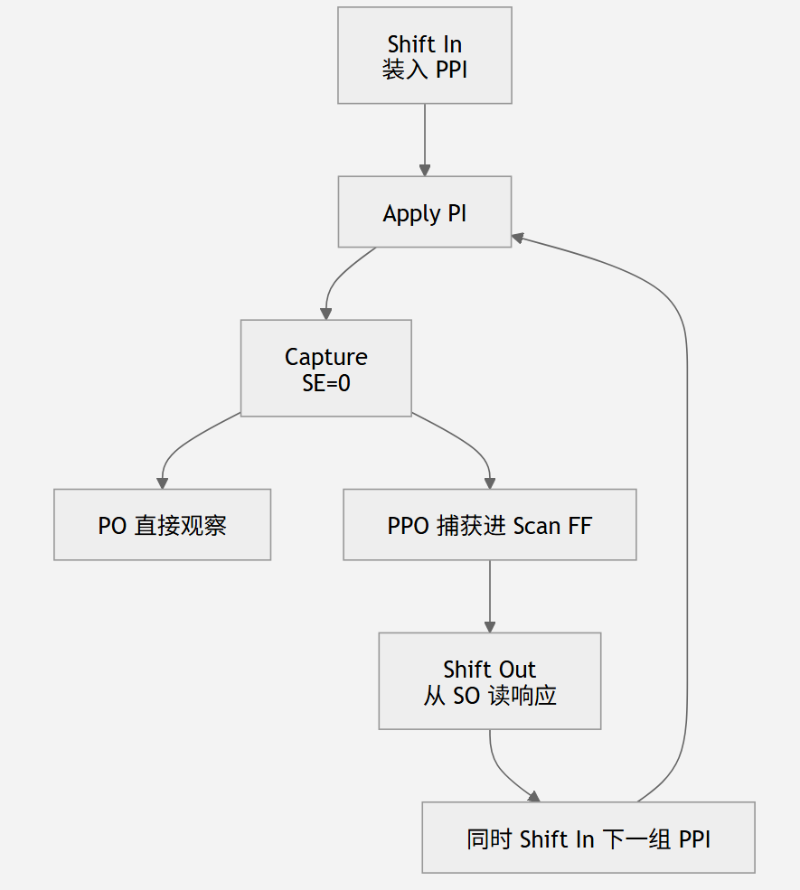

## 2.4 扫描单元设计

扫描单元有两个不同的输入源可供选择。第一个输入，即**数据输入**，由电路的组合逻辑驱动，而第二个输入，**扫描输入**，则由另一个扫描单元的输出驱动，以形成一个或多个称为扫描链的移位寄存器。

这些扫描链通过将扫描链中第一个扫描单元的**扫描输入连接到主输入**，**并将最后一个扫描单元的输出连接到主输出**端口，从而实现外部访问。由于扫描单元中有两个输入源，必须提供选择机制，使扫描单元能够在两种不同模式下工作：**正常/捕获模式和移位模式**。在正常/捕获模式下，选择数据输入以更新输出。在移位模式下，选择扫描输入以更新输出。这使得可以从一个或多个主要输入对所有扫描单元进行任意测试模式的移动，同时通过一个或多个主要输出所有扫描单元的内容。本节介绍三种广泛使用的扫描单元设计。

> **Shift 负责“搬数据”，Capture 负责“让功能逻辑真正工作一次并把结果记下来”。**

在典型的 muxed-D scan cell 里，`Scan Enable (SE)` 决定当前处于哪种模式。`SE=1` 时是 **Shift mode**：scan cell 串成移位寄存器，数据从 `Scan In` 一位一位移进去，同时旧数据一位一位移出去。`SE=0` 时是 **Capture mode**：scan cell 不再接收前一个 scan cell 的数据，而是接收原来功能逻辑的 `D` 输入；打一拍时钟，就把组合逻辑的响应捕获进各个 scan cell。

### 2.4.1 多路复用D扫描单元

图2.9a展示了**边缘触发多路复用-D扫描单元设计**。该扫描单元由**D型触发器**和**多路复用器**组成。多路复用器使用**扫描使能（SE）**&#x8F93;入在**数据输入（DI）**&#x548C;**扫描输入（SI）**&#x4E4B;间进行选择。

在**普通/捕捉模式**下，**SE设置为0**。当时钟沿施加时，数据输入DI处的值会被捕获到内部D触发器中。**移位模式下，SE设置为1**。SI 现在用于在D触发器内容被移出时将新数据移入D触发器。如图2.9b所示。


图2.10展示了**电平敏感/边缘触发**的多路复用D扫描单元设计，可用于替代扫描设计中的D锁存。该扫描单元**由多路复用器、D锁存器和D触发器**组成。同样，多路复用器使用扫描使能输入SE来选择数据输入DI和扫描输入SI; 但在这种情况下，**换位操作**采用**边缘触发**方式进行，而正常操作和捕获操作则以**电平敏感**方式进行。

\
中间为D Latch（电平敏感，区别于2.9的边沿触发），右边是DFF（边沿触发）

### 2.4.2 时钟扫描单元

**边缘触发时钟扫描单元**也可以用来替代扫描设计中的**D触发器**\[McCluskey 1986]。与多路复用D扫描单元类似，时钟扫描单元也具有数据输入DI和扫描输入SI;但在时钟扫描单元中，输入选择是通过**两个独立时钟**进行的，**数据时钟DCK**和**移位时钟SCK**，如图2.11a所示。


在**正常/捕获模式**下，**数据时钟DCK**用于将**数据输入DI**处的值捕获到时钟扫描单元。在**移位模式**下，**移位时钟SCK**用于将**扫描输入SI**的新数据移入时钟扫描单元，而时钟扫描单元的当前内容正在被移出。样本操作波形如图2.11b所示。与多路复用D扫描单元设计类似，也可以设计时钟扫描单元以支持D锁存的扫描替换。使用时钟扫描单元的主要优点是**不会导致数据输入的性能下降**。但主要缺点是需要额外的班次时钟路由。


### 2.4.3 LSSD扫描单元

如果原设计不是用边沿触发 DFF，而是大量使用电平敏感 Latch，还怎么做 Scan？

图2.12a展示了\[Eichelberger 1977]描述的极性保持移位寄存器锁存（**SRL**）设计，可用作**LSSD扫描单元**。最重要的一句话是：

> **C 和 A 决定“L1 从哪里拿数据”，B 负责“把 L1 的数据搬到 L2”。**

| 元件/信号 | 作用                                 |
| ----- | ---------------------------------- |
| `L1`  | master latch，主锁存器                  |
| `L2`  | slave latch，从锁存器                   |
| `D`   | Functional Data，正常功能数据             |
| `I`   | Scan Input，扫描输入                    |
| `C`   | system clock，让 **D → L1**          |
| `A`   | scan/shift clock，让 **I → L1**      |
| `B`   | transfer/shift clock，让 **L1 → L2** |
| `+L1` | L1 的输出                             |
| `+L2` | L2 的输出，也可以接到下一 Scan Cell           |


```
mermaid

flowchart LR
    D["功能数据 D"] -->|"时钟 C"| L1["Latch L1"]
    I["扫描数据 I"] -->|"时钟 A"| L1
    L1 -->|"时钟 B"| L2["Latch L2"]
    L2 --> SO["下一 Scan Cell"]
```

#### 优缺点对比

| 类型           | 主要适用            | 数据/Scan选择方式        |
| ------------ | --------------- | ------------------ |
| Muxed-D      | DFF-based       | MUX + Scan Enable  |
| Clocked-Scan | DFF-based       | DCK / SCK 两套时钟     |
| **LSSD**     | **Latch-based** | **C / A / B 多相时钟** |


## 2.5 扫描架构

本节介绍三种流行的扫描架构。这些扫描架构包括：（1）**全扫描设计**，所有存储元素都转换为扫描单元，并使用组合式ATPG进行测试生成;（2）**部分扫描设计**，将部分存储元件转换为扫描单元，通常使用顺序ATPG进行测试生成;以及（3）**随机访问扫描设计**，采用随机寻址机制代替串行扫描链，直接提供读写任意扫描单元的访问。

### 2.5.1 全扫描设计

Full Scan 中：

> 所有存储单元都被替换为 Scan Cell，并在 Shift Mode 下连接成一个或多个移位寄存器，即 Scan Chains。

#### 2.5.1.1 多路复用-D全扫描设计

PPI → 提高内部状态的可控性

PPO → 提高内部状态的可观测性

图2.13展示了一个带有三个D触发器的时序电路示例。


对应的电路如图2.14a所示。三个D触发器FF1、FF2和FF3被三个多路复用D扫描单元（SFF1、SFF2和SFF3）取代。

在图2.14a中，每个扫描单元的数据输入DI与组合逻辑的输出相连，就像原始电路中一样。形成扫描链时，SFF2和SFF3的扫描输入SI分别连接到前一扫描单元的输出Q，SFF1和SFF2。此外，**第一个扫描单元SFF1的扫描输入SI连接到主输入SI**，**最后一个扫描单元SFF3的输出Q连接到主输出SO**。因此，在**移位模式**下，**SE设为1**，扫描单元作为单一扫描链工作，允许我们任意组合的逻辑值移入扫描单元。在**捕获模式下，SE设为0**，且扫描单元用于捕捉组合逻辑中应用时钟的测试响应。


全扫描电路中的组合逻辑有两种输入类型：**主输入（PI）**&#x548C;**伪初级输入（PPI）**。**主输入指电路的外部输入**，而**伪主输入指的是扫描单元的输出**。PI和PPI都可以设置为任意所需的逻辑值。唯一的区别是，**PI是直接从外部输入并联设置**的，而**PPI则通过扫描链输入串行设置**。类似地，全扫描电路中的组合逻辑有两种输出类型：**主输出（PO）**&#x548C;**伪主输出（PPO）**。**主输出指电路的外部输出，而伪主输出指的是扫描单元输入**。可以观察到PO和PPO。唯一的区别是，**PO是直接从外部输出并行观测的，而PPO则通过扫描链输出串行观测。**

#### 为什么 Full Scan 能把时序电路“变成组合电路”？

| 名称  | 全称                            | 含义                             |
| --- | ----------------------------- | ------------------------------ |
| PI  | Primary Input                 | 芯片真正的外部输入                      |
| PO  | Primary Output                | 芯片真正的外部输出                      |
| PPI | Pseudo Primary Input，伪主输入 PPI | **Scan FF 的 Q**，对组合逻辑来说像“额外输入” |
| PPO | Pseudo Primary Output         | **组合逻辑送到 Scan FF 的 D 输入**      |
| SI  | Scan In                       | 扫描链串行输入                        |
| SO  | Scan Out                      | 扫描链串行输出                        |


假设 ATPG 给出第一个测试向量：

```
V1
```

它实际上分成：

```
V1:PI
+
V1:PPI
```

其中：

*   `PI` 部分直接从芯片输入端给；
*   `PPI` 部分必须通过 Scan Chain 移进去。

***

##### 第一步：Shift In

令：SE = 1，Scan Cell 进入 Shift Mode。

比如希望：

```
SFF1 = 1
SFF2 = 0
SFF3 = 1
```

那么从 SI 串行移：

```
SI → SFF1 → SFF2 → SFF3
```

经过若干个时钟后：

```
SFF1 = 1
SFF2 = 0
SFF3 = 1
```

也就是说：

> PPI 已经准备好了。

V1:PPI表示第一个测试向量 V1 所要求的内部状态已经通过 Scan Chain 装好了。

##### 第二步：Hold

移入完成以后，不是立刻 Capture。中间还有一个：**H = Hold Cycle。**&#x56E0;为要：

SE : 1 → 0，从 Shift Mode 切换到 Capture Mode。同时还要把：V1:PI  施加到真正的 Primary Inputs。

Hold Cycle 有两个作用：

1.  应用测试向量的 PI 部分；
2.  给全局布线的 `SE` 足够时间从 1 稳定切换到 0。

##### 第三步：组合逻辑开始“做题”

现在：PI = V1:PI ，`Scan FF 状态 = V1:PPI`

于是完整测试向量：

```
V1 = PI + PPI
```

已经施加到组合逻辑。

于是：

```
        V1:PI
          │
          ▼
     ┌───────────┐
V1:PPI─► 组合逻辑 ├─► PO
     └───────────┘
          │
          ▼
         PPO
```

此时可以直接看：PO是否符合期望。但是内部 PPO 还没真正存下来。

***

##### 第四步：Capture

现在：SE = 0，给功能时钟 `CK` 一个脉冲。

Scan FF 不再从 SI 接数据，而从 DI 接组合逻辑结果：

于是：

> **组合逻辑测试响应被捕获进 Scan FF。**

教材 Figure 2.14 的 `C` 就表示这个 Capture Operation，只需要施加一个 CK 脉冲来捕获 `V1` 对应的组合逻辑响应。

***

##### 第五步：Shift Out

问题来了：

响应虽然已经在：

```
SFF1
SFF2
SFF3
```

里面了，但我们在芯片外面看不到

再：SE = 1，然后 Shift：

```
SFF1 → SFF2 → SFF3 → SO
```

把刚才 Capture 的结果串行移出去。

这样就能观察：PPO了。

更妙的是：

> **Shift Out 上一个测试响应的同时，可以 Shift In 下一个测试向量。**

教材明确描述：

```
Shift out response of V1
+
Shift in V2:PPI
```

可以同时进行。


```
mermaid

flowchart LR
    A["2.4 Scan Cell<br/>一个触发器怎么变成可扫描单元"]
    --> B["2.5 Scan Architecture<br/>大量 Scan Cell 怎么组织"]
    B --> C["Full Scan<br/>所有时序单元都可扫描"]
    B --> D["Partial Scan<br/>只有一部分可扫描"]
    B --> E["Random-Access Scan<br/>不用串行链，按地址访问"]
```

```
mermaid

flowchart LR
    A["Shift In<br/>V1:PPI<br/>SE=1"]
    --> B["Hold<br/>设置 V1:PI<br/>SE: 1→0"]
    --> C["组合逻辑响应"]
    --> D["Capture<br/>CK 一次<br/>SE=0"]
    --> E["Hold<br/>SE: 0→1"]
    --> F["Shift Out V1 响应<br/>同时 Shift In V2:PPI"]
    --> G["Capture V2"]
    --> H["继续..."]
```



#### 2.5.1.2 时钟全扫描设计

主要区别在于这两种操作的区分方式。在多路复用D全扫描电路中，使用**扫描使能信号SE**，如图2.14a所示。在图2.15所示的时钟全扫描电路中，这两种操作通过在移位模式和捕获模式下分别正确应用**两个独立时钟SCK和DCK**来区分。


#### 2.5.1.3 LSSD 全扫描设计


### 2.5.2 部分扫描设计


### 2.5.3 随机访问扫描设计

RAS


PRAS(**Progressive Random-Access Scan，PRAS**)

\
MISR：

> “测试响应压缩器。”

第五章会正式学。

总结：

flowchart TB

   A\["Scan Architecture\<br/>怎么访问内部状态？"]

   A --> B\["Full Scan"]

   A --> C\["Partial Scan"]

   A --> D\["Random-Access Scan"]

   B --> B1\["所有 storage elements → Scan Cells"]

   B1 --> B2\["Shift / Capture"]

   B2 --> B3\["Sequential ATPG → Combinational ATPG"]

   C --> C1\["只选部分 FF → Scan Cells"]

   C1 --> C2\["仍有 non-scan FF"]

   C2 --> C3\["通常仍需 Sequential ATPG"]

   C3 --> C4\["面积/性能开销较低"]

   D --> D1\["Scan Cell 可按地址访问"]

   D1 --> D2\["类似 RAM Read / Write"]

   D2 --> D3\["低切换、低测试功耗"]

   D3 --> D4\["代价：地址逻辑和 routing"]
