这份笔记把教材第 2 章的 Scan 基础、设计规则、流程与移位验证，和第 10 章 10.4.2～10.4.5 的 IEEE 1500 Wrapper 放在同一条因果链里。重点不是记住术语，而是回答三个工程问题：内部状态怎样被写进去、怎样被读出来、以及工具生成的扫描结构怎样证明真的可用。

最短心智模型是：

> **Scan 先把“不可直接访问的状态”变成可串行访问的状态；Wrapper 再把“不可直接访问的 Core 边界”变成标准化的测试接口。**

# 1. 为什么需要 DFT

## 1.1 可测性其实在问两个问题

对电路内部任意一个信号或状态，测试都绕不开两件事：

| 概念 | 要回答的问题 | 如果很差，会发生什么 | Scan 的帮助 |
| --- | --- | --- | --- |
| **Controllability（可控性）** | 能否从 PI 或测试端口把它设成需要的 0/1？ | ATPG 需要绕很长的功能路径，甚至无法到达目标状态 | 用 Shift 直接把值装入 Scan Cell，等价于直接设置内部状态 |
| **Observability（可观测性）** | 内部值或故障效应能否传播到 PO 或测试端口？ | 故障效应被逻辑屏蔽，或必须经历很长的状态序列才能看到 | 用 Capture 把内部响应留在 Scan Cell，再用 Shift Out 串行读出 |

组合电路通常只需要沿着“输入 → 逻辑 → 输出”推导测试向量。时序电路多了一组状态寄存器：当前输出不仅由当前 PI 决定，还由上一拍或更早的状态决定。于是测试者必须同时完成两件事：

1. 先把电路带到一个特定的内部状态；
2. 再施加输入并在正确的时刻观察结果。

状态空间一大，功能模式就可能需要几十、几百甚至更多个周期才能把一个内部节点推到目标值；即使故障已经产生，后续逻辑也可能把它屏蔽掉。这就是“时序电路难测”的核心，而不是“触发器本身难以仿真”。

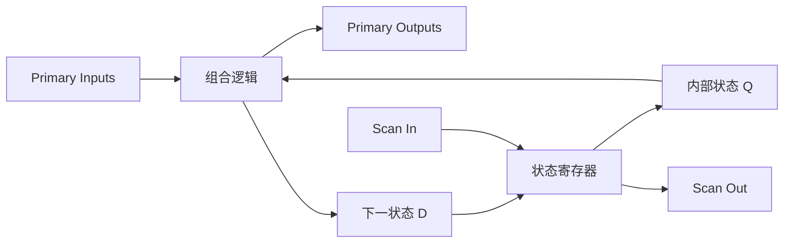

## 1.2 Scan 如何把时序测试改造成“状态可访问”的测试

Scan 在存储元件旁边加一条测试数据路径：

- **写状态**：Shift 模式下，通过 `scan_in` 一拍一拍把目标比特推入 Scan Chain；链上的 Scan Cell 输出就变成组合逻辑的 **PPI（pseudo primary input）**。
- **运行一次逻辑**：Capture 模式下，关闭串行输入选择，让组合逻辑根据 PI 和 PPI 计算一次，并把结果写回 Scan Cell。
- **读状态**：再次 Shift，把捕获的状态从 `scan_out` 推出来；Scan Cell 的输入可以视作 **PPO（pseudo primary output）**。

因此，原来的问题

> “怎样通过外部引脚和很多功能周期，间接到达并检查内部状态？”

变成了

> “怎样把状态移入，给组合逻辑一个捕获周期，再把状态移出？”

这就是全扫描设计的价值：它没有消除时序行为，而是把最难控制、最难观察的状态边界显式化，使主要 ATPG 问题接近组合逻辑测试。Scan 也不是“插入成功就等于可测”：时钟、复位、链路时序和模式切换仍然必须被验证。

# 2. Scan Cell

## 2.1 从普通 DFF 到 Muxed-D Scan FF

### 普通 DFF

普通边沿触发 DFF 在有效时钟边沿把 `D` 采样到 `Q`：

```text
Q_next = D       （在有效时钟边沿）
```

在功能设计里，`D` 通常来自组合逻辑的下一状态。问题是：测试者不能直接把一个任意值写到这个 DFF，只能通过功能输入和时钟“绕路”到达它。

### Muxed-D Scan FF

教材 Fig.2.9(a) 的做法是在 DFF 的 D 端之前加一个 2:1 MUX。`scan_en` 决定 DFF 在这一拍到底接收功能数据还是串行数据：


```text
selected_D = scan_en ? scan_in : DI
Q_next      = selected_D   （在 CK 有效边沿）
```

这里的关键不是“多了一个输入”，而是**同一个存储元件拥有两条互斥的数据来源**：

| 模式 | `scan_en` | DFF 采样的输入 | 这一拍的目的 |
| --- | ---: | --- | --- |
| **Functional / Normal** | 0 | `DI` | 按原设计运行功能逻辑 |
| **Capture** | 0 | `DI` | 把组合逻辑对测试向量的响应存进 Scan Cell |
| **Shift** | 1 | `scan_in` | 通过串行链装入新状态，同时把旧状态向后推进 |

所以“functional mode”和“capture mode”在 Muxed-D 单元内部使用的是同一条 `DI` 路径；二者的区别来自测试时序：正常模式是在功能环境中运行，capture 则是在已经准备好 PI/PPI 后用一个受控时钟采样响应。

## 2.2 `scan_en`、`scan_in` 和 `scan_out` 的直觉

教材 Fig.2.9(b) 的波形最值得观察的是：**每一个 CK 边沿只做一次选择后的采样**。

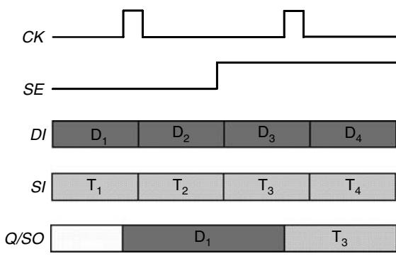

- `scan_en=0` 时，`scan_in` 的变化不会改写 DFF，DFF 等待 `DI` 在时钟边沿被捕获。
- `scan_en=1` 时，`DI` 被旁路，`scan_in` 的比特在时钟边沿进入 DFF；原来留在 `Q` 的内容随链路向下一级移动。
- 图中的 `Q/SO` 表示 Scan Cell 的 Q 可以作为串行输出；在一条链中，通常把**最后一个单元的 Q**接到外部 `scan_out`。
- `scan_in` 只负责给链头提供串行数据；中间单元的串行输入来自前一个单元的 Q，而不是每个单元都直接接顶层端口。

一个常见误解是“Shift 时只是在读链”。实际上 Shift 每一拍同时完成两件事：

1. 把新的 `scan_in` 比特写入当前单元；
2. 把当前单元的旧值交给下一级，并最终从 `scan_out` 方向流出。

这也是后面“移出旧响应的同时移入下一个测试向量”的基础。

# 3. Scan Chain / Full Scan

## 3.1 从普通时序电路到 Scan Chain

教材 Fig.2.14(a) 可以按四步读：

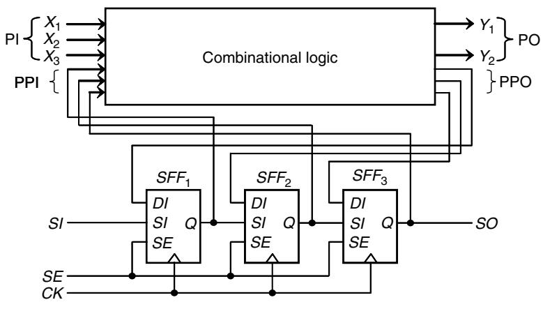

1. **普通时序电路**：原来有 `FF1`、`FF2`、`FF3`，每个 DFF 的 D 端接在原始组合逻辑的下一状态输出上。
2. **Scan FF replacement**：把选中的 DFF 替换成具有 MUX 的 `SFF1`、`SFF2`、`SFF3`。原来的功能 `DI` 连接保持不变，新增 `SI` 接到 MUX 的串行输入。
3. **Stitching**：将 `SFF1.Q → SFF2.SI`、`SFF2.Q → SFF3.SI`，并把链头接到外部 `SI`、链尾接到外部 `SO`。
4. **形成 Scan Chain**：`SI → SFF1 → SFF2 → SFF3 → SO` 成为一个可串行访问的移位寄存器；`SE`（本文统一写作 `scan_en`）控制所有 Scan FF 的模式。

这条链路不会替代原来的组合逻辑。它只是在每个状态边界旁边提供一条测试旁路，所以：

- `scan_en=1` 时，组合逻辑的下一状态输出 `DI` 暂时不装入 Scan FF，链作为移位寄存器工作；
- `scan_en=0` 时，Scan FF 回到功能数据路径，组合逻辑响应会在 Capture 时被装入。

Full Scan 的“full”指设计中目标存储元件基本都被替换并串接；Partial Scan 则只选择一部分状态元件。全扫描并不意味着所有逻辑都被串行化，而是尽量让所有状态边界可访问。

## 3.2 Shift 和 Capture 到底怎么协作

教材 Fig.2.14(b) 把一个测试向量拆成两部分：

- `V:PI`：外部主输入，直接并行施加；
- `V:PPI`：由 Scan Cell 的 Q 提供，必须通过 Scan Chain 串行移入。


以三单元链为例，典型节奏如下：

| 阶段 | `SE` | CK | Scan Cell 接收什么 | 发生的事 |
| --- | ---: | --- | --- | --- |
| **Shift in** | 1 | 多个移位脉冲 | `scan_in` | 把 `V1:PPI` 串行装入三个 Scan FF；旧内容从末端流出 |
| **Hold / 切换** | 由 1 切到 0 | 无需采样沿 | 暂不改状态 | 施加 `V1:PI`，等待全局 `SE` 稳定 |
| **Capture** | 0 | 一个功能/捕获脉冲 | `DI` | 组合逻辑在 `V1:PI + V1:PPI` 下计算，把响应写回 Scan FF；同时可在 PO 检查并行响应 |
| **Hold / 切回** | 由 0 切到 1 | 无需采样沿 | 暂不改状态 | 让 `SE` 稳定，并准备观察 PPO/`SO` |
| **Shift out + next shift in** | 1 | 多个移位脉冲 | `scan_in` | 将刚刚 Capture 的响应从 `SO` 移出，同时装入下一个向量的 `V2:PPI` |

直接回答问题：

> **Shift 负责把“要测试的内部状态”写进去；Capture 让组合逻辑在这个状态上真正运行一拍，并把响应冻结在 Scan Cell；下一轮 Shift 再把这个响应读出来。**

Shift 和 Capture 不是两个同时发生的动作，也不是“Shift 负责输入、Capture 负责输出”这么简单。它们共享同一组 Scan FF，但由 `SE` 选择不同的数据源：

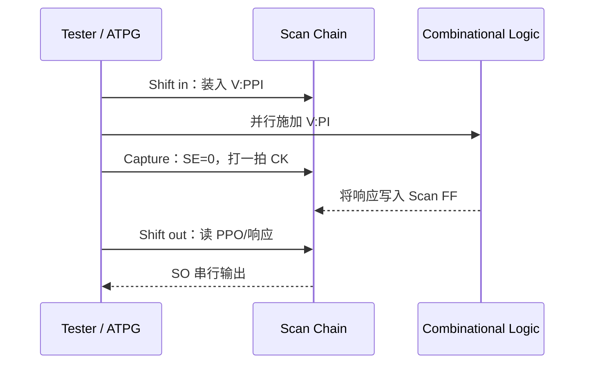

如果没有 Shift，内部状态不可控；如果没有 Capture，组合逻辑不会把故障效应转成可读的状态；如果没有后续 Shift Out，内部响应又不可观测。三者是一个闭环。

# 4. Scan Design Rules

## 4.1 规则的共同目的

Scan 规则可以统一成一句话：

> **在 Shift 期间，所有 Scan Cell 必须稳定地收到“恰好该收到的移位边沿”，且不能被时钟门控或异步控制偷偷改写；在 Capture 期间，又必须允许真实功能路径传播并保留可测故障。**

因此测试模式要求时钟和复位“可控”，不一定意味着它们都必须物理上直接接顶层 pin；它们至少要能通过 `TM`、`SE`、测试 mux 或受约束的测试时钟路径被外部测试环境确定地控制。

## 4.2 四类常见问题

| 结构 | 为什么会破坏 Scan | 常见修复 | 修复时的覆盖率/时序取舍 |
| --- | --- | --- | --- |
| **Gated clock** | 内部 `CEN=0` 时 Scan FF 根本收不到移位时钟，链在这里“断流” | 测试期间旁路门控；Fig.2.23(b) 用 `TM` 或 `SE` 强制有效门控 | 用 `TM` 简单但可能测不到门控逻辑故障；用 `SE` 只在 Shift 旁路，Capture 仍保留门控行为，覆盖率较好但 ATPG 更复杂 |
| **Derived clock** | PLL、分频器、脉冲发生器生成的时钟不能由外部直接逐拍安排 | 测试期间用 mux 旁路到一个外部可控 CK，或使用专用 test clock | 旁路必须覆盖整个相关测试过程，并保持时钟关系明确 |
| **Combinational feedback** | 环路可能表现成隐藏状态或振荡；环内值既不可确定也不容易观测 | 最好重写 RTL；做不到时用测试模式控制点/观察点断环 | 断环逻辑不能破坏 Normal mode；否则可能影响功能等价 |
| **Asynchronous set/reset** | 异步控制若在 Shift 中突然有效，会把刚移入的数据清零/置一 | Shift 期间将其强制为 inactive；Fig.2.26(b) 用测试模式控制旁路 | 用 `TM` 简单但会屏蔽复位逻辑故障；用 `SE` 或独立 `RE` 可提高覆盖率，但要处理复位与 CK 的竞争 |

### Gated clock：Fig.2.23 的重点

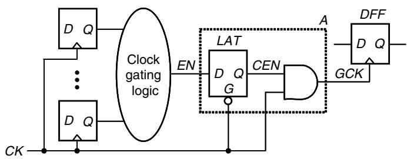

Fig.2.23(a) 中，内部逻辑生成 `EN`，经锁存器形成 `CEN`，再与 CK 组合出实际给 DFF 的 `GCK`。功能上这是省功耗的合理结构；测试上却有一个问题：测试者无法保证每个 `GCK` 都会跳变。

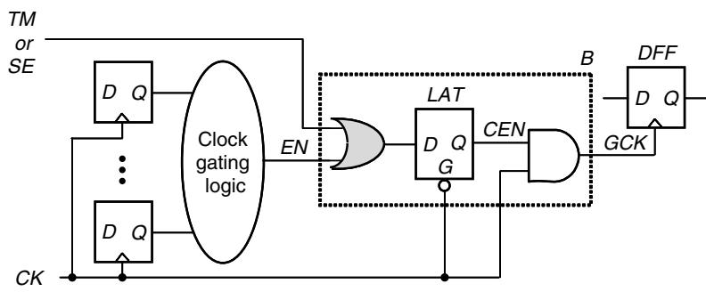

Fig.2.23(b) 的修复思路是让测试控制信号参与门控使能，使移位时有效门控被强制打开。这里要区分两种策略：

- `TM` 强制：整个测试期间都旁路门控，简单可靠，但 Capture 时门控逻辑也被绕开，门控故障可能失去覆盖。
- `SE` 强制：仅 `SE=1` 的 Shift 期间打开门控，Capture 时 `SE=0` 释放门控，较有利于测试门控逻辑，但测试向量生成更复杂。

### Derived clock 与组合反馈

派生时钟的基本修复是：

```text
功能模式：      DFF clock = derived_clock
测试模式 TM=1： DFF clock = externally_controllable_CK
```

组合反馈的首选修复不是“让 ATPG 猜环里的值”，而是回到 RTL 把不必要的组合环路消除；只有无法改动时，才通过 `TM` 控制一个测试断点，让 Shift/Capture 期间环路保持在确定状态。

### Async Reset：Fig.2.26 的重点

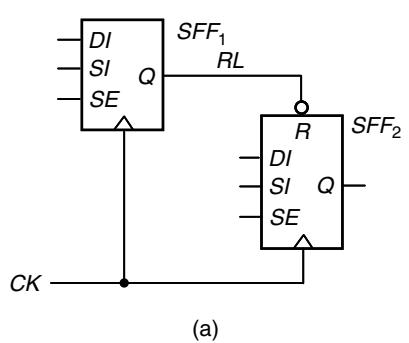

如果链中某个 Scan FF 的异步复位 `RL` 由内部顺序逻辑产生，外部测试器可能无法保证它在每一次 Shift 期间都保持 inactive。这样即使 SI、CK、SE 都正确，数据也会被异步复位抢走。

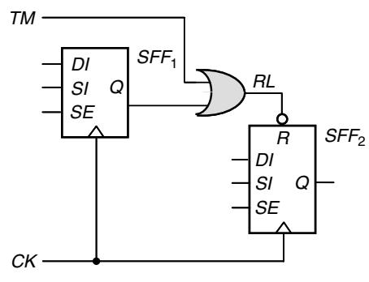

Fig.2.26(b) 的直觉是：在测试模式下用控制逻辑把 `RL` 固定在 inactive。具体使用 OR 还是 AND，要根据复位的有效电平决定；图示的 OR 只是一个实现例子。若始终用 `TM` 禁用异步复位，复位逻辑内部的故障可能测不到；用 `SE` 或独立 `RE` 做分阶段测试，则能在“数据路径测试”和“复位逻辑测试”之间取得更好的平衡。

## 4.3 为什么时钟/复位可控是硬要求

移位的正确性依赖于一个非常机械的假设：第 i 个 Scan Cell 的输出在正确的时刻到达第 i+1 个 Scan Cell 的输入，并且第 i+1 个单元只在预期边沿采样。不可控的 gated/derived clock 会让某些单元漏掉边沿；不可控的异步 set/reset 会让某些单元在边沿之外被改写。两者都会让“链上数据流”不再是确定的移位操作。

Capture 则要求另一种确定性：组合逻辑要有机会在给定 PI/PPI 下产生响应，且不能因为测试修复把真实功能路径永久旁路。因此一个好的规则修复既要让 Shift 能跑，也要避免为了 Shift 把 Capture 的故障覆盖率一并牺牲掉。

# 5. Scan Design Flow

## 5.1 Fig.2.27 的流程读法


把教材流程展开成工程上可执行的顺序就是：

```text
Pre-scan
  → DRC
  → repair
  → scan configuration
  → scan replacement
  → scan reordering
  → scan stitching
  → scan extraction
  → scan verification
```

| 阶段 | 它真正决定/检查什么 | 主要产物或验收问题 |
| --- | --- | --- |
| **Pre-scan** | 读取 RTL 或门级 netlist、时钟/复位/测试约束，确定哪些状态元件和端口进入范围 | 输入设计与约束是否完整；是否知道 clock domain、边沿和 reset 极性 |
| **DRC** | 找到 gated/derived clock、不可控 async set/reset、组合反馈、总线/三态冲突等扫描规则违例 | 违规清单；每条违例是否有明确根因 |
| **repair** | 加测试旁路、控制点、观察点、lock-up 等，把设计变成 testable design | 修复后 Shift/Capture 的前提是否成立；是否保持功能意图 |
| **scan configuration** | 决定 Scan Chain 数量、Scan Cell 类型、排除哪些寄存器、时钟域和边沿如何分配 | 链数、最大链长、don’t-scan 范围、时钟规划 |
| **scan replacement** | 用功能等价的 Scan Cell 替换原始存储元件 | `DI` 功能路径仍对，Scan MUX/端口存在且无悬空 |
| **scan reordering** | 根据物理位置和时序约束优化链内顺序，减少布线并避免跨边沿/时钟域风险 | 重排没有破坏时钟结构；必要的负边沿/正边沿顺序仍正确 |
| **scan stitching** | 把前一级 Q 接到后一级 SI，并连接外部 SI/SO；必要时插入 lock-up latch/FF | 每条链有明确起点、终点、方向，跨域处没有漏插隔离 |
| **scan extraction** | 沿 Shift 数据路径追踪真实链路，提取每条链包含哪些单元及其顺序 | 报告中的链序与网表连接一致，没有断链、环链或孤立单元 |
| **scan verification** | 用全时序模型检查 Shift 和 Capture，而不只检查零延迟逻辑 | flush test 通过；Capture 响应与预期一致；SDF/STA 下没有移位时序问题 |

其中 scan synthesis 往往包含 configuration、replacement、reordering、stitching 四步；scan extraction 是对已经形成的链做结构核对，scan verification 则是用波形/时序去验证它真的能工作。

## 5.2 “工具运行成功”为什么不等于 DFT 结果正确

工具 exit code 为 0，通常只说明命令、脚本和数据库流程完成了；它不自动证明：

- 生成的链序就是你以为的链序；
- `scan_en` 的有效电平、CK 边沿、reset 极性与 testbench 一致；
- 所有跨时钟域链段都插入了合适的 lock-up；
- gated/derived clock 在真实测试模式下真的会跳变；
- 物理实现后的 hold/setup 和 clock skew 仍满足 Shift；
- Capture 期间没有把应该测试的门控/复位逻辑永久旁路；
- 工具导出的 netlist、SDF、chain report 和 ATPG 使用的是同一个版本。

最低限度的结果核对应该同时看三层证据：

1. **结构证据**：scan extraction/chain report 与网表追踪结果一致；
2. **功能证据**：Normal mode 的等价性和基本功能回归不被 Scan 插入破坏；
3. **时序证据**：Shift flush 与 Capture 在 full-timing/SDF 环境下通过。

# 6. Scan Shift Verification

## 6.1 Flush test 在验证什么

Flush test 不是为了测试某一个特定逻辑故障，而是先验证“这条链是否真的像一根可靠的移位寄存器”。做法是选择一个短 pattern，连续送入 `scan_in`，让它**完整穿过整条 Scan Chain**，然后检查它是否在正确的时钟周期、以正确的顺序从 `scan_out` 出现。

为什么必须把 pattern 整条移过去？因为只看链头附近，无法覆盖所有相邻 Scan Cell 的连接和时钟关系。一个长度为 L 的链，pattern 要传播到链尾大约需要 L 个 shift cycle（教材以 1000 个单元为例，约 1000 个移位周期后才开始在 SO 端出现）。如果 pattern 提前若干拍出现，往往提示存在相近数量级的 hold-time/时钟偏斜问题；如果根本不出现，则优先怀疑断链、复位、门控时钟或模式初始化。

## 6.2 为什么 `01100` 是很好的 flush pattern

把相邻输入比特看成一次次“对 Scan Cell 的刺激”，`01100` 连续包含：

```text
0 → 1    （上升跳变）
1 → 1    （保持 1）
1 → 0    （下降跳变）
0 → 0    （保持 0）
```

它同时覆盖 `0→1`、`1→0`、`0→0`、`1→1` 四种相邻变化：既能给时钟 skew/hold 问题提供跳变，也能检查“保持不变”的数据是否被意外破坏。连续 shift 后，几乎每个链段都会经历这几类情况，因此比只送一种电平更有诊断力。

## 6.3 `00000` / `11111` 能发现什么

- 连续 `00000…`：如果链中某处 stuck-at-1、输出恒为 1 或有类似的“1 泄漏”，全 0 流中会出现异常 1。
- 连续 `11111…`：对称地帮助发现 stuck-at-0、输出恒为 0 或类似的“0 泄漏”。

全 0/全 1 几乎没有数据跳变，所以对 skew 和 hold 类问题不如 `01100` 敏感；它们适合补充定位“某个单元/链段被钉死”的问题，而不是替代 `01100` 的时序验证。

## 6.4 `scan_out` 错了，如何定位到内部 Scan Cell

只看 `scan_out`，只能知道“某个时刻的末端比特不对”，不能知道错误从链上的哪个位置开始。教材 2.7.4.1 的实用做法是让 flush testbench 在每个 shift cycle 同时记录所有内部 Scan Cell 的 Q，并将其与黄金模型逐格比较：

1. 先确认错误是“提早/延迟出现”还是“某一位被固定为 0/1”；
2. 在出错的第一个周期，找到最早偏离期望的内部 Scan Cell；
3. 检查该单元与前一级之间的数据路径、两个单元的时钟、异步控制以及链序；
4. 把首错单元映射回 clock domain 和物理位置，再决定是补 lock-up、修 CTS/缓冲、重排链，还是修 reset/clock test bypass。

常见现象与优先排查方向如下：

| 首错形态 | 更可能的根因 |
| --- | --- |
| 不同 clock domain 的接缝处出现 hold 错 | 漏插 lock-up latch，或跨域时钟关系没有建模 |
| 同一 clock domain 内出现 hold/setup 错 | CTS skew、局部路径太快，或需要缓冲 |
| 正边沿/负边沿混排后每拍出现重复或错位 | Scan ordering 错误；需要重排或插 lock-up FF |
| 某些单元在 Shift 中突然回到固定值 | async set/reset 未被禁用，或 gated/derived clock 没有真正打开 |
| 所有单元都没有按预期移动 | test mode/SE 初始化错误、链路未 stitch，或时钟没有到达 |

除了 full-timing flush simulation，也可以对 Shift mode 的链路直接做 STA；STA 能快速列出所有不满足时序的相邻单元对，但它不能替代模式初始化和实际波形验证。

# 7. IEEE 1500 Wrapper

## 7.1 从 Core 到 WSP：Wrapper 到底包住了什么

Scan 主要解决“Core 内部触发器不容易访问”；IEEE 1500 Wrapper 解决“嵌入式 Core 的边界和测试接口不容易访问”。它在每个 Core 的 I/O 边界包一圈标准化电路，让核提供方和 SoC 集成方不必共享全部内部实现细节。

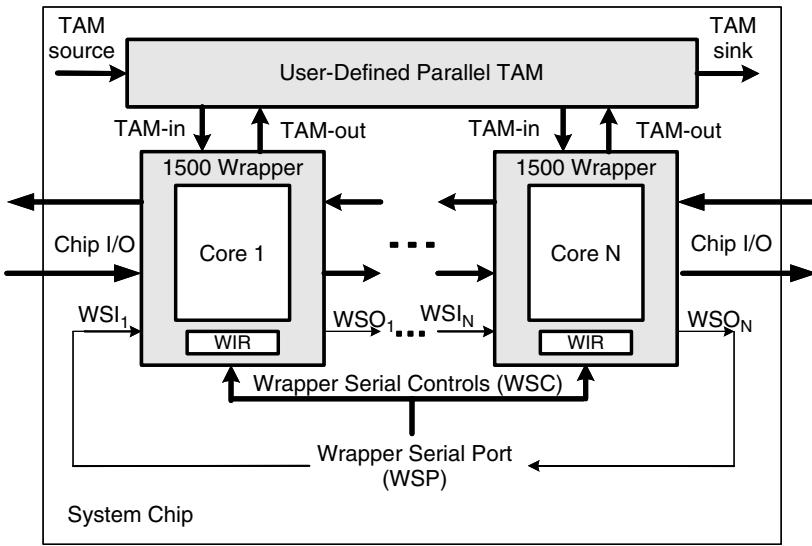


可以按下面的层次读 IEEE 1500：

```text
System / TAM
└─ Core Wrapper
   ├─ Core：真正的功能逻辑
   ├─ Wrapper Cell（WBC）：每个边界端子的测试单元
   ├─ WBR：由一圈 WBC 串成的 Wrapper Boundary Register
   ├─ WIR：保存并译码当前 Wrapper 指令
   ├─ WBY：无关核的 1-bit 旁路寄存器
   └─ WSP = WSI + WSO + WSC
```

各名称的直觉如下：

| 名称 | 它做什么 |
| --- | --- |
| **Core** | 被复用、被集成、需要独立测试的功能核 |
| **Wrapper** | 围绕 Core 边界的测试外壳，负责隔离、驱动和捕获 |
| **WBC（Wrapper Boundary Cell）** | 单个边界端子的测试单元；在功能侧与测试侧之间切换 |
| **WBR（Wrapper Boundary Register）** | 一组 WBC 的集合/扫描路径，负责边界数据的移位、捕获和施加 |
| **WIR（Wrapper Instruction Register）** | 通过串行接口装入指令，再译码选择 WBR、WBY、WDR 或 Core 的测试行为 |
| **WBY（Wrapper Bypass Register）** | 不需要测试某个 Core 时，用最短路径把串行数据旁路过去 |
| **WSP（Wrapper Serial Port）** | 强制存在的串行接口，包含 WSI、WSO、WSC |
| **WSI / WSO** | Wrapper Serial Input / Output，串行移入和移出指令或数据 |
| **WSC** | Wrapper Serial Control，包含 WRCK、WRSTN、SelectWIR、CaptureWR、ShiftWR、UpdateWR 等控制端子 |

1500 的串行端口是强制的；WPP（`WPI/WPO/WPC`）是可选的并行测试端口。并行 TAM 可以降低 SoC 测试时间，但不改变 WSP/WIR/WBR 这条基本直觉。

## 7.2 Fig.10.23：WBR、WBC、WIR、WSP 如何连起来


Fig.10.23 重点看三条“世界”：

- **功能世界**：`FI/FO` 以及每个 WBC 的 `CFI/CFO`，承载 Core 正常数据；
- **测试边界世界**：WBR 由 WBC 串起来，WBC 的 `CTI/CTO` 形成串行移位方向；
- **控制世界**：WIR 根据当前指令和 WSC 信号，决定 WSI/WSO 之间到底选 WIR、WBR、WBY 还是其他数据寄存器。

一个不必背全部标准细节的操作顺序是：

1. `SelectWIR=1`：WSI 与 WSO 之间选择 WIR，配合 `ShiftWR` 和 `WRCK` 串行装入新指令。
2. `UpdateWR`：把移位得到的指令更新到当前执行级；WIR 译码出 `DR_Select`、WBR/WBY 控制和 Core 控制。
3. `SelectWIR=0`：WSI/WSO 改为连接被指令选中的数据寄存器，例如 WBR 或 WBY。
4. 对被选寄存器执行 `CaptureWR`、`ShiftWR`、`UpdateWR`；WSC 信号决定当前是在捕获边界值、移位数据，还是把数据更新到功能侧。

WIR 采用“移位级 + 译码/更新级”的两阶段直觉很重要：移入新指令的过程中，旧指令仍然可以继续控制当前 Wrapper；直到 Update 后新指令才生效。1500 没有 1149.1 那样的 TAP 状态机，控制来自“当前 WIR 指令 + WSC 端子状态”。

## 7.3 WBR 与 WBC：五种事件不必死记，但要知道谁负责什么

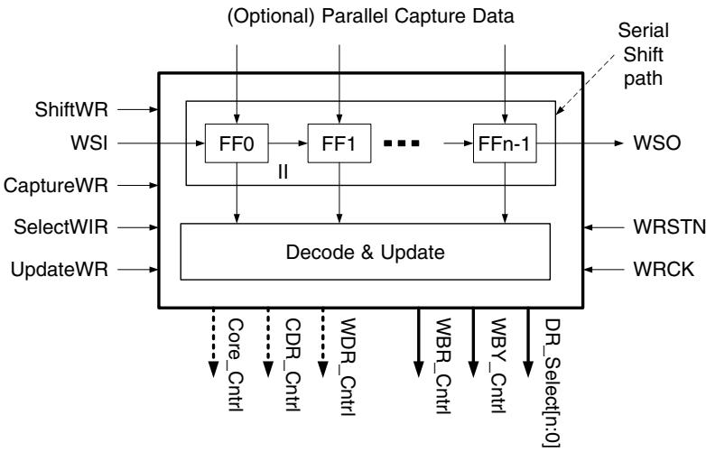

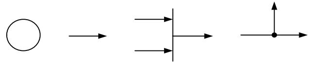

教材用 Fig.10.25 的气泡图表示 WBC：圆圈代表存储元件，箭头代表数据路径，选择线代表 mux/判决点；圈内的 `S/C/U/T/F` 分别表示该存储元件支持 Shift、Capture、Update、Transfer、Functional 事件。

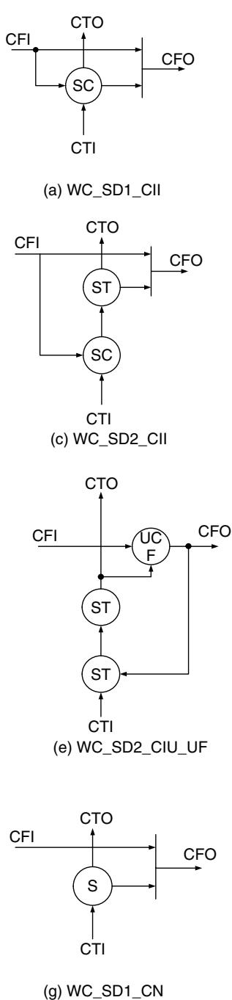


| 事件 | 直觉 | 在测试流程中的作用 |
| --- | --- | --- |
| **Shift** | 测试数据沿 WBR 移向串行输出，WSI 的新数据进入串行输入端 | 把指令或边界测试数据搬运到位；是强制事件 |
| **Capture** | 把 `CFI` 或 `CFO` 的功能侧值抓进 WBC 存储元件 | 记录 Core 输出或外部互连响应；大多数普通边界端子需要它 |
| **Update** | 把移位路径末端的值装入移位路径之外的存储元件 | 让已准备好的测试值在功能侧稳定生效；可选 |
| **Transfer** | 在 WBC 内部的多个存储元件之间搬运数据 | 保留更多 Capture 值或产生时序激励；可选 |
| **Apply** | 由其他事件推导出的“测试值真正生效”时刻 | 内向时驱动 Core 功能输入，外向时驱动 Wrapper 功能输出；不是单独画出的存储事件 |

Fig.10.26(a) 的简单 WBC 只需要一个存储元件支持 Shift + Capture；Fig.10.26(e) 的 WBC 有更多存储级，可支持 Transfer/Update；Fig.10.26(g) 不支持 Capture，可对应时钟、复位等可以免于普通包裹的端子。比赛中通常先掌握“哪些端子被包、数据从哪边进出、哪个事件让它生效”，不必先背全套 WBC 型号。

## 7.4 Normal、Inward-facing、Outward-facing

这三个模式是 Wrapper Scan 最重要的直觉：

| 模式 | WBR/WBC 在做什么 | 测试对象 |
| --- | --- | --- |
| **Normal mode** | Wrapper 对系统透明，Core 按原功能运行 | 不进行 Wrapper 测试；验证插入不能破坏功能 |
| **Inward-facing test** | WBR 控制 Core 的功能输入，并捕获/观察 Core 的功能输出 | **Core 自身**，对应 INTEST 类测试 |
| **Outward-facing test** | WBR 控制 Wrapper 的功能输出，并捕获 Wrapper 的功能输入 | **Core 外部的互连和 UDL**，对应 EXTEST 类测试 |

可以把方向记成：

```text
Inward：  WBR  →  Core 输入       Core 输出  →  WBR
Outward： WBR  →  Core 外部输出   Core 外部输入 → WBR
```

Inward 并不是“把数据往芯片内部随便推”，而是用边界寄存器替代 Core 的功能输入、观察 Core 的功能输出；Outward 也不是测试 Core 内部逻辑，而是让 Core 的边界输出变成可控激励，并在边界输入捕获外部互连的响应。若使用 `WS_INTEST_SCAN`，Core 内部 Scan Chain 还可以与 WBR 串接，让前面第 3 节的 Shift/Capture 继续向 Core 更深处延伸。

## 7.5 CTL 只需要掌握的部分

CTL（Core Test Language）是核提供方给系统集成方和自动化工具的测试信息契约。它不是又一条 Scan Chain，而是描述“这个 Core 怎样被包装、怎样接入和怎样复用测试数据”。

最有用的直觉是：

- `Signals`、`Patterns`、`Timing`、`MacroDefs` 描述信号、向量、时序和施加协议；
- `Environment` 按测试模式描述边界信号的静态属性和测试序列；
- `Internal` 描述核内部/端子的测试属性；
- `PatternInformation` 说明测试图案用途和所需模式；
- `External` 说明与芯片引脚、其他 Core、TAM、UDL 的连接关系；
- `ScanInternal`、`Relation`、`TestResourceConstraints`、`CoreInstance` 分别补充内部 Scan、信号关系、测试资源限制和层次实例信息。

CTL 的核心价值是把“核的测试数据”和“系统集成时如何施加这些数据”分开。这样换一个 SoC 级测试接口时，集成方主要修改协议/映射，而不必重写整个 Core 的测试图案。

## 7.6 比赛 Wrapper Scan 的最小闭环

面对 Wrapper Scan 任务，可以先按这条闭环检查：

1. **Core 边界是否包住**：每个应测试的功能 I/O 是否有对应 WBC/WBR 路径；时钟、复位等特殊端子是否按规则处理。
2. **WIR 是否能选路**：能否通过 WSI 装入指令，Update 后选择 WBR、WBY 或其他数据寄存器。
3. **WSP 是否连通**：`WSI → 选中的寄存器 → WSO` 的路径、WRCK 和 WSC 控制是否一致。
4. **三个模式是否语义正确**：Normal 透明，Inward 测 Core，Outward 测 Core 外部互连。
5. **事件顺序是否可验证**：Shift 搬运、Capture 采样、Update/Apply 生效；不要把“有寄存器”误认为“测试值已经施加”。
6. **交付描述是否匹配**：Wrapper 结构、端子映射、测试模式和内部 Scan 信息是否能由 CTL 类描述复用。

## 参考资料

- 教材原文：[VLSI Test Principles and Architectures - Design for Testability](<../../../../学习材料/DFT补强/VLSI Test Principles and Architectures - Design for Testability.md>)（重点阅读第 2 章和第 10 章 10.4.2～10.4.5）
- FYH 中已有的实验导向讲解：[DFT Scan 与 Wrapper 实验讲解笔记](DFT_Scan与Wrapper实验讲解笔记.md)

本笔记是基于上述教材的重组理解稿，配图为教材相关图示的本地副本；没有逐段翻译教材，也没有把 IEEE 1500 的全部标准细节展开。
