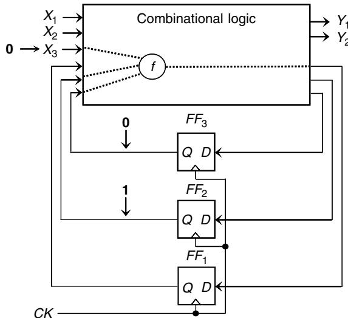
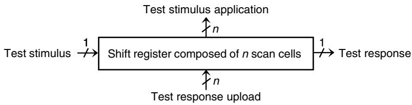
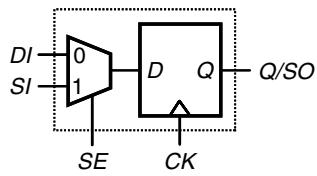
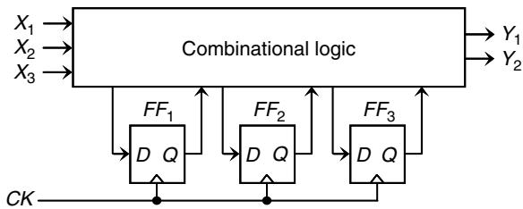
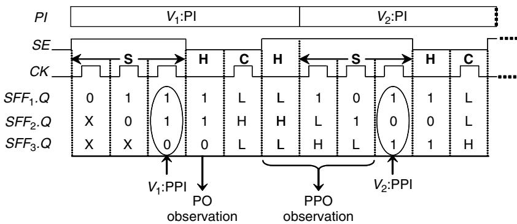
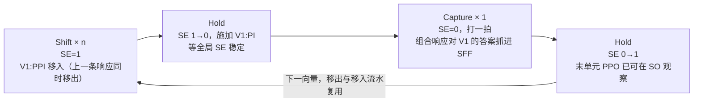
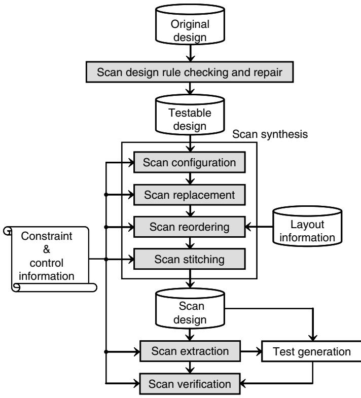
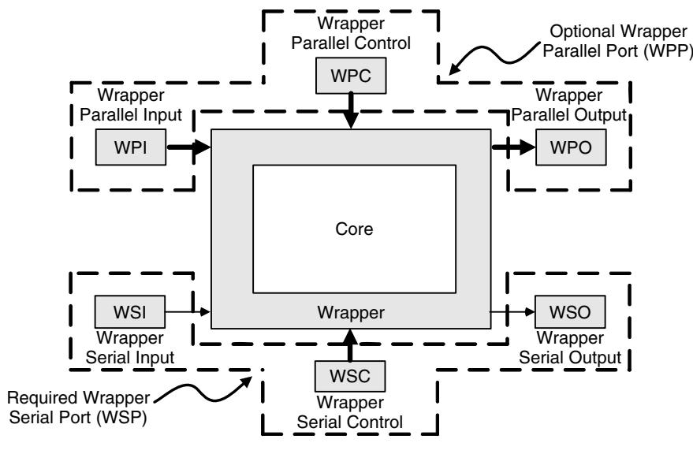
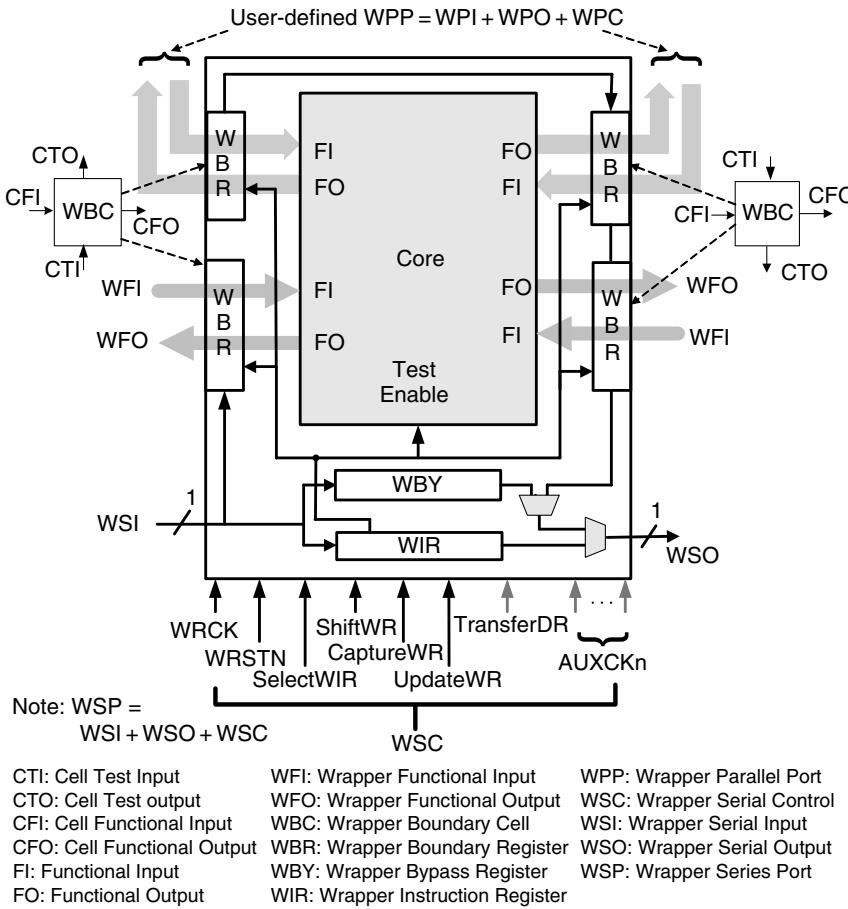
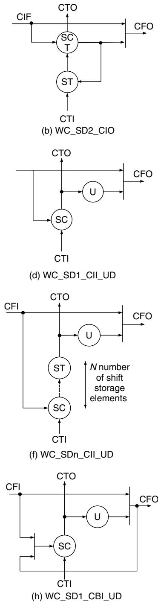

# DFT：Scan 与 Wrapper 实验讲解笔记

> **一句话定位：**这份笔记把教材《VLSI Test Principles and Architectures》第 2 章（2.2–2.7）和 10.4 节（IEEE 1500）重排成一条能口头讲出来的主线——"为什么难测 → Scan Cell 怎么开后门 → 链怎么转 → 规则防什么 → 流程怎么走 → 移位怎么验证 → Wrapper 怎么隔离核"，并逐节挂接到已有实验 E05 和计划实验 E06。它不是教材翻译，也不是广立微 DFTR 规则手册。

## 0. 如何使用本笔记

| 章节 | 讲什么 | 教材出处 | 配图 | 关联实验 |
| --- | --- | --- | --- | --- |
| 1 | 为什么需要 DFT | 2.2–2.3 | Fig.2.7 / 2.8 | E05（功能模式对照） |
| 2 | Scan Cell | 2.4 | Fig.2.9 | E05（RTL 行为模型） |
| 3 | Scan Chain / Full Scan | 2.5 | Fig.2.13 / 2.14 | E05（shift→capture→shift-out） |
| 4 | Scan Design Rules | 2.6 | Fig.2.23 / 2.26 | E07（计划）/ 网表检查经验 |
| 5 | Scan Design Flow | 2.7（2.7.1–2.7.3） | Fig.2.27 | E05 综合流程 / E06（计划） |
| 6 | Scan Shift Verification | 2.7.4.1 | — | **E06（下一个，待确认）** |
| 7 | IEEE 1500 Wrapper | 10.4.2–10.4.5 | Fig.10.21–10.26 | E08（计划）/ 比赛任务二 Wrapper Scan |
| 8 | 四个实验如何对应教材 | — | — | E05–E08 总览表 |

所有配图复制自教材 MinerU 转换资产，存放在本目录 [assets/](assets/) 下，文件名带图号。讲的时候直接对照图讲，不要背文字。

**教材与工具的边界（全笔记适用）：**本笔记所有规则、流程、机制均为教材与 IEEE 标准口径。广立微（Semitronix）工具中的 DFTR 规则条目、scan verification 报告形式、CTL 交付模板是工具实现，以工具手册和实际输出为准。**禁止把教材通用 Scan Rule 说成 DFTR 规则**，反之亦然。

---

## 1. 为什么需要 DFT

**先给结论：测试只做两个动作——把电路"摆"到某个状态（controllability），再把结果"看"出来（observability）。组合电路只是做这两件事越来越费劲，时序电路则是这两件事从结构上就没保证。Scan 的价值是用很小的硬件代价，让每一个存储元件都变得可直接控制、可直接观察。**

### 1.1 两个核心量

- **Controllability（可控性）**：从主输入出发，把某个内部节点设置成想要的 0 或 1 有多难。
- **Observability（可观测性）**：内部节点上的一个差异，能不能传播到主输出被人看见。

教材用 SCOAP 把这两件事量化成数字（2.2.1 节）：每个信号算 6 个值——CC0/CC1/CO 衡量要摆弄多少个信号，SC0/SC1/SO 衡量要花多少个时钟周期。数字越大越难测。我们不背公式，只记两条定性结论：

1. 组合逻辑每加深一层，可控性数字 +1——深组合靠"堆逻辑"变难；
2. 信号每穿过一个存储元件，时序数字 +1——**时序电路难在"过触发器要按拍数算钱"**。

SCOAP 是 O(n) 的拓扑启发式估计，不精确，但足够在测试生成前指出"哪里难测"，指导插测试点或做 DFT。

### 1.2 时序电路到底难在哪



> **读图 Fig.2.7**
> - **讲什么**：故障 f 的激活与捕获需要主输入 X₃=0 且内部状态 FF₂=1、FF₃=0——内部状态不直接受你控制。
> - **重点观察**：①FF₂/FF₃ 的 Q→D 反馈路径（状态绕不出来）；②X₃ 是唯一能直接摆的输入；③故障点 f 藏在组合逻辑深处。
> - **对应实验**：E05（functional 阶段体现"状态只能经组合逻辑间接到达"）。
> - **代码对应**：`tiny_core_prescan.v` 的 `q[3:0]`（不可直接访问的状态）与唯一输出 `y`（观测窗口极窄）。

对照 Fig.2.7 讲：组合逻辑里有一个故障 f，要激活并捕获它，需要主输入 X₃=0，同时要求 FF₂=1、FF₃=0。麻烦在于 FF₂、FF₃ 的值**不在你手里**——它们藏在电路内部，只能靠一长串输入序列把状态"绕"过去，最坏情况需要指数级的时钟拍数；即便成功捕获，故障效应被存进 FF₁，还得再来一个很长的检查实验（checking experiment）把 FF₁ 的值传播到主输出才能看见。

所以时序电路难测的根因一句话：**内部状态既难控制、又难观察，进出都得穿过功能逻辑绕路。**组合电路的 ATPG 早已是成熟可解的问题，时序电路的 ATPG 却长期是硬骨头。

### 1.3 Scan 的回答：给每个触发器开一扇"后门"

早期改进可测性靠 Ad Hoc 手法（插测试点、避免异步置复位、拆小模块……见教材表 2.5）：有效但局部、不成体系、工期没法预算。结构化 DFT（structured DFT）把"为测试而设计"变成流程里可预算、可自动化的一步，其中最成功的就是 scan design。



> **读图 Fig.2.8**
> - **讲什么**：n 个存储元件被组织成一条移位寄存器，测试激励 n 拍移入、测试响应 n 拍移出。
> - **重点观察**：①单bit入口/出口（1→n 的移位）；②顶部与底部的 n 位并行上传/下载箭头（与并行口的关系）；③"移位寄存器"就是全部结构——scan 没有更多魔法。
> - **对应实验**：E05（q[3:0] 就是这张图 n=4 的实例）。
> - **代码对应**：`tiny_core_scan.v` 的 `scan_in/scan_out` 端口与 `q[3:0]` 移位路径。

Fig.2.8 是整章的"封面图"：把 n 个存储元件改造成扫描单元并串成一条移位寄存器（scan chain）之后——

- 任意测试激励 n 拍**移入**，任意测试响应 n 拍**移出**；
- 回看 Fig.2.7 的故障 f：四步搞定——①移位模式把 FF₂、FF₃ 置成 1、0；②主输入 X₃ 给 0；③捕获模式打一拍，故障效应进 FF₁；④再移位，把响应移出比对。

控制与观察都不再穿过功能逻辑绕路。更关键的是：全扫描把"所有存储元件的输入"变成组合逻辑的可全控输入（PPI），"所有存储元件的输入端"变成可全观的输出（PPO），**时序 ATPG 问题退化成组合 ATPG 问题**——这是 scan 能成为工业标配的根本原因。

**讲解钩子：**scan 不改功能逻辑，它只是在每个触发器旁边加了一条旁路通道。功能世界和测试世界靠一个选择信号切换——这就是下一节的主角。

---

## 2. Scan Cell

**先给结论：Muxed-D Scan Cell = 一个普通 DFF + 一个 2 选 1 MUX。MUX 用 scan_en（SE）决定每个时钟沿"吃"功能数据还是"吃"链上前一级的数据。一个单元，两种人格：SE=0 是功能触发器，SE=1 是链上的一环。**

### 2.1 从普通 DFF 说起

普通 DFF 只有两个外部接口：D（来自组合逻辑）和时钟沿。它的状态既不能从引脚直接设置（不可控），也不能在引脚上直接读出（不可观测）——这正是第 1 节的困难在"单元级"的样子。

### 2.2 Muxed-D Scan Cell 与三个信号



> **读图 Fig.2.9(a)**
> - **讲什么**：DFF 的 D 端前挂 2 选 1 MUX，SE 决定时钟沿"吃"功能数据（DI）还是链数据（SI），输出即 Q/SO。
> - **重点观察**：①SE 的选择作用；②DI 与 SI 两个来源；③Q/SO 兼具功能输出与链出口两个身份；④只有一个 CK——模式切换不换时钟。
> - **对应实验**：E05。
> - **代码对应**：`tiny_core_scan.v` 的 `always` 块 `if (scan_en)`/`else` 两分支（MUX 行为等价）；`d0~d3`=DI，`scan_in`=SI，`scan_out`=SO。

Fig.2.9(a) 结构一眼讲完：DFF 的 D 端前面挂一个 MUX——

| 信号 | 全名 | 作用 |
| --- | --- | --- |
| DI | data input | 功能数据，来自组合逻辑 |
| SI | scan input | 扫描数据，来自链上前一级的 Q（首单元接外部引脚） |
| SE | scan enable | 模式选择：0 选 DI，1 选 SI |
| Q / SO | 输出 | 驱动组合逻辑，同时送给链上后一级（末单元接外部引脚 scan_out） |

- **functional / capture mode（SE=0）**：时钟沿把 DI 捕获进触发器——这就是电路正常工作的方式，也是测试时"抓响应"的方式。
- **shift mode（SE=1）**：时钟沿把 SI 移进来、旧值往链尾挪一格——所有单元串成移位寄存器。


> **读图 Fig.2.9(b)**
> - **讲什么**：SE 低电平时逐拍捕获 DI 上的 D₁~D₄；SE 拉高后逐拍移入 SI 上的 T₁~T₄。
> - **重点观察**：①SE 的翻转发生在时钟无效区间；②Q/SO 在 SE 翻转点换数据源；③DI、SI 两条并行推进的数据流。
> - **对应实验**：E05（波形 20–56 ns 功能段与 60–96 ns 移位段合起来就是这张图）。
> - **代码对应**：`tiny_core_scan_tb.v` 在 negedge 改 `scan_en`/`scan_in`；`tiny_core_scan.v` 的 `q` 即 Q/SO。

Fig.2.9(b) 波形照着讲：SE 低电平期间，每个上升沿 Q 依次装进 D₁、D₂、D₃……；SE 拉高之后，每个上升沿 Q 装进的是 T₁、T₂、T₃……（SI 上的流式数据）。注意 **SE 必须在时钟无效区间切换**，绝不能在捕获沿附近翻转——这是后面 hold 周期存在的第一个理由。

**成本与地位：**每个单元在功能路径上多了一级 MUX 延迟（性能代价）；但它与单时钟 DFF 设计天然兼容、EDA 工具支持最全，所以是绝对主流。教材还给了两种替代：clocked-scan cell（用数据时钟 DCK / 移位时钟 SCK 两个时钟代替 MUX 选择，数据路径零延迟但要额外移位时钟布线）和 LSSD（面向锁存器设计、结构上免竞态、要更多时钟布线）。比赛中遇到的多半都是 Muxed-D，另两种知道存在即可（教材 2.4.2/2.4.3）。

### 2.3 对上实验 E05

[tiny_core_scan.v](../../experiments/E05_tiny_core_scan/src/tiny_core_scan.v) 里的存储行为就是 Muxed-D 的 RTL 行为模型：

```verilog
always @(posedge clk or negedge rst_n) begin
    if (!rst_n)     q <= 4'b0000;   // 异步复位（来自外部引脚）
    else if (scan_en) begin        // Shift mode：SI → q[0] → q[1] → q[2] → q[3] → SO
        q[0] <= scan_in;  q[1] <= q[0];  q[2] <= q[1];  q[3] <= q[2];
    end
    else begin                     // Capture mode：组合逻辑 → q
        q[0] <= d0;  q[1] <= d1;  q[2] <= d2;  q[3] <= d3;
    end
end
assign scan_out = q[3];
```

注意两点，第 4 节会回收：①这里 `rst_n` 由**外部引脚直接控制**，恰好符合异步复位规则的"Use external pins"合规解；②链方向是 SI 进 q[0]、q[3] 出 SO——**先移入的位，n 拍后离 SO 最近**。

---

## 3. Scan Chain / Full Scan

**先给结论：Full Scan 就两步——把所有 DFF 换成 Scan Cell（replacement），再把它们的 Q→SI 首尾串起来（stitching）。之后 Shift 负责搬状态进出，Capture 负责让组合逻辑"答题"，两者靠同一个时钟、只靠 SE 区分，配合成一个可无限重复的节奏。**

### 3.1 从普通时序电路到扫描链



> **读图 Fig.2.13**
> - **讲什么**：插链前的原始时序电路——组合逻辑 + 3 个普通 DFF。
> - **重点观察**：①FF₁~FF₃ 的 D 都来自组合逻辑输出（状态只能间接到达）；②三个 FF 共享 CK；③没有 SI/SE——此时还不存在扫描。
> - **对应实验**：E05（prescan 版）。
> - **代码对应**：`tiny_core_prescan.v`（4 FF 版），`always` 块只有功能分支。


> **读图 Fig.2.14(a)**
> - **讲什么**：Fig.2.13 替换 + 串接后的样子：FF→SFF，Q→SI 首尾相连成链，链首链尾接外部 SI/SO。
> - **重点观察**：①每个 SFF 的 DI/SI/SE 三输入；②SFF₁.Q→SFF₂.SI 的串接方向；③组合逻辑的输入被标注为 PI+PPI、输出为 PO+PPO——全部可控可观测。
> - **对应实验**：E05（scan 版）。
> - **代码对应**：`tiny_core_scan.v` 的移位语句 `q[0]<=scan_in; q[1]<=q[0]; …`（Q→SI 串接）与端口 `scan_in/scan_out/scan_en`。

对照两图讲"改造三件事"：

1. **替换**：FF₁/FF₂/FF₃ → SFF₁/SFF₂/SFF₃，各自的 DI 仍接原来的组合逻辑输出，功能一点没变；
2. **串接（stitching）**：SFF₁.Q → SFF₂.SI，SFF₂.Q → SFF₃.SI；链首 SI 接外部引脚，链尾 Q 接外部引脚 SO；
3. **共享控制**：SE、CK 全链共用。

改完之后，组合逻辑眼中的世界变了：它的输入 = **PI**（主输入，并行直接设）+ **PPI**（伪主输入，即各 SFF 的 Q，串行移位设置）；它的输出 = **PO**（主输出，并行直接看）+ **PPO**（伪主输出，即各 SFF 的 D 端，串行移出观察）。四个方向全部可控可观测——组合 ATPG 因此可以把 SFF 当成"普通的输入和输出"来用，全扫描电路的时序深度为 0。

### 3.2 Shift 和 Capture 到底是怎么协作的



> **读图 Fig.2.14(b)**
> - **讲什么**：施加 V₁、V₂ 两条向量的完整时钟拍——S（移位）、H（保持）、C（捕获）三种拍型的交替。
> - **重点观察**：①SE 在 S 段为 1、H 段拉低、C 段保持 0；②SFF₁~₃.Q 行展示数据逐拍推进与捕获瞬间（椭圆圈出的 V₁:PPI、V₂:PPI）；③两个 H 拍分别服务"SE 稳定+施加 PI"和"SE 恢复+观察 SO"。
> - **对应实验**：E05（testbench 各阶段与这张图的 S/H/C 一一对应，时间窗见 [E05 README §7](../../experiments/E05_tiny_core_scan/README.md)）。
> - **代码对应**：`tiny_core_scan_tb.v` 的 `shift_in_bit`（S）、阶段切换处对 `scan_en` 的赋值（H）、CAPTURE 段单拍（C）。

这是本节要讲透的问题。Fig.2.14(b) 的横轴是时钟拍，字母含义：S=Shift、C=Capture、H=Hold（保持拍）。施加一个测试向量 V₁ 的完整节奏：



逐拍拆解 Fig.2.14(b)：

1. **S×3**：SE=1，三个上升沿把 V₁ 的 PPI 部分移进 SFF₁~SFF₃。如果这是第二条向量，这一段同时在干另一件事——把上一条的响应从 SO 移出去。**移入和移出复用同一批拍**，这是 scan 测试时间能压到"每向量约链长 + 1 拍"的关键。
2. **H（hold）**：SE 拉低、并行施加 V₁ 的 PI 部分。专门空一拍的原因：SE 是全局布线的大信号，1→0 的翻转需要稳定时间，绝不能让"捕获沿"附近模式模糊。
3. **C（capture）**：SE 已经是 0，打**一个**时钟脉冲，组合逻辑对完整向量（PI+PPI）的响应被同时抓进所有 SFF。PO 上的组合响应不经过捕获、直接在输出比较。
4. **H**：SE 拉回 1，末单元里的 PPO 值已经顶在 SO 上可以先看起来。
5. 回到 1，下一条向量开始，响应移出与 V₂:PPI 移入流水化重叠。

**回答标题问题的一句话：Shift 负责"把电路摆到想要的内部状态、把上一题的答卷收回来"；Capture 负责"让组合逻辑在摆好的状态上答一拍题"。两者用同一个时钟，唯一的开关是 SE——所以对 ATPG 来说，每条向量只需要分析一个组合时间帧。**

### 3.3 用 E05 的数字走一遍

E05 的 testbench（[tiny_core_scan_tb.v](../../experiments/E05_tiny_core_scan/tb/tiny_core_scan_tb.v)）就是 Fig.2.14(b) 的四拍缩小版：

1. **Shift-in `1010`**：逐位移入，注意顺序——第一位 `1` 进 q[0]，4 拍后被推到链尾 q[3]，结束时 q=1010；
2. **Capture**：scan_en=0，置 in_a=1, in_b=1, in_c=0，打一拍。手算：d0=1^1=0，d1=q[0]&1=0，d2=q[1]^q[0]=1^0=1，d3=q[2]|0=0 → 新 q={d3,d2,d1,d0}=**0100** ✓
3. **Shift-out**：scan_out=q[3]（链尾先出），期望序列 **0,1,0,0**。

这个例子可以拿来回答两个常见疑问："为什么移出顺序和移入顺序看起来反着？"——因为链尾离 SO 最近；"capture 前要不要先移空链？"——不需要，capture 只看 DI，shift-in 的遗留值会在下一轮 shift-out 时自然排出去。

---

## 4. Scan Design Rules

**先给结论：Shift 模式是功能设计从未打算运行的模式。任何会让"某个触发器在移位期间少吃一个时钟沿"、会让"链上数据被异步清掉/冲乱"、或会让"捕获结果不可预测"的结构，都必须在测试模式下被强制可控。规则不是美学，是在保护移位和捕获这两件事的确定性。**

教材表 2.7 给了完整清单，这里只精讲四个重点，其余一笔带过。

### 4.1 Gated Clock（门控时钟）


> **读图 Fig.2.23(a)**
> - **讲什么**：时钟门控——EN 经锁存器 LAT 在下降沿锁存成 CEN，CEN 与 CK 相与生成 GCK 驱动 DFF。
> - **重点观察**：①EN→LAT→CEN 的生成路径（内部逻辑，引脚够不着）；②与门输出 GCK（CEN=0 时 GCK 恒 0）；③DFF 的时钟端接的是 GCK 不是 CK。
> - **对应实验**：E07（计划：`gated_clk_bad.v` 复现此结构）。
> - **代码对应**：E07 `gated_clk_bad.v` 的 `EN`、`gclk` 与被门控的 scan FF（待建）。


> **读图 Fig.2.23(b)**
> - **讲什么**：加一个 OR 门，测试期间用 TM 或 SE 把 CEN 强制为 1，GCK 恢复跟随 CK。
> - **重点观察**：①OR 门新增的输入（TM 或 SE）；②移位期间 CEN 恒 1；③"用 TM 还是 SE"决定捕获期门控逻辑是否可测。
> - **对应实验**：E07（计划：`gated_clk_good.v` 修复版）。
> - **代码对应**：E07 `gated_clk_good.v` 的 `test_en/scan_en → gclk` 旁路逻辑（待建）；验收=比较修复前后 shift 是否正常。

时钟门控是省功耗的常规手段（Fig.2.23a）：使能信号 EN 经锁存器 LAT 在时钟下降沿锁存成 CEN，CEN 与 CK 相与生成 GCK 去驱动 DFF。问题：**CEN 由内部逻辑产生，测试者控制不了**。移位期间一旦 CEN=0，这个触发器就"不吃时钟"，链上数据在这里断流，整条链的波形全乱。

修复（Fig.2.23b）：加一个 OR 门，在测试期间把 CEN 强制为 1。用哪个信号去"顶"它是个真实的工程取舍：

- 用 **TM**（test mode）：整个测试期间门控常开——简单、移位捕获都安全，但门控逻辑本身的故障测不到，损失覆盖率；
- 用 **SE**：只在移位期间强制 CEN=1，捕获时释放——门控逻辑可测、覆盖率高，代价是 ATPG 要多考虑门控行为，复杂度上升。

### 4.2 Derived Clock（派生时钟）

分频器、PLL、脉冲发生器内部产生的时钟都属于派生时钟——从引脚**根本控不了它的沿**。规则：整个测试期间用 MUX 旁路（TM=1 时选一路从引脚直接可控的 CK 去驱动这些触发器）。与门控时钟的区别值得强调：门控是"至少移位期间要能强制开"，派生时钟是"整个测试期间必须换源"。

### 4.3 Combinational Feedback（组合反馈环路）

组合环上如果没有反相（偶数级反相）会表现出时序行为，奇数级反相则直接振荡。环里存的值在测试期间既控不了也定不了——ATPG 对它无能为力。最佳修复是重写产生环路的 RTL；改不了 RTL 时，插入一个 TM 控制的扫描点（控制点+观察点组合）在测试期间永久打断环路。

### 4.4 Asynchronous Set/Reset（异步置位/复位）


> **读图 Fig.2.26(a)**
> - **讲什么**：SFF₁.Q 驱动 SFF₂ 的**异步**复位端 R——典型的"顺序控制"复位违例。
> - **重点观察**：①RL 的来源是另一个触发器的 Q（移位中乱变的数据）；②SFF₂ 的 R 端（低有效圈）；③一旦 RL 变有效，SFF₂ 在无时钟的情况下被异步清零。
> - **对应实验**：E05（合规对照——E05 没有这个结构）。
> - **代码对应**：`tiny_core_scan.v` 的 `rst_n`——直接来自外部引脚，属表 2.7 "Use external pins" 合规解，测试者亲手可控。


> **读图 Fig.2.26(b)**
> - **讲什么**：加 OR 门 + TM：TM=1 时整个测试期间 RL 被压成无效，SFF₂ 的复位不再受 SFF₁.Q 摆布。
> - **重点观察**：①OR 门与 TM 的接法；②TM=1 时 RL 恒为无效值；③教材讨论的替代方案（用 SE 或独立 RE 分两阶段）在此图之外。
> - **对应实验**：暂无直接实验（E05 走引脚方案无需此修复；E07 聚焦门控时钟）。作为网表检查时的对照图使用。
> - **代码对应**：原理对照——若 E05 的 `rst_n` 改为内部逻辑生成，就需要这张图的 OR 门修复。

Fig.2.26(a) 是最典型的违规形态：SFF₁.Q 驱动 SFF₂ 的**异步**复位端 R。教材称这类由内部逻辑驱动的异步信号为"顺序控制（sequentially controlled）"信号——移位期间 SFF₁.Q 是数据流，值不停乱变，某拍变 0 就会把 SFF₂ **异步清零**，链上数据当场被毁，且这种破坏和移位数据毫无关系，完全不可预测。

修复（Fig.2.26b）：OR 门 + TM=1，整个测试期间把 RL 压成无效。教材进一步讨论了取舍：用 SE 代替 TM 可以在捕获期保留复位逻辑的可测性（但有 clock/reset 竞争风险）；更稳妥的是独立复位使能 RE，分两阶段生成向量（阶段一全程禁用复位测数据故障，阶段二只在捕获期放开、不打时钟，专门测复位逻辑）。

**回收 E05 的伏笔：**E05 的 `rst_n` 直接来自顶层引脚，属于表 2.7 推荐解"Use external pins"——测试者亲手控制它，天然合规。违规与否的关键不在"有没有异步复位"，而在"它是不是由内部逻辑驱动、测试者够不够得着"。

### 4.5 为什么测试模式要求 clock/reset 可控

把四条规则收拢成一个判断标准：

- **移位要成立**：每个 scan cell 在每个移位周期必须恰好吃到时钟、从不被异步置/清——所以时钟要能从引脚强制给到（gated clock 移位期强制开、derived clock 换源），复位要能强制无效；
- **捕获要可预测**：ATPG（零延迟模型）必须能确定地算出期望响应——所以捕获期的时钟来源、时钟顺序、复位状态都不能有"意外"。

其余条目按同一标准理解即可：三态总线（移位期间固定一个驱动者，防冲突）、双向 I/O（移位期间强制方向）、时钟当数据用（阻断）、悬空总线/悬空输入（加保持器/接固定电平）、交叉耦合门（用标准单元）。

> **边界声明：**以上全部是**教材口径的通用 Scan Rule**。广立微 DFTR 报告里的规则名称、严重等级、检查范围与推荐修法是工具自己的条目体系，两者不能互相冒充。比赛材料里引用规则时，教材的讲原理，工具报告的讲违规事实。

---

## 5. Scan Design Flow

**先给结论：流程 = "先修电路（DRC/repair）→ 再改结构（scan synthesis 四步）→ 再验两件事（extraction 查连接、verification 查行为）"。工具每一步"跑成功"只代表那一类检查通过；DFT 结果是否正确，最终由 verification 说话。**



> **读图 Fig.2.27**
> - **讲什么**：从 Original design 到 Scan verification 的完整流程，中间穿过 DRC/repair、扫描综合四步、extraction、verification。
> - **重点观察**：①DRC/repair 的产物叫 Testable design；②Scan synthesis 方框里的四步顺序（configuration→replacement→reordering→stitching）及两路外部输入（约束信息、布局信息）；③Extraction 与 Verification 是两个独立的把关步骤，Test generation 从 extraction 之后的 scan design 拿扫描架构。
> - **对应实验**：E05（Yosys 综合脚本 = replacement+stitching 的手工版；流程后半段的 verification 延伸到 E06）。
> - **代码对应**：`E05/scripts/synth.ys` 与 `tiny_core_prescan.v → tiny_core_scan.v` 的手工替换/串接；E06（计划）对应图中的 Scan verification。

对照 Fig.2.27 从上往下讲：

### 5.1 Scan Design Rule Checking and Repair

入口。对综合前 RTL 或综合后门级网表执行规则检查并修复，产物叫 **testable design**。注意图里修复后的设计还会在综合后再查一遍——综合本身可能引入新的违例。同域内相邻 scan cell 的 skew 要管住；跨时钟域的数据路径要满足 `clock skew < data path delay + clock-to-Q delay`，否则捕获会失配，工程上用交错施钟（staggered）、独热施钟（one-hot）或时钟分组（clock grouping，把彼此无交互的时钟域分成组同时施钟）来处理。

### 5.2 Scan Synthesis 四步（testable design → scan design）

| 步骤 | 干什么 | 关键决定 |
| --- | --- | --- |
| Scan configuration | 规划链的总体结构 | 链数（受引脚/测试机通道限制，链越长测试越慢）；scan cell 类型；排除项（关键路径上的 FF、加密等 don't-scan 模块）；排链原则（同一时钟域一条链；同链必须负边沿单元在正边沿单元**之前**；跨时钟域相邻单元插 lockup latch） |
| Scan replacement | 存储元件 → 功能等价 scan cell | 产物叫 scan-ready design；扫描输入先临时接本单元输出防悬空，后续 stitching 时改接 |
| Scan reordering | 按物理布局重排链内顺序 | 目标是省扫描布线；链内重排不跨时钟/极性边界，链间重排必须保持时钟结构；要保住单元间最小间距 |
| Scan stitching | 逐个把 Q 接到下一级 SI | 链首接 SI 端口、链尾接 SO 端口；lockup latch/FF 在这一步插进相邻跨域单元之间 |

教材还提到现代流程把这四步并入逻辑综合（one-pass synthesis），对使用者透明——E05 用 Yosys 手工做替换和 stitching，本质上就是把这一步摊开给人看。

### 5.3 Scan Extraction

对移位模式下的设计逐链追踪，验证所有连接完好（该串的串上了、没断线、没多并东西），同时提取出最终扫描架构供 ATPG 使用。设计发生任何变更后都应重跑。

### 5.4 Scan Verification

验证分两半，对应后面第 6 节和捕获验证：

- **Shift 验证**：全时序仿真跑 flush test（教材 2.7.4.1，第 6 节展开），或对移位路径跑静态时序分析（STA）；
- **Capture 验证**：全时序仿真对照 ATPG 零延迟模型的期望响应，常用 broadside-load（直接并行加载、只仿捕获拍）省时间，再抽 3~5 条向量做全串行仿真，完整复现测试机行为。

### 5.5 工具运行成功 ≠ DFT 结果一定正确

这是流程图要传达的最重要的工程判断，展开成三条：

1. **各步成功各管各的**：DRC 通过=规则修干净了；综合成功=网表生成没报错；等价性检查通过=功能没变。它们都**不**保证移位波形正确、捕获响应可预测。
2. **移位失败的典型根因**（教材 2.7.4 原文归纳）：相邻单元间保持时间违例（同域→CTS 没做好；跨域→漏插 lockup latch）；初始化序列没把设计送进测试模式；DRC 修复不完整（异步复位没压住、门控时钟没放开）；正边沿单元被排在负边沿单元前面。
3. **捕获失败的典型根因**：零延迟模型与全时序行为失配——跨域 skew 大于数据路径延迟时不等式被破坏、时钟与数据同时翻转等。此时要么给时钟排序留足间隔，要么用 STA 定位，粗暴做法是把失配点位 mask 成 X（这是掩盖不是修复）。

**这正是 E05/E06 存在的理由：在自己手里复现"结构改对了"和"行为真的对"之间的距离。**

---

## 6. Scan Shift Verification：Flush Test（直接服务 E06）

**先给结论：flush test 把一段选定图案完整地移过整条链，验证它"在第 n 拍准时、原样"地从 scan_out 冒出来。它用真实数据把每一个 Q→SI 跳板都踩一遍，是移位完整性的体检。**

（教材 2.7.4.1 原文没有配图，本节以文字 + E06 实验设计呈现。）

### 6.1 定义与"整条移过"的原因

含 1000 个 scan cell 的链，需要 1000 个移位周期，选定图案才开始从扫描输出到达。判定标准有两条：

- **时机**：图案必须恰好在第 n 拍开始出现。**提前 m 拍到达 ≈ 电路里存在约 m 处保持时间问题**——hold 违例会让单元在本该保持的拍上抢先吞了新值，数据等于"抄近道"往前赶；
- **保真**：图案到达 SO 时必须与移入时完全一致。任何一位畸变，说明链上某处把数据改了。

为什么要"整条移过"而不是随便移几拍？因为链的每一个相邻单元对接缝（Q→SI）都要被真实数据踏过；只移几拍只能覆盖链头。flush test 用 n 拍覆盖全部 n 个接缝，这才能把" somewhere 坏了"变成"第 k 个接缝坏了"。

### 6.2 为什么是 01100

移位过程中，每个单元相邻两拍会经历四种可能的状态迁移之一：0→0、0→1、1→1、1→0。

- 只会用 0101…：只含 0↔1 交替，单元永远见不到"保持"情形（0→0、1→1），某些保持类缺陷会漏检；
- **01100 循环流**：0,1,1,0,0,0,1,1,0,0… 相邻对包含**全部四种迁移**（0→1、1→1、1→0、0→0）。每个单元在整个流过过程中都会经历全部四种情形，对两个方向的时钟偏斜都敏感；
- 图案短、可无限循环，任意长度链都能覆盖，且翻转活动适中。

### 6.3 00000 / 11111 是干什么的

全零、全一图案是**链内 stuck-at 的调试工具**：

- 连续移 `00000…`：链上任何卡在 1 的单元（stuck-at-1、输出恒 1 的坏链路）会在全 0 的流里把 1 "漏"出来，一路漏到 SO；
- 连续移 `11111…`：反之抓 stuck-at-0。

它们对偏斜类缺陷不敏感（没有跳变），但对手脚坏了的单元极敏感——与 01100 互补。

### 6.4 scan_out 错了，怎么定位到内部 Scan Cell

只在 SO 上观察是不够的：错误可以在链上任何一点产生，到了 SO 都只是"某一位不对"，无法定位。教材给的做法是**flush testbench 观测所有内部 scan cell 的值**，找到第一个与期望流偏离的单元——错误注入点就在它和它的前一级之间。E05 的 tb 已经在用层次引用 `dut.q` 整体观测，这个习惯直接沿用到 E06。

首错单元定位后，按教材的根因映射处置：

| 首错位置的邻接关系 | 根因指向 | 处置 |
| --- | --- | --- |
| 跨时钟域的两个单元之间 | 漏插 lockup latch（hold 问题） | 补插 lockup latch |
| 同一时钟域内 | CTS 未做好（hold/setup 问题） | 重做 CTS 或加缓冲器减速 |
| 正边沿单元紧跟在负边沿单元后 | 链序错误 | 插 lockup FF，或重排为"负边沿全部在前" |

现代替代/补充：对移位路径直接跑 STA，一次性列出所有时序不合格的相邻单元对。

### 6.5 E06 实验设计草案（下一步要做的）

在 E05 的 tiny_core 上做，目录按统一交付格式建 `experiments/E06_flush_test/`（`src/`、`tb/`、`build/`、`waves/`、yosys 脚本、`README.md` 11 节格式、`results.md`），**不改动 E05 已有文件**：

1. **基线**：正常链循环移 01100，验证第 4n 拍起 SO 序列与输入流严格一致（E05 链长 4）；
2. **stuck-at 注入**：force 某个 q 位为 0/1，分别用 00000、11111、01100 冲，记录三类图案各自的"漏点"表现差异；
3. **偏斜注入**：把某一单元改成下降沿捕获（模拟该接缝少吃一个沿/半拍偏斜），用 01100 观察 SO 的错位起点，并验证"内部首错单元"定位法能指出第几个接缝出错；
4. **链序注入**：把一个单元换成负边沿并放在正边沿单元之前，复现教材所述"两个单元每拍末恒等值"的症状。

**验收判据**：①基线 SO 流与输入流逐位相等；②每个注入场景都能说出"SO 上看到什么、内部首错单元是哪个、对应哪类根因"；③全程不改 E05。

> **边界声明：**flush test / 01100 / 00000 / 11111 / 首错定位都是教材 2.7.4.1 的方法口径。广立微工具的 scan verification 用什么报告呈现移位问题，以工具实际输出为准。

---

## 7. IEEE 1500 Wrapper

**先给结论：Scan 解决"触发器够不着"，IEEE 1500 解决"核够不着"。1500 在每个核的边界包一圈 wrapper（关键部件是链状的 WBR + 存指令的 WIR），让任何来源的核都用同一套串行口（WSP）受指令控制，在 Normal / Inward / Outward 三种朝向之间切换：测核自己、测核外面的互连，或安静地让路。**

### 7.1 为什么需要 Wrapper

SOC 里的核来自不同供应商、深嵌在芯片内部、出于 IP 保护不开放内部结构，系统集成商却要在制造之后测试每一个核。核提供方和集成商之间需要一套标准化的"核测试接口"——这就是 1500（2005 年批准，继承 1149.1 的思想但不用 TAP 控制器）。与 scan 类比着记：**scan 给每个触发器开后门，wrapper 给整个核开后门。**

### 7.2 总体架构与端口


> **读图 Fig.10.21**
> - **讲什么**：N 个核各包一个 1500 wrapper；串行口 WSI/WSO 首尾串成芯片级链，WSC 控制总线共享，另有用户定义并行 TAM。
> - **重点观察**：①每个 wrapper 里的 WIR；②WSI₁→WSO₁→WSI_N→WSO_N 的串接路径；③TAM source/sink 与 TAM-in/out 的并行通路。
> - **对应实验**：E08（计划：顶层结构原型）。
> - **代码对应**：E08 顶层模块的 `wsi/wso` 串行路径与模式控制端口（待建）。



> **读图 Fig.10.22**
> - **讲什么**：单个核的外壳端口全景——必选的 WSP（WSI/WSO/WSC）与可选的 WPP（WPI/WPO/WPC）。
> - **重点观察**：①wrapper 包住 core 的边界位置；②WSP 标注为 Required、WPP 标注为 Optional；③WPC 是并行口的控制线组。
> - **对应实验**：E08（计划：wrapper 模块端口表的设计依据）。
> - **代码对应**：E08 wrapper 模块的端口声明（串行强制、并行可选的取舍，待建）。

Fig.10.21：N 个核各包一个 wrapper。每个 wrapper 的串行口 **WSP = WSI + WSO + WSC**（串行口是**强制性**的）；核内还挂一个 **WIR** 存当前指令。WSI/WSO 还可以首尾串起来，芯片级只需一组串行引脚。

Fig.10.22：除串行外，1500 允许用户定义**并行**测试访问机制 TAM——**WPI/WPO/WPC**（wrapper parallel input/output/control，对应 TAM-in/TAM-out）。并行口是**可选**的，但它是 1500 与 1149.1 的主要区别，能把 SOC 测试时间显著缩短（多条链并行搬数据）。

### 7.3 Wrapper 的五个组成部分



> **读图 Fig.10.23**
> - **讲什么**：wrapper 五部件（WSP/WPP/WIR/WBY/WBR）的全景接线，WBC 的 CFI/CFO/CTI/CTO 四端子也标在这张图两侧。
> - **重点观察**：①WBC 四端子（功能世界 CFI/CFO 与测试世界 CTI/CTO 各走各的门）；②SelectWIR 控制下 WSI–WSO 之间选通 WIR 或数据寄存器（WBY/WBR）；③WBR 环绕 core 边界、受 Test Enable 控制。
> - **对应实验**：E08（计划：wrapper 输入/输出单元与简化 WBR 的结构原型）。
> - **代码对应**：E08 的 `wrapper_input_cell/wrapper_output_cell`（对应左右两侧 WBC）与串行路径 `wsi→…→wso`（待建）。

Fig.10.23 一张图包含全部五个部件：

1. **WSP**（串行口）：WSI/WSO + WSC。WSC 的强制端子：`WRSTN`（复位外壳、自动装载 bypass 指令、回到 normal 模式）、`WRCK`（外壳专用时钟）、`SelectWIR`（1=指令在 WSI–WSO 之间，0=选某个数据寄存器）、`CaptureWR` / `ShiftWR` / `UpdateWR`（对选中寄存器分别使能捕获/移位/更新）；可选：`TransferDR`、`AUXCKn`。时序规则：前四者在 WRCK 上升沿采样，`UpdateWR` 在下降沿采样。
2. **WPP**（并行口）：WPI+WPO+WPC，可选。
3. **WIR**（指令寄存器）：

   > **读图 Fig.10.24**
   > - **讲什么**：WIR 两级结构——上面一排移位级 FF（串行移入新指令），下面 Decode & Update 级译码成各路控制信号。
   > - **重点观察**：①移位级 FF0~FFn-1（ShiftWR/WSI 驱动）；②译码级输出的 Core_Cntrl/CDR_Cntrl/WDR_Cntrl/WBR_Cntrl/WBY_Cntrl/DR_Select；③可选的并行捕获数据入口。
   > - **对应实验**：E08（计划：简化 WIR 只保留"移位 + 更新"两拍）。
   > - **代码对应**：E08 简化 `wir` 的移位寄存器与模式译码输出（待建）。

   两级结构——移位级（shift stage）+ 译码/更新级（decode & update stage），移入新指令不打断当前指令的执行。与 1149.1 的两大区别：**没有 TAP 状态机**，控制信号 = f(当前指令, WSC 端子当前状态)；可选**并行加载**模式（WSC 端子本身也是 WIR 的输入，可直接捕获）。
4. **WBY**（旁路寄存器）：1 位旁路，缩短无关核的 WSI–WSO 路径；复位后和未识别指令码下的默认寄存器。
5. **WBR**（外壳边界寄存器）：由一圈 **WBC**（wrapper boundary cell）连成，包住核的所有边界端子。每个 WBC 有四个数据端子：**CFI/CFO**（功能输入/输出）和 **CTI/CTO**（测试串行输入/输出）——功能世界和测试世界在单元级各走各的门。

### 7.4 WBR 的三种朝向（比赛最需要记住的部分）

| 模式 | WBR 在做什么 | 测的是谁 |
| --- | --- | --- |
| **Normal mode** | WBR 对系统透明，核跑正常功能 | 谁都不测（功能运行） |
| **Inward-facing（内向）** | WBR **控制**核的功能输入、**观测**核的功能输出 | **核自己**（对应 INTEST 类指令） |
| **Outward-facing（外向）** | WBR **控制**外壳功能输出与 WPO、**捕获**外壳功能输入与 WPI | **核外部的互连与 UDL**（对应 EXTEST 类指令） |

另有 safe mode（把核输入和外壳输出钳到安全值），知道即可。

### 7.5 WBC 的五个事件与气泡图


> **读图 Fig.10.25**
> - **讲什么**：气泡图的四个基本符号——圆圈（存储元件）、箭头（数据通路）、竖线（选择点）、同源分叉。
> - **重点观察**：圆圈 + 选择点两个符号——所有 WBC 都由它们组合而成。
> - **对应实验**：E08（读图工具：实验里每个 wrapper cell 的 MUX/FF 组合对应图中的一个圆圈加一条选择线）。
> - **代码对应**：E08 `wrapper_output_cell` 里的数据选择语句与存储寄存器（待建）。




> **读图 Fig.10.26（两幅）**
> - **讲什么**：IEEE 1500-2005 给出的 8 种标准 WBC 气泡图（a~h），圈内字母 S/C/U/T/F 标注存储元件承担的事件。
> - **重点观察**：①(a) WC_SD1_CII 最简——一个存储元件只做 Shift+Capture；②(g) WC_SD1_CN 没有 Capture——适合时钟/复位这类免包裹端子；③(e) 含三个存储元件、支持 Update——功能端子的"完整版"。
> - **对应实验**：E08（计划：Input/Output cell 选型参照——教学模型取 (a) 类最简结构即可）。
> - **代码对应**：E08 `wrapper_input_cell/wrapper_output_cell` 的实际支持事件（Shift+Capture，无 Update/Transfer，待建）。

WBR/WBC 支持五个事件：**Shift**（强制性，沿移位路径前移一位）、**Capture**（把 CFI 或 CFO 上的值抓进单元内存储元件；时钟/复位类可免包裹端子除外）、**Update**（可选，把移位路径末端的值装载到移位路径之外的存储元件）、**Transfer**（可选，沿移位路径搬运，服务延迟测试等时序激励）、**Apply**（派生的"虚拟"事件：激励实际生效的一刻，不单独画在气泡图里）。

气泡图读法（Fig.10.25 符号）：圆圈 = 存储元件，圈内字母 S/C/U/T/F 标注它承担的事件；箭头 = 数据通路；竖线带多入一出 = 选择点。Fig.10.26 举例：**(a) WC_SD1_CII** 最简单，一个存储元件只做 S+C；(e) 类含三个存储元件，支持 Update。**g 类没有 Capture**——适合时钟、复位这类"免包裹"端子。读图时认准字母就行，不必背每个型号。

### 7.6 指令集：只留比赛用得上的直觉

1500 指令命名 `W<S/P/H>_<Command>`：S/P/H = 串行/并行/混合。建立"朝向 ↔ 指令"的映射就够了：

| 指令 | 强制性 | 朝向/用途 |
| --- | --- | --- |
| `WS_BYPASS` | 强制 | 走 WBY 快速旁路 |
| `WS_EXTEST` | 强制 | 外向：测核间互连与片外 UDL，WBR 串行在 WSI–WSO 之间 |
| `WS_INTEST_RING` | 至少一条 INTEST | 内向：WBR 是 WSI–WSO 间唯一寄存器，单步测核 |
| `WS_INTEST_SCAN` | 同上二选一 | 内向 + **核的内部扫描链与 WBR 串成一条链**，访问更深、覆盖率更高 |
| `WS_PRELOAD` / `WP_PRELOAD` | 条件必需/可选 | 不干扰系统的情况下预载 WBR，防 EXTEST 加载时出现不定态 |
| `WS_CLAMP` / `WS_SAFE` | 可选 | 把外壳输出钳在预存/常值安全态 |

`WS_INTEST_SCAN` 是 Wrapper Scan 与第 2~6 节 scan 知识的**会师点**：内向测试时，核内部 scan chain 拼进 WSI–WSO 环，前面整条 scan 的 shift/capture 机制原封不动地运转在 wrapper 框架里。

### 7.7 CTL 一页纸（10.4.5）

CTL（Core Test Language）= IEEE 1450 STIL 的扩展，是核提供方交给集成商的**测试信息契约**：`Signals/Patterns/Timing/MacroDefs` 描述核的信号、向量、时序（pattern 与施加协议分离，集成时只需改协议不用改向量），外加 `Environment` 块按测试模式描述边界信号的静态属性与序列。它让四件事可自动化：wrapper 实例化、核端子到外壳端子映射、核测试复用、核外 UDL 与连线测试。

### 7.8 对比赛任务的映射

比赛 Wrapper Scan 任务的心智模型就是本节内容：给 core 包 wrapper（插 WBC、生成 WIR/WBR），让它能被 WSP/WPP 访问与隔离，在 Normal/Inward/Outward 间切换，最终交付 wrapper 网表与 CTL 类描述。教材讲的是 IEEE 1500-2005 标准**本身**；比赛中广立微工具的 wrapper 流程、CTL 模板与交付格式是工具实现，以宣讲口径和工具手册为准——标准用来建立直觉，工具产物才是交付物。

---

## 8. 四个实验如何对应教材

实验严格按 **E05 → E06 → E07 → E08** 顺序进行，一次只做一个：完成当前实验并满足验收标准后，总结结果、更新实验 README，然后停止，等确认后才进入下一个。下表中 E06～E08 为计划项，行内内容在实验完成后用实测结果回填。

| 教材知识 | 教材图 | 实验 | 实验中观察什么 | 对比赛有什么用 |
| --- | --- | --- | --- | --- |
| Muxed-D Scan Cell：SE/DI/SI，capture 与 shift 两种模式 | Fig.2.9(a)(b) | E05（已完成） | `scan_en` 翻转时 `q` 数据来源的切换；SI 数据流逐拍推进 | 任务一：看懂网表中 scan_en/scan_in/scan_out 连接与 scan cell 替换 |
| Full Scan：替换 + stitching，PI/PPI/PO/PPO | Fig.2.13、Fig.2.14(a)(b) | E05（已完成） | prescan/scan 两版 diff；S/H/C 节奏与移出顺序 | 理解插链后网表变化；核对工具 scan chain 报告的链序与移位方向 |
| Scan Chain 验证：flush test 与全 0/全 1 图案 | 2.7.4.1（教材无图） | E06（下一个） | good 与故障版 `scan_out` 的首错周期与首错单元 | 理解 scan verification 必要性；学会从移位错误定位链上问题 |
| 链内故障的可观察性：stuck-at、断链 | 2.7.4（移位失败根因清单） | E06（下一个） | 同一故障在三类图案下的不同表现 | 排查工具报"移位失败/失配"时的根因思路 |
| Gated Clock 破坏 shift 的机理与修复 | Fig.2.23(a)(b) | E07 | `EN=0` 时 `gclk` 无沿、scan FF 停摆；加 `test_en` 后移位恢复 | 看懂门控时钟类违例报告的物理含义与修复方向 |
| 异步置位/复位的可控性要求 | Fig.2.26(a)(b) | E05（合规对照） | `rst_n` 来自外部引脚，测试者直接可控 | 判断网表复位结构是否需要测试修复（引脚方案 vs OR 门方案） |
| IEEE 1500：Core/Wrapper/WBR 与三种朝向 | Fig.10.21–10.23（辅 10.24–10.26） | E08 | Normal / Inward / Outward 模式下 wrapper cell 数据通路切换 | 任务二 Wrapper Scan：wrapper cell 插入直觉与 CTL 交付理解 |

## 9. 当前状态与下一步

- **E05（已完成并通过验收，2026-09-05）**：在既有 shift/capture/shift-out 结果上补齐 `scan_en=0` 功能模式四拍校验与移出后回功能校验，全部 PASS；目录重构为统一交付格式（`src/ tb/ build/ waves/ scripts/`），[README](../../experiments/E05_tiny_core_scan/README.md) 按 11 节统一格式重写，另附 [results.md](../../experiments/E05_tiny_core_scan/results.md) 结果记录（含一次黄金模型算错的失败留证）。本笔记第 2、3、6 节反复引用它作为讲解载体。
- **E06（下一个，待确认后开始）**：按第 6.5 节草案在 tiny_core 上做 flush test 与故障注入，按统一交付格式建 `experiments/E06_flush_test/`。验收判据见 6.5。纪律：完成 → 总结 → 更新 README → 停止等 review。
- **E07 / E08**：排在 E06 之后，目标见第 8 章表格与第 4、7 节。
- **本笔记**：覆盖教材 2.2–2.7、10.4.2–10.4.5 指定全部小节与全部指定插图（Fig.2.9/2.14/2.23/2.26/2.27/10.21–10.26 均已核对图号为原文插图，每图附读图块）。
- **进度记录**：不设 progress.md / decisions.md（已于 2026-09-06 起取消维护）；各实验状态以 `experiments/*/results.md` 与本节为准。

## 参考资料

- 教材原文（本次精读使用）：[学习材料/DFT补强/VLSI Test Principles and Architectures - Design for Testability.md](../../../学习材料/DFT补强/VLSI%20Test%20Principles%20and%20Architectures%20-%20Design%20for%20Testability.md)
- 实验 E05：[README](../../experiments/E05_tiny_core_scan/README.md) / [results.md](../../experiments/E05_tiny_core_scan/results.md) / [src/tiny_core_scan.v](../../experiments/E05_tiny_core_scan/src/tiny_core_scan.v) / [tb/tiny_core_scan_tb.v](../../experiments/E05_tiny_core_scan/tb/tiny_core_scan_tb.v) / [waves/wave.vcd](../../experiments/E05_tiny_core_scan/waves/wave.vcd)
- 学习规划（现存）：[02_9.2学习计划与实验方案](../技术路线与实验规划/02_9.2学习计划与实验方案.md)
- 外部引用：暂无（本笔记全部内容来自上述仓库内教材与实验产物）
