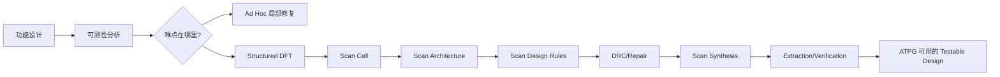
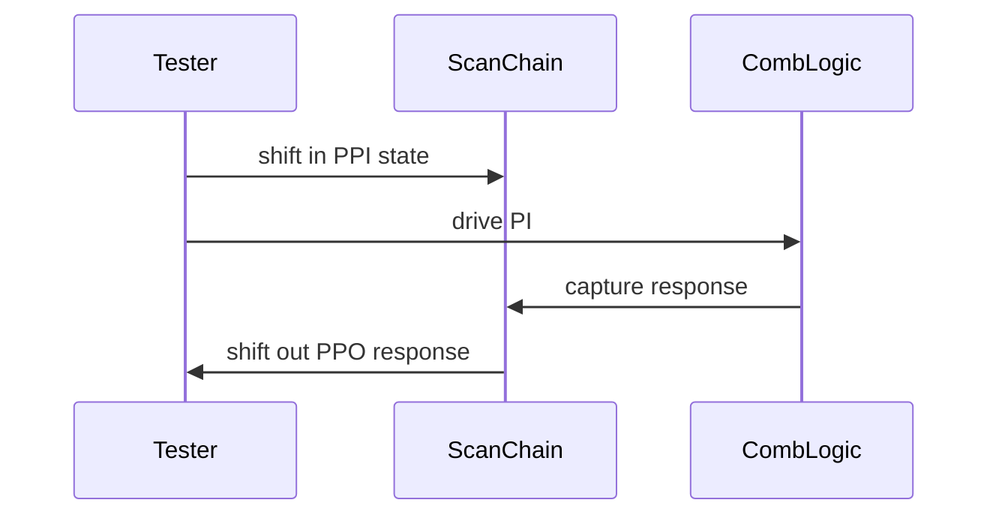
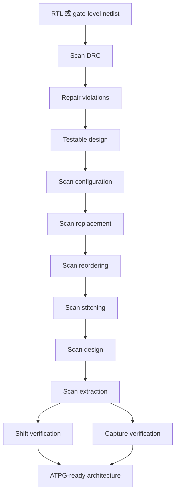

# Chapter 2 Design for Testability

> 本笔记只整理教材 Chapter 2，不提前展开后续章节。默认按工作工程师深度讲解：既解释直觉，也保留能用于网表、DFT 工具和比赛排障的工程细节。

> **公式兼容说明：**为兼容 Obsidian 与 VS Code Office Viewer，本文公式使用 HTML 下标标签和 Unicode 运算符，避免依赖 MathJax 数学定界符。

## 2.0 本章速览

Chapter 2 的主线是：**先量化哪里难测，再用 DFT 结构把难测的时序电路变成容易处理的扫描结构，最后用规则、流程和 RTL 方法保证这种改造不破坏功能。**



本章最重要的三个工程判断：

1. `controllability` 是“能否从输入把内部节点设成想要的值”；`observability` 是“内部差异能否传到输出被看见”。
2. 全扫描（`full-scan`）通过把存储元件串成 `scan chain`，把难的 `sequential ATPG` 转化成相对简单的 `combinational ATPG`。
3. 扫描不是“替换触发器后串起来”这么简单；clock、reset、三态总线、跨时钟域、竞态、物理布线和验证都可能使扫描失效。

## 2.0.1 学习目标

学完本章，应能：

- 解释 `testability`、`controllability`、`observability` 与 `fault coverage` 的关系；
- 手算基本门的 SCOAP `CC0`、`CC1`、`CO`，并知道时序版本 `SC0`、`SC1`、`SO` 在哪里增加成本；
- 区分 topology-based、probability-based、simulation-based 和 RTL testability analysis；
- 说明 `Ad Hoc DFT` 与 `Structured DFT` 的差异，并判断何时需要 `test point insertion`；
- 画出并解释 `Muxed-D`、`clocked-scan`、`LSSD` 三类 scan cell 的数据通路与时钟关系；
- 解释 full-scan、partial-scan、random-access scan 的取舍；
- 根据扫描规则识别 gated clock、derived clock、tristate bus、combinational feedback loop、异步 set/reset 等风险；
- 读懂 scan design flow，并知道 DRC、scan synthesis、scan extraction、scan verification 各自回答什么问题；
- 说明 enhanced scan、snapshot scan、error-resilient scan 的目标；
- 理解为什么 testability 问题应尽早在 RTL 层发现和修复。

## 2.0.2 知识地图

| 节点                     | 前置关系           | 关键产出                 | 掌握等级     |
| ------------------------ | ------------------ | ------------------------ | ------------ |
| 2.1 DFT 背景             | 数字逻辑、制造测试 | 为什么需要 DFT           | 【必须掌握】 |
| 2.2 Testability Analysis | 逻辑门、故障模型   | 可控性/可观测性分数      | 【必须掌握】 |
| 2.3 DFT Basics           | 2.2                | TPI 与结构化 DFT         | 【必须掌握】 |
| 2.4 Scan Cell            | 触发器、锁存器     | SI/DI/SE/时钟切换        | 【必须掌握】 |
| 2.5 Scan Architecture    | Scan Cell          | full/partial/RAS         | 【必须掌握】 |
| 2.6 Scan Design Rules    | Scan Architecture  | 可移位、可捕获、安全测试 | 【必须掌握】 |
| 2.7 Scan Design Flow     | 2.6                | DRC→synthesis→verify   | 【必须掌握】 |
| 2.8 Special-Purpose Scan | 基本 scan          | delay/debug/soft error   | 【理解即可】 |
| 2.9 RTL DFT              | RTL、综合          | 提前修复与复用           | 【必须掌握】 |
| 2.10–2.11 总结与练习    | 全章               | 自测与实验入口           | 【必须掌握】 |

## 2.1 Introduction

### 2.1.1 从“设计”和“测试”分离到 DFT

早期 IC 设计中，设计工程师只实现功能，测试工程师在设计完成后再想办法筛出制造缺陷。小规模组合逻辑或浅层有限状态机还能用这种方式处理；进入 VLSI 后，内部状态数量和时序深度急剧增加，仅靠功能向量（`functional patterns`）很难把所有状态激励到并检查出来。

教材指出，20 世纪 80 年代大量依赖功能向量和 `fault simulation` 的方法，故障覆盖率通常难以超过约 80%。核心原因不是“向量数量不够”，而是内部状态很难从外部引导和确认。

### 2.1.2 DFT 的核心问题

制造测试通常只能直接操作 `primary inputs (PI)` 和 `primary outputs (PO)`。内部信号要被测试，必须完成两件事：

1. **激活（activate）**：把故障位置置于能产生差异的逻辑值；
2. **传播（propagate）**：让差异经过后续逻辑到达 PO 或某个可扫描观察点。

对于时序电路，还要先把内部存储元件置于正确状态，再在正确的时钟边沿捕获响应。这正是 `controllability` 和 `observability` 低时导致 ATPG 困难的地方。

### 2.1.3 Scan 作为结构化解决方案

扫描设计把选定的存储元件替换为 `scan cell`，并通过 `scan input (SI)` 与 `scan output (SO)` 串接为 `scan chain`。这样可以：

- 在 shift mode 串行写入内部状态；
- 在 capture mode 让组合逻辑运行并捕获响应；
- 再在 shift mode 串行读出响应。

测试问题于是从“如何用很长的功能序列到达内部状态”转成“如何加载一个组合逻辑测试向量并检查其响应”。这不是免费得到的能力，代价包括面积、时钟/布线、功耗、测试时间以及对功能时序的影响。

### 2.1.4 Scan 术语范围

- `full-scan`：所有存储元件都替换为 scan cell；
- `almost full-scan`：只留下少量非扫描存储元件；
- `partial-scan`：只扫描一部分存储元件，通常仍需 `sequential ATPG`；
- `pipelined/feed-forward partial-scan`：选择 scan cell 打断时序反馈，使结构图变成无环图；
- `balanced partial-scan`：把 `sequential depth` 控制在目标范围内；
- `random-access scan (RAS)`：用地址机制单独读写 scan cell，而不是整条链移位。

**掌握等级：**【必须掌握】为什么扫描能把时序测试简化为组合测试，以及这种简化的硬件代价。

## 2.2 Testability Analysis

### 2.2.1 Testability、Controllability、Observability

`testability` 是测试一个逻辑电路所需工作量或成本的相对度量。教材默认只有 PI 能直接控制、PO 能直接观测。

- `controllability`：从 PI 把内部信号线设为所需逻辑值的难度；
- `observability`：内部信号发生变化后，把这个变化传播到 PO 的难度；
- `fault coverage`：给定测试集合检测到的目标故障比例。

可测性分析的作用不是直接生成所有向量，而是为 ATPG、测试点选择和早期设计决策提供“哪里更难”的依据。

### 2.2.2 SCOAP Testability Analysis

SCOAP（`Sandia Controllability/Observability Analysis Program`）是基于门级拓扑的快速分析方法。它为每个信号 s 计算六个数：

| 指标              | 含义                          | 数值越大/越小代表 |
| ----------------- | ----------------------------- | ----------------- |
| CC<sub>0</sub>(s) | 组合逻辑中控制 s=0 的成本     | 越大越难          |
| CC<sub>1</sub>(s) | 组合逻辑中控制 s=1 的成本     | 越大越难          |
| CO(s)             | 组合逻辑中在 PO 观察 s 的成本 | 越大越难          |
| SC<sub>0</sub>(s) | 时序逻辑中控制 s=0 的成本     | 越大越难          |
| SC<sub>1</sub>(s) | 时序逻辑中控制 s=1 的成本     | 越大越难          |
| SO(s)             | 时序逻辑中观察 s 的成本       | 越大越难          |

组合指标大致反映要操纵多少逻辑条件；时序指标大致反映要跨过多少个存储元件/时钟周期。边界条件为：PI 的 CC<sub>0</sub>=CC<sub>1</sub>=1、SC<sub>0</sub>=SC<sub>1</sub>=0，PO 的 CO=SO=0。


#### 2.2.2.1 Combinational Controllability and Observability Calculation

组合可控性从 PI 向 PO 正向计算，通常先进行 `levelization`，保证计算某个门输出时其所有输入已经有分数。组合可观测性从 PO 向 PI 反向计算。

##### 2.2.2.1.1 基本门的可控性规则

对 y=a & b：

<div class="math-block">CC<sub>0</sub>(y)=min{CC<sub>0</sub>(a),CC<sub>0</sub>(b)}+1</div>

<div class="math-block">CC<sub>1</sub>(y)=CC<sub>1</sub>(a)+CC<sub>1</sub>(b)+1</div>

y=0 只需 a 或 b 一个为 0，所以取 `min`；y=1 要求两者都为 1，所以成本相加。`+1` 表示再经过一级逻辑门。

对 y=a | b：

<div class="math-block">CC<sub>0</sub>(y)=CC<sub>0</sub>(a)+CC<sub>0</sub>(b)+1</div>

<div class="math-block">CC<sub>1</sub>(y)=min{CC<sub>1</sub>(a),CC<sub>1</sub>(b)}+1</div>

对 y=~ a：

<div class="math-block">CC<sub>0</sub>(y)=CC<sub>1</sub>(a)+1，CC<sub>1</sub>(y)=CC<sub>0</sub>(a)+1</div>

NAND/NOR 先按 AND/OR 的输入条件推理，再交换输出目标值。

对 XOR：输出为 0 需要输入相同（`00` 或 `11`），输出为 1 需要输入不同（`01` 或 `10`）：

<div class="math-block">CC<sub>0</sub>(a⊕b)=min{CC<sub>0</sub>(a)+CC<sub>0</sub>(b)，CC<sub>1</sub>(a)+CC<sub>1</sub>(b)}+1</div>

<div class="math-block">CC<sub>1</sub>(a⊕b)=min{CC<sub>0</sub>(a)+CC<sub>1</sub>(b)，CC<sub>1</sub>(a)+CC<sub>0</sub>(b)}+1</div>

##### 2.2.2.1.2 基本门的可观测性规则

观察 AND/NAND 的输入 a 时，其他输入必须设成非控制值 `1`，否则其他输入为 0 会把输出固定为 0：

<div class="math-block">CO(a)=CO(y)+CC<sub>1</sub>(b)+1</div>

观察 OR/NOR 的输入 a 时，其他输入必须设成非控制值 `0`：

<div class="math-block">CO(a)=CO(y)+CC<sub>0</sub>(b)+1</div>

NOT/BUFFER 只有一条传播路径：

<div class="math-block">CO(a)=CO(y)+1</div>

若主干 `stem` 有多个分支，任意一个分支能把变化带到输出即可，因此：

<div class="math-block">CO(stem)=min<sub>i</sub> CO(branch<sub>i</sub>)</div>

##### 2.2.2.1.3 全加器图的读法

教材 Figure 2.1 的每条线写成：

```text
v1 / v2 / v3 = CC0 / CC1 / CO
```

例如 `3/3/2` 表示**控制为 0 的成本为 3、控制为 1 的成本为 3、从输出观察的成本为 2**。计算顺序是：

1. 以 A、B、C<sub>in</sub> 为边界，向 PO 正向计算 `CC`；
2. 以 `Sum`、C<sub>out</sub> 为边界，向 PI 反向计算 `CO`。


##### 2.2.2.1.4 工程示例

若 y=a & b 且 a、b 都是 PI，则 CC<sub>0</sub>(a)=CC<sub>1</sub>(a)=CC<sub>0</sub>(b)=CC<sub>1</sub>(b)=1。于是：

<div class="math-block">CC<sub>0</sub>(y)=min{1,1}+1=2</div>

<div class="math-block">CC<sub>1</sub>(y)=1+1+1=3</div>

AND 输出为 1 比为 0 难，因为为 1 必须同时满足两个输入条件。对 stuck-at fault，检测 stuck-at-0 需要正常值把节点激励为 1，检测 stuck-at-1 需要正常值把节点激励为 0；随后还要用 `CO` 把差异传播出去。

#### 2.2.2.2 Sequential Controllability and Observability Calculation

时序指标的关键差别：**经过组合逻辑门本身不按门级逐次加 1，经过触发器、锁存器等存储元件时才增加存储/时钟成本**。

对 d=a | b：

<div class="math-block">SC<sub>0</sub>(d)=min{SC<sub>0</sub>(a),SC<sub>0</sub>(b)}</div>

<div class="math-block">SC<sub>1</sub>(d)=SC<sub>1</sub>(a)+SC<sub>1</sub>(b)</div>

若 D 触发器的输出 q 通过上升沿更新，则把 d 的值送到 q 通常需要一个时钟沿，因此 `SC` 公式会增加 1。异步 reset 可以在不施加时钟的情况下改变 q，所以可能形成比数据端更便宜的控制路径。

**易错点：**`CC` 的 `+1` 是逻辑层成本；`SC` 的 `+1` 主要是跨存储元件/时钟拍，不能把二者混为“门数”。SCOAP 仍是启发式估计，在 reconvergent fanout 很多时可能失真。

**掌握等级：**【必须掌握】`min` 表示“**多条可行路径选最容易**”，`sum` 表示“**多个条件必须同时满足**”；能解释 AND/OR 的观察条件。

控制
- 要满足“或者” → 取 min
- 要满足“并且” → 成本相加
- 经过组合门 → CC 加 1

观察
- 先把其他输入设为非阻塞值
- 再加上传播路径的观察成本
- 经过组合门 → CO 加 1

时序
- 经过触发器/存储元件 → SC/SO 加 1
- 故障测试
- 先把故障激活
- 再把错误传播到输出

因此可以粗略写成：
\[
\text{检测难度}
\approx
\text{控制难度}
+
\text{观察难度}
\]
### 2.2.3 Probability-Based Testability Analysis

概率型分析针对随机或伪随机测试，定义：

- C<sub>0</sub>(s)：随机输入下把 s 得到 0 的概率；
- C<sub>1</sub>(s)：随机输入下把 s 得到 1 的概率；
- O(s)：在 PO 观察到 s 的概率。

对信号 s：
\[
C_0(s)=P(s=0)
\]\[
C_1(s)=P(s=1)
\]\[
O(s)=P(\text{s 的变化能传播到某个主输出})
\]因为信号只有 0 和 1 两种状态：
\[
C_0(s)+C_1(s)=1
\]注意：

- C0/C1 是“信号取某个值的概率”；
- O 不是信号为 1 的概率；
- O 是“信号发生变化后，输出能否看见这个变化”的概率。
  如果主输入是均匀随机的：
  \[
  C_0(\text{PI})=C_1(\text{PI})=0.5
  \]主输出直接可观察，因此：
  \[
  O(\text{PO})=1
  \]
  
边界通常设为 PI 的 C<sub>0</sub>=C<sub>1</sub>=0.5、PO 的 O=1，且 C<sub>0</sub>(s)+C<sub>1</sub>(s)=1。**和 SCOAP “大数更难”不同，概率指标是“概率越小越难”**。

对独立输入的 AND：

<div class="math-block">C<sub>1</sub>(y)=∏<sub>i</sub> C<sub>1</sub>(x<sub>i</sub>)，C<sub>0</sub>(y)=1-C<sub>1</sub>(y)</div>

对 OR：

<div class="math-block">C<sub>0</sub>(y)=∏<sub>i</sub> C<sub>0</sub>(x<sub>i</sub>)，C<sub>1</sub>(y)=1-C<sub>0</sub>(y)</div>

对 AND 的某个输入 a，随机可观测性近似为输出观测概率乘以其他输入为 1 的概率：

<div class="math-block">O(a)=O(y)×C<sub>1</sub>(b)（二输入 AND）</div>

概率很小的信号容易成为 `random-pattern resistant (RP-resistant)` 故障。逻辑 BIST 使用随机/伪随机向量时，常通过插入测试点改善这些概率。

**与 SCOAP 的区别：** SCOAP 衡量确定性结构成本；概率型方法衡量随机向量“碰巧命中”的机会。一个节点可能确定性不难，但随机概率极低，因而在 BIST 中仍然难测。

**掌握等级：**【必须掌握】知道指标方向相反（SCOAP 大数难，概率小数难）和它服务于 BIST 的原因；具体 XOR/XNOR 概率公式【理解即可】。

### 2.2.4 Simulation-Based Testability Analysis

`SCOAP` 和概率型方法只看拓扑，速度快但忽略真实向量相关性，尤其容易在 reconvergent fanout 下不准。仿真型方法使用一组随机、伪随机或已有功能向量：

1. 对样本向量执行 logic simulation 或 fault simulation；
2. 统计每条信号出现 0、1、0→1、1→0 的次数；
3. 找出几乎不翻转、难以控制或难以观察的信号；
4. 必要时推荐 test point 或其他可测性增强。

`RRFA (random resistant fault analysis)` 可用少量随机向量的故障仿真统计识别 RP-resistant 信号和信号相关性。优点是更贴近真实行为，缺点是仿真时间长，所以通常用于高故障覆盖率、生命攸关或任务攸关产品的增强决策。

**掌握等级：**【理解即可】能说清“静态快但近似、动态慢但更贴近行为”的取舍。

### 2.2.5 RTL Testability Analysis

在门级修复可测性可能引入面积/时序损失，并需要反复综合。RTL 分析尝试在更高抽象层提前发现问题。

#### 2.2.5.1 Structure Graph 与 Sequential Depth

数据通路可表示成结构图：顶点 v<sub>i</sub> 代表寄存器，从 v<sub>i</sub> 到 v<sub>j</sub> 的边代表一段组合功能块。结构图最大层级称为 `sequential depth`，可近似表示控制/观察非扫描状态需要的时钟周期数。

- 组合逻辑块：`sequential depth=0`；
- full-scan：所有存储元件可直接移位访问，`sequential depth=0`；
- partial-scan：替换一个存储元件相当于从结构图移除一个顶点。

打断反馈环路可以把时序 ATPG 简化；但移除太多顶点会带来扫描面积和性能开销，因此是覆盖率与成本的优化问题。

#### 2.2.5.2 RTL DAG 与高层操作

另一类 RTL 方法把每个功能块建模为 DAG：内部节点是加法、比较、数据传输、逻辑运算等多 bit 高层操作，边是可能由多 bit 组成的信号。RTL 的再汇聚扇出通常比门级少，因此有时更准确且更快，但在复杂 RTL 上自动增强仍有挑战。

**掌握等级：**【必须掌握】为什么把 DFT 问题前移到 RTL 可以减少综合迭代；结构图的“寄存器顶点、功能块边、最大层级”。

## 2.3 Design for Testability Basics

### 2.3.1 为什么需要结构化 DFT

组合逻辑层级越深，可测性通常越差；时序逻辑还额外面对大量内部状态。早期 `Ad Hoc` 方法依赖经验做局部修改，改善通常是真实的，但效果不可预测、难自动化、难预估工期。

`Structured DFT` 把测试结构纳入设计流程，结果更可预算、更可自动化。Scan design 是本章重点，因为它以统一结构改善存储元件的可控性和可观测性。

### 2.3.2 Ad Hoc Approach

典型经验规则包括：

| 编号 | 经验规则           | 目的                                   |
| ---- | ------------------ | -------------------------------------- |
| A1   | 插入 test point    | 提高局部 controllability/observability |
| A2   | 避免异步 set/reset | 减少扫描状态不可控                     |
| A3   | 避免组合反馈环     | 减少振荡/未知状态                      |
| A4   | 避免冗余逻辑       | 减少不可观测或不可激励逻辑             |
| A5   | 避免异步逻辑       | 让时序更可预测                         |
| A6   | 划分大电路         | 降低分析和测试复杂度                   |

#### 2.3.2.1 Test Point Insertion

`TPI` 有两种基本类型：

- `observation point (OP)`：捕获低可观测性节点，再通过观察移位寄存器移出；
- `control point (CP)`：通过 MUX 在正常源值和测试寄存器值之间选择，测试时强制目的端。

典型 OP/CP 都可由 MUX、D 触发器和串行连接构成。`SE` 或 `TM` 决定正常路径与测试路径。

**图逻辑文字化：**OP 在 capture 时把内部节点装入 DFF，在 shift 时把多个 DFF 当移位寄存器读出；CP 在 shift 时先把期望值移入 DFF，在 test mode 选择 DFF 输出驱动原目的端。CP 会给功能路径增加 MUX 延迟，因此不应随意放在 critical path；若同时需要控制和观察，优先使用 `scan point`。

共享测试点（例如用 XOR 合并多个低可观测节点）可降低面积，但可能增加布线难度和诊断歧义。

**掌握等级：**【必须掌握】CP 改善 controllability、OP 改善 observability，以及“功能影响/面积/路由”三者的取舍。

### 2.3.3 Structured Approach：三种扫描模式

扫描设计通常有三种模式：

| 模式             | 扫描单元选择 | 主要动作               |
| ---------------- | ------------ | ---------------------- |
| `normal mode`  | DI/功能输入  | 按原设计运行           |
| `shift mode`   | SI/扫描输入  | 串行移入或移出状态     |
| `capture mode` | DI/功能输入  | 运行组合逻辑并捕获响应 |

一个典型测试序列是：



这里 `PPI (pseudo primary input)` 是扫描单元 Q 输出，`PPO (pseudo primary output)` 是扫描单元 D/DI 输入。PI/PPI 都可控制，PO/PPO 都可观察；区别只在于 PI/PO 并行访问，PPI/PPO 经 scan chain 串行访问。

## 2.4 Scan Cell Designs

### 2.4.1 Scan Cell 的共同抽象

每个 scan cell 至少有两类输入：

- `DI`：组合逻辑的数据输入；
- `SI`：前一个 scan cell 的扫描输出，用于形成 scan chain。

扫描模式选择机制必须保证：normal/capture 选择 DI，shift 选择 SI。

### 2.4.2 Muxed-D Scan Cell

结构：`MUX + D flip-flop`，`SE` 控制 MUX。

| `SE` | 模式           | DFF 在时钟沿采样 |
| ------ | -------------- | ---------------- |
| 0      | normal/capture | `DI`           |
| 1      | shift          | `SI`           |

优点：兼容现代单时钟边沿触发设计，EDA 工具支持成熟。缺点：每个 cell 在功能数据路径上增加 MUX 延迟；跨时钟域或不同边沿时需要额外处理。

对于锁存器替换，可使用由 MUX、D latch 和 DFF 组成的电平敏感/边沿触发变体：正常/捕获保持电平敏感，移位用边沿触发。


### 2.4.3 Clocked-Scan Cell

Clocked-scan cell 也有 DI 和 SI，但不用 MUX/SE 选择，而用两个独立时钟：

- `DCK`：normal/capture 时采样 DI；
- `SCK`：shift 时采样 SI。

优点：数据输入路径不增加 MUX 延迟，功能性能较好。缺点：需要额外的 shift clock routing，时钟规划和物理实现更复杂。

### 2.4.4 LSSD Scan Cell

`LSSD (level-sensitive scan design)` 主要面向 latch-based 设计。典型 polarity-hold `SRL` 含 master latch L<sub>1</sub> 和 slave latch L<sub>2</sub>，使用 `C/A/B` 时钟在功能数据和扫描数据之间切换。

为了 race-free operation，`A/B/C` 必须以 nonoverlapping 方式施加。shift 时用 A、B 依次把 SI 送入 L<sub>1</sub>、L<sub>2</sub>；capture 时用 C、B 把功能数据加载到扫描状态。

优点：支持锁存器设计，并在满足不重叠时钟规则时保证无竞态。缺点：需要额外时钟，布线复杂度和时钟约束更高。

**三类 cell 对比：**

| Cell         | 选择方式       | 功能路径代价    | 适用设计    | 主要风险                |
| ------------ | -------------- | --------------- | ----------- | ----------------------- |
| Muxed-D      | MUX +`SE`    | 有 MUX delay    | 单时钟 DFF  | 关键路径退化、跨域 skew |
| Clocked-scan | `DCK/SCK`    | DI 无 MUX delay | 边沿触发    | 额外时钟布线            |
| LSSD         | 多个不重叠时钟 | 锁存器级联      | latch-based | 时钟相位/竞态/布线      |

**掌握等级：**【必须掌握】能从 SI/DI、模式信号或时钟判断 shift/capture 数据走哪条路径。

## 2.5 Scan Architectures

### 2.5.1 Full-Scan Design

所有存储元件替换为 scan cell，并在 shift 时组成一条或多条 scan chain。组合逻辑的输入（PI + PPI）均可控制，输出（PO + PPO）均可观察，因此主要测试工作可交给 `combinational ATPG`。

几乎全扫描（`almost full-scan`）会把少量关键路径或小 clock domain 的存储元件排除在外，代价是这些非扫描元件可能降低 fault coverage。

#### 2.5.1.1 Muxed-D Full-Scan 的操作

以三条扫描单元为例：

1. `SE=1`，施加若干 shift clock，把 V<sub>1</sub>:PPI 串入；
2. 加 hold cycle，让全局 `SE` 从 1 稳定到 0，同时把 V<sub>1</sub>:PI 施加到外部输入；
3. `SE=0`，施加 capture clock，把组合逻辑响应捕获进 scan cell；
4. 再加 hold cycle，把 `SE` 切回 1；
5. 下一轮 shift 时，一边移出 V<sub>1</sub> 响应，一边移入 V<sub>2</sub>:PPI。

教材 Figure 2.14 中 `S`、`C`、`H` 分别代表 shift、capture、hold。hold 不是“多余空拍”，而是给模式控制和全局布线信号稳定的时间。

#### 2.5.1.2 Clocked Full-Scan

功能与 Muxed-D full-scan 相同，但 shift/capture 通过分别施加 `SCK` 和 `DCK` 区分，不使用 `SE` 控制 MUX。核心取舍是性能与时钟布线之间的交换。

#### 2.5.1.3 LSSD Full-Scan

LSSD 可做 single-latch 或 double-latch。latch-based 设计通常需要至少两个不重叠系统时钟 C<sub>1</sub>、C<sub>2</sub>，以避免组合反馈和竞态。shift 用 A/B，capture 用 C<sub>1</sub>/C<sub>2</sub>。

**易错点：**full-scan 的“组合化”只针对被扫描存储元件之间的组合逻辑；留下的 non-scan storage、异步控制和跨时钟域仍然可能保留时序复杂度。

### 2.5.2 Partial-Scan Design

只把部分存储元件替换为 scan cell。优点：较小面积开销和功能性能退化；缺点：非扫描状态仍需被间接控制/观察，通常需要 sequential ATPG，测试生成时间更长，fault coverage 可能较低，对 debug/diagnosis 支持也较弱。

扫描单元选择策略：

- **功能划分**：数据通路上的关键存储元件不扫描，控制部分优先扫描；
- **Pipelined/feed-forward**：在结构图中选择顶点打断所有时序反馈环路，使图成为 DAG；
- **Balanced partial-scan**：把 sequential depth 限制在目标值（如 3–5），以多时帧组合 ATPG 换取较低开销。

把反馈环路全部打断是一个最小顶点集问题，但不一定要打断所有小环路；保留自环/小环路有时能在更小开销下得到相近覆盖率。

### 2.5.3 Random-Access Scan Design

串行 scan 的优点是相邻 cell 连接、布线开销低；缺点是单独更新某个 cell 会影响同链其他 cell，shift 翻转活动可能导致高测试功耗。

`RAS` 用行列译码和地址寄存器随机读写任意 scan cell，减少不必要的移位和功耗，但代价是地址逻辑、cell 结构和布线开销高，测试时间不一定总能减少。

`PRAS (progressive random-access scan)` 逐行使能，只需并行提供列地址，并用 `MISR` 压缩响应。其关键优化目标是减小下一测试向量与上一响应之间的汉明距离，从而少更新 scan cell。

**掌握等级：**【必须掌握】full-scan/partial-scan/RAS 的访问方式与覆盖率、面积、功耗、测试时间取舍；PRAS 内部算法细节【理解即可】。

## 2.6 Scan Design Rules

扫描规则的目标是保证两件事：**shift 能安全完成，capture 的期望响应可被 ATPG 确定性预测。**“avoid”规则要在 shift 和 capture 全程修复；“avoid during shift”只需在 shift 修复。

### 2.6.1 Tristate Buses

shift 时扫描单元输出会变化，可能让多个三态驱动器同时开启并产生 bus contention。常见修复是 test mode 下强制只开启一个 driver，其他 enable 置 0。

浮空总线也会导致 fault coverage loss，因为其值不可预测，难以测试 enable 上的 stuck-at-1。可加入 pull-up、pull-down 或 bus keeper。

### 2.6.2 Bidirectional I/O Ports

shift 时双向 I/O 的方向控制可能随扫描数据改变，导致芯片输出与 tester 驱动相冲突。常见修复是 `SE=1` 时强制端口为输入或关闭输出三态缓冲器；capture 时再由测试向量决定输入/输出角色。

### 2.6.3 Gated Clocks

clock gating 虽可降功耗，但会使部分 scan cell 的时钟不能由外部直接控制。至少在 shift 期间要旁路/强制 clock enable：

- 用 `TM` 强制整个测试期间开启：简单，但 clock-gating 逻辑本身可能不可测；
- 用 `SE` 只在 shift 开启：覆盖率更好，但 capture ATPG 更复杂。

### 2.6.4 Derived Clocks

PLL、分频器、脉冲发生器或内部存储元件产生的派生时钟无法直接由 PI 控制。测试期间应通过 MUX 旁路，用可控外部时钟驱动相关 scan cell；否则 ATPG 无法可靠控制和捕获。

### 2.6.5 Combinational Feedback Loops

组合反馈环可能因反相级数不同表现为时序行为或振荡，环路中的值难以控制/确定。最佳修复是重写产生环路的 RTL；无法重写时，可插入 scan point 并用 `TM` 在 shift/capture 期间断开环路。

### 2.6.6 Asynchronous Set/Reset Signals

非 PI 直接控制的异步 set/reset 可能在 shift 中清空或置位 scan cell，使移位数据无法保持。通常要求 shift 期间强制其处于 inactive。

修复策略取舍：

- `TM`：整个测试期间禁用异步控制，简单但异步逻辑内部 fault 不可测；
- `SE`：只在 shift 禁用，覆盖率较高但可能有时钟/异步端口竞争；
- 独立 `RE`：把测试分两阶段，兼顾数据 fault 和异步控制逻辑 fault，是更稳妥但测试生成更复杂的方案。

### 2.6.7 跨时钟域与 Capture 时序

跨 clock domain 数据路径在同时施加时钟时可能因 skew 产生 mismatch。教材给出的约束是：

<div class="math-block">clock skew < data path delay + clock-to-Q delay of the originating clock</div>

若无法满足，可使用：

- `staggered clocking`：不同 clock domain 顺序施加；
- `one-hot clocking`：每次 capture 只施加一个 clock；
- `clock grouping`：识别不相互作用的 clock，允许它们同时施加以减少模式数量。

## 2.7 Scan Design Flow

### 2.7.1 总体流程



流程不是只跑一次工具：scan synthesis 后可能产生新违例，因此通常还要重新 DRC；shift/capture verification 分别检查链路完整性和捕获时序/期望响应。

### 2.7.2 Scan Design Rule Checking and Repair

第一步把原始设计变成 `testable design`：识别并修复所有影响 fault coverage 或 shift/capture 正确性的结构。跨时钟域还要分析 clock skew、数据路径延迟、clock-to-Q，决定同时、交错还是独热施加 clock。

### 2.7.3 Scan Synthesis

扫描综合应保持 normal mode 功能等价。现代工具可能把 DFT 修复和 scan synthesis 集成到 one-pass/single-pass synthesis。典型四步：

#### 2.7.3.1 Scan Configuration

决定 scan chain 数量、scan cell 类型、排除哪些存储元件、每条链的排列。链越多，最大链长通常越短、测试时间越少，但受可用 tester channel、高速 I/O 时序和额外布线限制。

#### 2.7.3.2 Scan Replacement

把符合条件的存储元件替换为功能等价的 scan cell；关键路径、安全/加密区域或特殊 clock domain 可标记 `don't scan`。

#### 2.7.3.3 Scan Reordering

根据 clock domain、物理位置和布线约束重新排列 scan cell，目标是平衡链长、降低跨域风险和布线拥塞。

#### 2.7.3.4 Scan Stitching

把各 cell 的 SO→SI 串接，接入 scan input/output。跨时钟域、混合正负边沿或相邻 cell 时序不安全时，要使用 lock-up latch/flip-flop 等结构（具体实现取决于工具和 clocking 方案）。

### 2.7.4 Scan Extraction

从生成后的扫描设计中追踪每条链的真实连接，提取 cell 顺序、链长、时钟域、SI/SO 和控制信号，形成 ATPG 使用的 scan architecture 描述。Extraction 不是形式上的“导出文件”，而是检查工具实际连成了什么。

### 2.7.5 Scan Verification

#### 2.7.5.1 Shift Verification

使用 `flush test` 把已知序列移入，再移出并比较位序，验证 SI→cell→SO 的链路、极性、时钟和异步控制。任何位移错位都可能意味着 stitching、clock skew、reset 或 cell 顺序问题。

#### 2.7.5.2 Capture Verification

使用 broadside-load 或等价 capture 测试，比较 zero-delay ATPG/故障仿真模型与 full-timing 仿真的响应，重点检查跨 clock domain、gated clock、异步控制和 hold cycle。

### 2.7.6 Scan Design Costs

工程上至少同时预算：

- **面积**：MUX、额外锁存器、控制逻辑、lock-up、译码/MISR；
- **性能**：Muxed-D 的功能路径延迟、时钟负载；
- **功耗**：shift 翻转、capture at-speed 活动、IR drop；
- **测试时间/数据量**：链长、链数、模式数、压缩效率；
- **验证成本**：DRC、LEC、仿真和故障覆盖率闭环。

## 2.8 Special-Purpose Scan Designs

### 2.8.1 Enhanced Scan

目标是 delay fault testing。延迟测试需要以工作频率施加一对向量 ⟨V<sub>1</sub>,V<sub>2</sub>⟩，先初始化，再产生转换并在 at-speed 捕获。Enhanced scan 在每个 scan cell 增加保持第二个 bit 的 latch，使 V<sub>1</sub> 和 V<sub>2</sub> 可以连续施加，而不是被功能相关性限制。

优点：高 delay fault coverage。代价：额外 latch、UPDATE 与 CK 的严格时序、可能激活 false path 导致 over-test。常规 launch-on-shift/launch-on-capture 可在覆盖率、真实路径和复杂度之间折中。

### 2.8.2 Snapshot Scan

目标是 system debug、diagnosis 和 failure analysis。它在不打断功能运行的情况下捕获内部存储状态快照，再通过 scan chain 读出；也可以把测试数据写回系统锁存器以复现故障状态。

核心价值是把“只能看到少量 PO”升级为“能观察内部状态”，代价是额外 scan cell 和面积。

### 2.8.3 Error-Resilient Scan

目标是正常系统运行期间的 soft error protection。软错误可能翻转存储状态，也可能由组合门瞬态被存储元件捕获。错误韧性 scan cell 用系统存储路径和 shadow scan 路径保存相同值，再用 `C-element` 和 bus keeper 在两路不一致时保持旧值，避免瞬态差异传播到 Q。

在 test mode，scan 部分负责 shift/capture；在 system mode，scan 部分像 shadow latch 一样与系统触发器同步，检测两路不一致。代价是更多锁存器、时钟、控制信号和面积。

**掌握等级：**【理解即可】知道三种特殊 scan 分别服务 delay、debug、soft error，不要求记住每个晶体管级实现。

## 2.9 RTL Design for Testability

### 2.9.1 为什么把 DFT 前移到 RTL

门级修复的典型问题是：每修一次都可能要重新综合，形成耗时闭环；门级插入也更容易带来不可预测的面积、功耗和时序变化。RTL 修复可以让综合和物理综合在全局信息下重新优化，并形成可复用的 testable RTL core。

可测性前移还便于在 RTL 集成 memory BIST、logic BIST、test compression、boundary scan 和 AMS BIST。

### 2.9.2 RTL Scan DRC and Repair

通常先做 fast synthesis，把组合 RTL 映射到组合基元和高层模型，并推断寄存器、clock domain 与极性；随后进行静态或动态 RTL testability checking。

RTL lint 可以加入 scan rule：检查 generated clock、异步控制、三态总线、编码风格和可复用性。对于 generated clock，可在 RTL 中用 `TM` 增加测试旁路，让测试时用可控 clock 驱动目标寄存器。

### 2.9.3 RTL Scan Synthesis

- `RTL scan synthesis`：在 RTL 中插入 scan equivalent 结构和 scan chain；
- `pseudo RTL scan synthesis`：不直接插入完整链，只指定 PPI/PPO 并与 PI/PO 串接，便于后续在 RTL 集成 BIST/压缩结构。

寄存器识别需确定所有 clock、寄存器边界、clock polarity 和所属 domain。串接时，利用 RTL 中“同一寄存器的多个 bit”信息顺序连接，通常比随机连接更能降低布线拥塞和互连面积。

### 2.9.4 RTL Scan Extraction and Verification

对 RTL scan design 做 fast synthesis 后，可以像门级一样提取 scan chain；使用 flush testbench 验证 RTL 与门级 scan 接口和操作一致。也可以在 RTL 使用 broadside-load/random/deterministic pattern 验证 capture。

**掌握等级：**【必须掌握】RTL DFT 的价值是减少综合迭代、提高复用和让工具进行全局优化；具体 pseudo RTL 实现【理解即可】。

## 2.10 Concluding Remarks

本章的闭环可压缩为：

1. 用 testability analysis 找到 controllability/observability 差的区域；
2. 用 Ad Hoc TPI 或 Structured scan 改善可测性；
3. 用 scan cell 和 scan architecture 访问内部状态；
4. 用 scan design rules 防止 shift/capture、时钟、复位和总线问题；
5. 用 DRC、synthesis、extraction、verification 形成可回归流程；
6. 把高层 DFT 问题尽可能在 RTL 发现并修复。

Chapter 2 的核心工程结论是：**扫描把“内部状态不可访问”这个根本问题结构化地解决了，但扫描本身也必须被设计、检查、验证和权衡。**

## 2.11 Exercises

下面按“先手算、再建模、最后跑工具”的顺序组织练习，不提前引入后续章节内容。

### 2.11.1 基础手算

1. 对三输入 XOR 及其 NAND-NOR 实现，按 SCOAP 规则计算所有 `CC0/CC1/CO`。
2. 对三输入 XNOR 及其 NAND-NOR 实现，假设 PI 的 C<sub>0</sub>=C<sub>1</sub>=0.5、PO 的 O=1，计算概率型指标。
3. 对 Figure 2.1 全加器重复概率型分析，并比较哪些节点对随机向量更敏感。
4. 对 n-bit ripple-carry adder，推导 a<sub>i</sub> 在 s<sub>k</sub> 处的可观测性如何随 k-i 变化。

### 2.11.2 结构与规则练习

1. 构造一个组合反馈环，说明为什么它会造成低可测性或振荡。
2. 用 XOR 网络把三个低可观测节点共享到一个 observation point，并讨论诊断歧义。
3. 为 clocked-scan cell 画出门级等价结构，说明 DCK 与 SCK 不能同时误触发。
4. 比较 LSSD single-latch 与 double-latch 的时钟和功能差异。
5. 对包含 gated clock、derived clock、异步 reset、三态总线的 RTL 设计，逐项写出 DRC 规则和修复策略。

### 2.11.3 Scan 时间与链路练习

1. 设有 m 条平衡 scan chain，每条长度 L，测试 n 个向量，按 shift/capture/hold 顺序推导总 clock cycle 数。
2. 已知上一向量与下一向量相差 d bit，比较 full-scan 和 RAS 更新所需周期，说明何时 RAS 才有优势。
3. 对 `SI → SFF_1 → ... → SFF_5 → SO` 的 flush 序列，定位错位响应可能对应的 cell，并设计 lock-up 修复。
4. 给出 clock grouping 的图算法：把 clock domain 作为顶点，跨域数据路径作为边，找出可同时施加的独立组。

### 2.11.4 工程实验建议

建议使用一个小型 Verilog 门级设计完成以下闭环：

1. 写一个含 3–5 个 DFF、一个 gated clock、一个异步 reset 和一个三态总线的 RTL；
2. 手工标注可能的 scan rule violations；
3. 改写为可扫描 RTL：加入 `TM/SE` 旁路、bus keeper 或强制方向；
4. 用 Yosys/网表脚本检查寄存器和 scan chain 连接；
5. 编写 flush testbench：移入已知 bit pattern，再移出并自动比对；
6. 编写 capture testbench：shift→hold→capture→shift-out，记录每条链的响应；
7. 用简单 Python/脚本实现 AND、OR、NOT 的 SCOAP 计算，与手算结果交叉验证；
8. 记录面积、链长、shift cycle、capture mismatch 和修复前后 fault coverage（若工具支持）。

验收标准：normal mode 与原 RTL 功能等价；shift 无位错、无意外 reset、无总线冲突；capture 响应可由测试模型重现；每个修复都能说明它改善的是 controllability、observability、时钟可控性还是安全性。

## 2.12 本章关键术语

| English                          | 中文与本章含义                                              |
| -------------------------------- | ----------------------------------------------------------- |
| `design for testability (DFT)` | 面向测试的设计，在设计阶段加入提高测试可控性/可观测性的结构 |
| `testability`                  | 测试成本或工作量的相对度量                                  |
| `controllability`              | 从 PI 设置内部信号的难度                                    |
| `observability`                | 把内部信号变化传播到 PO 的难度                              |
| `SCOAP`                        | 基于拓扑的六项可测性分析方法                                |
| `stuck-at fault`               | 固定型故障，如 stuck-at-0、stuck-at-1                       |
| `fault coverage`               | 测试集合检测到的目标故障比例                                |
| `ATPG`                         | automatic test pattern generation，自动测试向量生成         |
| `scan cell`                    | 具有功能数据路径和扫描数据路径的存储单元                    |
| `scan chain`                   | 由 scan cell 串成的移位寄存器                               |
| `shift operation`              | 串行装载/卸载扫描状态                                       |
| `capture operation`            | 让组合逻辑响应被存入 scan cell                              |
| `PI/PO`                        | primary input/output，外部主输入/输出                       |
| `PPI/PPO`                      | pseudo primary input/output，由 scan cell 提供的伪输入/输出 |
| `Muxed-D`                      | 用 MUX 和`SE` 选择 DI/SI 的扫描单元                       |
| `LSSD`                         | level-sensitive scan design，面向锁存器并依赖不重叠时钟     |
| `full-scan`                    | 所有存储元件扫描化                                          |
| `partial-scan`                 | 仅部分存储元件扫描化                                        |
| `random-access scan`           | 通过地址随机读写 scan cell                                  |
| `test point insertion`         | 插入 control/observation/scan point 改善局部可测性          |
| `lock-up latch`                | 缓解跨时钟域或混合边沿 shift 时序风险的锁存结构             |
| `clock grouping`               | 识别可同时施加的独立 clock domain                           |
| `scan extraction`              | 从实现后的设计追踪并提取真实 scan chain 结构                |

## 2.13 与比赛工程联系

本章不是只用于教材考试，它直接对应 Scan Insertion 比赛中的输入、修复和验收：

| Chapter 2 知识                | 比赛工程落点                      | 实际检查                                                 |
| ----------------------------- | --------------------------------- | -------------------------------------------------------- |
| controllability/observability | 解释 DRC/ATPG 为什么卡在某节点    | 找低可控/低可观测节点，决定 test point 或 scan 覆盖      |
| Muxed-D/clocked/LSSD          | 选择与 Liberty 库匹配的 scan cell | 检查 cell 类型、时钟极性、SI/SO 端口                     |
| full/partial scan             | 规划 scan architecture            | 统计扫描寄存器、非扫描寄存器、链长和链数                 |
| tristate/bidirectional        | 修复 shift 冲突                   | 检查 enable、I/O 方向、bus keeper                        |
| gated/derived clock           | 保障 scan clock 可控              | 检查 clock mux/bypass、TM/SE/RE 逻辑                     |
| async set/reset               | 防止 shift 状态被破坏             | 检查 reset 是否在 shift inactive，是否产生 race          |
| clock grouping                | 处理多时钟 capture                | 分析跨域边、skew 约束和 staggered/one-hot 策略           |
| scan design flow              | 组织自动化脚本                    | DRC → repair → synthesis → extraction → verification |
| RTL DFT                       | 降低迭代次数                      | 在 RTL lint/结构分析阶段拦截 generated clock、三态等问题 |
| scan verification             | 交付证据                          | flush test、capture test、报告和波形可回查               |

对当前比赛工作，最值得形成的最小闭环是：

```text
门级网表/Liberty
    → 识别 storage elements、clock/reset、三态和跨域关系
    → 扫描规则诊断与最小修复
    → scan replacement/stitching
    → flush/capture 验证
    → 报告链长、端口、时钟、故障覆盖与等价性证据
```

**暂时跳过：**本章没有必要在当前阶段实现完整 RAS、error-resilient cell 的晶体管级版图，也不需要提前学习 Chapter 3 之后的仿真算法；先把扫描结构、规则和验证闭环跑通。

## 2.14 掌握分级与复习清单

### 2.14.1 【必须掌握】

- 能用一句话解释 controllability 与 observability；
- 能手算 AND/OR/NOT 的 SCOAP 组合指标；
- 能解释 stuck-at fault 的激活与传播；
- 能画出 Muxed-D scan cell 和 shift/capture 时序；
- 能区分 full-scan、partial-scan、RAS；
- 能说明 gated clock、derived clock、异步 reset、三态总线为何影响扫描；
- 能描述 DRC、scan synthesis、extraction、verification 流程；
- 能解释为什么 RTL 修复比反复门级修复更适合大规模可复用设计。

### 2.14.2 【理解即可】

- 概率型 XOR/XNOR 的完整递推式；
- RRFA/STAFAN 的统计细节；
- LSSD 的全部时钟规则与 polarity-hold SRL 电路；
- PRAS 的 MISR 压缩和汉明距离优化；
- enhanced/error-resilient scan 的内部细节。

### 2.14.3 【暂时跳过】

- 扫描单元的晶体管级 CMOS 实现；
- 复杂多时钟 ATPG 的具体求解器算法；
- Chapter 3 的 logic/fault simulation 细节；
- Chapter 4/5 的完整 ATPG、BIST 和测试压缩算法。

## 2.15 参考文献

### 2.15.1 教材原文

- [教材 Chapter 2：Design for Testability](<../../../学习材料/DFT补强/VLSI%20Test%20Principles%20and%20Architectures%20-%20Design%20for%20Testability.md>)
- [Figure 2.1：SCOAP full-adder example](<../../../学习材料/DFT补强/assets/VLSI%20Test%20Principles%20and%20Architectures%28MinerU%29/image_26.jpg>)
- [Figure 2.9：Muxed-D scan cell](<../../../学习材料/DFT补强/assets/VLSI%20Test%20Principles%20and%20Architectures%28MinerU%29/image_34.jpg>)
- [Figure 2.27：Typical scan design flow](<../../../学习材料/DFT补强/assets/VLSI%20Test%20Principles%20and%20Architectures%28MinerU%29/image_62.jpg>)

### 2.15.2 教材引用的代表性来源

教材 Chapter 2 引用的代表性工作包括：Goldstein（SCOAP）、Williams/McCluskey（结构化 DFT 与 scan）、Eichelberger（LSSD）、Cheng（partial-scan）、Crouch（scan flow）、Mitra（error-resilient scan）。本笔记不扩展这些文献的后续章节内容；需要深入时应以教材 References 和原始论文为准。
