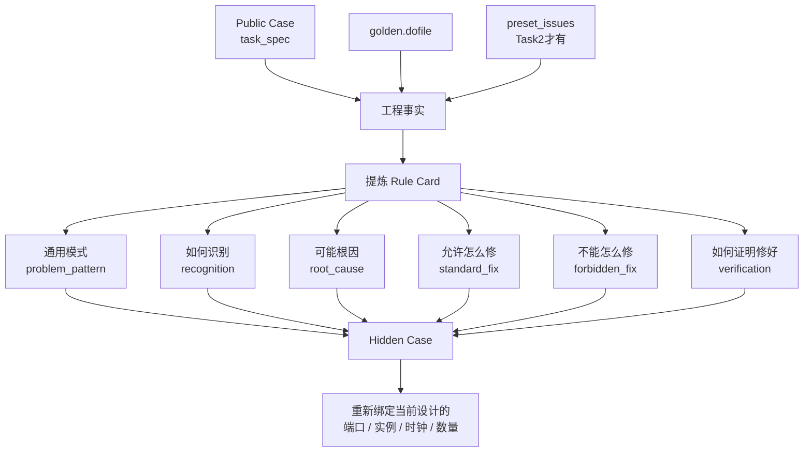

```mermaid

flowchart TD
    A["Public Case<br/>task_spec"] --> D["工程事实"]
    B["golden.dofile"] --> D
    C["preset_issues<br/>Task2才有"] --> D

    D --> E["提炼 Rule Card"]

    E --> F["通用模式<br/>problem_pattern"]
    E --> G["如何识别<br/>recognition"]
    E --> H["可能根因<br/>root_cause"]
    E --> I["允许怎么修<br/>standard_fix"]
    E --> J["不能怎么修<br/>forbidden_fix"]
    E --> K["如何证明修好<br/>verification"]

    F --> L["Hidden Case"]
    G --> L
    H --> L
    I --> L
    J --> L
    K --> L

    L --> M["重新绑定当前设计的<br/>端口 / 实例 / 时钟 / 数量"]
```

