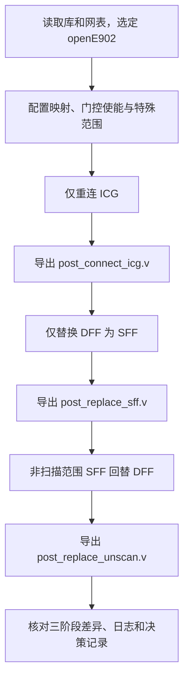

# Task1 Case1 解读：扫描前置处理的三个阶段

**T1C1 要完成的是“选对 ICG 重连对象、按功能替换扫描单元、把指定非扫描模块中的扫描单元回替”，最终停在前置处理阶段，不构建扫描链。**
## 1. 先把题目读成明确的输入输出

### 1.1 案例身份与输入

本例是 `官方材料/public_cases/task_1/case1`，简称 **T1C1**。

| 材料 | 作用 | 阅读时要提取什么 |
| --- | --- | --- |
| `input/task_spec.md` | 本例任务要求 | 操作范围、四组映射、特殊模块、阶段终点、输出清单 |
| `input/limitations.md` | 运行限制 | 整个 case 的 wall time 不超过 **150 秒** |
| `input/netlist/opene902.v` | 综合后的层级化门级网表 | 顶层 `openE902`、实例路径、引脚连接、既有单元类型 |
| `input/lib/sky130.lib` | 标准单元库 | 单元功能、扫描引脚、复位/置位功能与时序模型 |
| `input/golden.dofile` | 官方参考实现 | 将任务要求转成工具命令的一种写法 |

150 秒是整个案例执行预算，不是每轮工具调用各有 150 秒。任务书没有规定本例必须生成几条链或每条链多长，因为本例根本不建链。[S:5–16、75；L:5]

### 1.2 三个阶段

| 阶段         | 主要对象            | 发生的变化              | 导出文件                         |
| ---------- | --------------- | ------------------ | ---------------------------- |
| ICG 重连     | 符合条件的门控测试控制端    | 从原先常量 0 改接指定门控测试使能 | `post_connect_icg.v`         |
| DFF→SFF    | 可扫描的普通触发器       | 换成对应扫描触发器，保留相应功能属性 | `post_replace_sff.v`         |
| SFF→DFF 回替 | 指定非扫描模块内的既有 SFF | 回到普通触发器形式          | `post_replace_unscan.v`，最终网表 |

三个输出是同一设计连续处理后的快照，便于定位哪一步改错了；不能只导出最终网表，再复制成另外两个文件。[S:78–86；G:38–55]

下图只表达本例的处理顺序，不代表完整扫描测试流程。



## 2. 先理解三个容易混淆的概念

### 2.1 DFF、SFF 与扫描链

普通 DFF 在有效时钟沿采样功能数据 `D`。扫描触发器 SFF 增加了扫描数据输入和选择控制，典型的逻辑模型是：

```text
扫描使能无效：下一状态取功能数据 D
扫描使能有效：下一状态取扫描数据 SI（本库部分单元名为 SCD）
```

这里略去了复位、置位和使能等具体功能，实际替换必须保留它们。

**“替换成 SFF”只解决单个寄存器具备扫描能力的问题；“建链”还要将前一级的输出接到后一级的扫描数据输入，并安排链端口及顺序。** 本例要求前者，不做后者。因此看到网表中出现 `sdf*` 单元，不能直接说已经插好扫描链。

### 2.2 ICG 与扫描使能

ICG 是 Integrated Clock Gating，即**集成时钟门控单元**。它根据功能使能决定是否让时钟通过，以减少无用翻转。**测试控制入口**则让扫描测试能够控制门控，避免功能使能关闭时下游寄存器收不到所需时钟。

本例的实际单元是 `sky130_fd_sc_hd__sdlclkp_1`。网表中的门控封装与底层单元这样对应：[N:35646–35661]

```verilog
sky130_fd_sc_hd__sdlclkp_1 latch (
    .CLK(CLK),
    .GATE(EN),
    .SCE(TE),
    .GCLK(ENCLK)
);
```

| 封装引脚    | 底层引脚   | 职责       |
| ------- | ------ | -------- |
| `CLK`   | `CLK`  | 输入时钟     |
| `EN`    | `GATE` | 功能门控使能   |
| `TE`    | `SCE`  | 测试门控使能   |
| `ENCLK` | `GCLK` | 门控后的输出时钟 |

因此，任务书的“改 TE”和 golden 注释中的“改 SCE”可以指向同一条层级连接。不能因为底层单元没有名为 `TE` 的引脚，就认为网表缺失测试入口。库中也将此单元声明为 `latch_posedge_precontrol`，并包含时钟门控引脚属性。[B:163917 起]

注意：ICG 的 `SCE` **控制时钟是否通过**；SFF 的 `SCE` 控制采样功能数据还是扫描数据。名字相同，作用对象和职责不同。

### 2.3 两种“排除”分别控制什么

| 范围                              | 本例要求                 | golden 命令                                                   | 不能据此推导的结论                   |
| ------------------------------- | -------------------- | ----------------------------------------------------------- | --------------------------- |
| `x_cr_had_top`                  | 其下 ICG 不重连           | `set_dft_clock_gating_cfg -exclude_elements "x_cr_had_top"` | 不能据此断言该模块所有 FF 都不扫描         |
| `x_cr_core_top/x_cr_sys_io_pll` | 模块标为不可扫描，内部既有 SFF 回替 | `set_scan_element false "x_cr_core_top/x_cr_sys_io_pll"`    | 不能据此将整个 `x_cr_core_top` 都排除 |
|                                 |                      |                                                             |                             |

前者约束 **ICG 连接范围**，后者约束 **扫描单元范围**。`x_cr_sys_io_pll` 本例不含 ICG，所以无需再为它添加 ICG 排除设置。[S:54–55；G:29–34]

## 3. 第一阶段：有选择地重连 ICG

### 3.1 必须同时满足驱动条件与范围条件

本例授权目标可写成：

```text
需要重连的对象 = TE 原接常量 0 的 ICG − x_cr_had_top 层级下的 ICG
```

| 原始连接/所在范围 | 本例处理 |
| --- | --- |
| TE 接常量 0，且不在排除范围 | 重连到指定门控使能 |
| TE 接常量 0，但在 `x_cr_had_top` 下 | 保留原连接 |
| TE 已接功能信号 | 保留原连接 |

例如，原始网表 `cr_sys_io` 中有如下实例：[N:5637–5640]

```verilog
SNPS_CLOCK_GATE_HIGH_cr_sys_io_0 clk_gate_ccvr_reg (
    .CLK(forever_cpuclk),
    .EN(clk_en),
    .ENCLK(net6091),
    .TE(1'b0)
);
```

它展示了“TE 接 0”的具体形式。判断时还要解析完整实例层级，不能只搜索 `.TE(1'b0)` 后全部替换。网表的 `cr_had_regs` 中也存在 TE 接 0 的门控实例，而该模块位于需要保护的调试层级中。[N:2340 起、9489 起]

### 3.2 三条命令如何配合

```tcl
set_scan_signal -type scan_enable -port pad_yy_gate_clk_en_b -usage clock_gating
set_dft_clock_gating_cfg -exclude_elements "x_cr_had_top"
insert_dft_logic -connect_icg_only -verbose
```

第一条声明用哪个信号控制门控，以及该信号的用途；第二条设置不允许修改的范围；第三条才执行实际连接。`-usage clock_gating` 表示用于时钟门控，不能把它直接解读为“已经连接了全设计 SFF 的扫描使能”。`-verbose` 影响日志详细程度，不扩大处理范围。[G:24–38；M:“仅连接 ICG”及信号用途说明]

端口虽以 `_b` 结尾，仍应以任务配置、库功能和工具语义判断有效电平，不能凭命名自行添加反相器或改写参数。golden 本例没有显式写 `-off_state`。

## 4. 第二阶段：DFF 替换成对应的 SFF

### 4.1 四组显式映射

以下名称均省略公共前缀 `sky130_fd_sc_hd__`：[S:61–68]

| DFF        | SFF         | 必须保留的功能特征             |
| ---------- | ----------- | --------------------- |
| `dfrtp_1`  | `sdfrtp_1`  | 低有效异步复位               |
| `edfxtp_1` | `sedfxtp_1` | 功能使能；任务书说明本例无该 DFF 实例 |
| `dfxtp_1`  | `sdfxtp_1`  | 基本 DFF 功能             |
| `dfstp_2`  | `sdfstp_2`  | 低有效异步置位               |

例如，把有异步复位的 DFF 换成没有对应复位功能的扫描单元，即使寄存器数量相同，也不满足功能配对要求。显式映射因此需要基于库定义，不能只在类型字符串前面加一个 `s`。

任务书明确允许表外 DFF 使用工具默认映射。因此既不能要求表外单元一律不处理，也不必自行列出所有可能的映射。`edfxtp_1` 没有实例不等于可以漏掉任务要求声明的映射；它的实际替换计数为零也不构成失败。

### 4.2 声明映射不等于执行替换

```tcl
set_scan_cell_mapping sky130_fd_sc_hd__dfrtp_1  sky130_fd_sc_hd__sdfrtp_1
set_scan_cell_mapping sky130_fd_sc_hd__edfxtp_1 sky130_fd_sc_hd__sedfxtp_1
set_scan_cell_mapping sky130_fd_sc_hd__dfxtp_1  sky130_fd_sc_hd__sdfxtp_1
set_scan_cell_mapping sky130_fd_sc_hd__dfstp_2  sky130_fd_sc_hd__sdfstp_2

insert_dft_logic -replace_only -verbose
dump_netlist -file "$out_res_dir/post_replace_sff.v"
```

前四条指定候选单元配对；`-replace_only` 执行替换，并停在单元替换阶段。[G:17–20、45–48]

手册说明，不可扫描标记、部分 `dont_touch` 情况、缺少对应扫描单元及 DRC 条件等均可能影响替换资格。因此验收应检查“该替换的实例是否使用正确配对、未替换对象是否有依据”，不能简单要求全网表普通 DFF 数量必须为零。[M:DFF/SFF 替换说明]

## 5. 第三阶段：非扫描域中的既有 SFF 回替

### 5.1 为什么先变扫描单元，又有回替

任务书明确说输入中已经存在部分扫描 FF，而指定模块不参与扫描，需要将它们回替为普通 FF。[S:9、55、76]

所以三阶段更准确的理解是：可扫描范围内做正向替换，非扫描范围内清理输入中已经存在的扫描单元。

golden 在执行三个阶段之前就声明：

```tcl
set_scan_element false "x_cr_core_top/x_cr_sys_io_pll"
```

随后第三阶段执行：

```tcl
insert_dft_logic -replace_unscan -verbose
dump_netlist -file "$out_res_dir/post_replace_unscan.v"
```

“标记不可扫描”是配置，“回替为普通 DFF”是后续实际网表操作。仅写 `set_scan_element false` 不足以证明已有 SFF 已经回替。[G:34、52–55]

### 5.2 原始网表里能看到什么

本次按 `cr_sys_io_pll` 模块定义内的标准单元实例声明做静态计数，得到：

| 原始类型 | 实例声明数 |
| --- | --- |
| `sky130_fd_sc_hd__sdfrtp_1` | 71 |
| `sky130_fd_sc_hd__sdfstp_2` | 5 |
| 合计 | **76 个 SFF** |

这是对输入文本的计数，不是 Scan 工具的回替报告，也不是全设计 FF 总量。模块定义从 N:6028 开始，实例路径绑定见 N:1820 起。

其中 `_200_` 的实际连接为：[N:7203–7208]

```verilog
sky130_fd_sc_hd__sdfrtp_1 _200_ (
    .CLK(forever_cpuclk),
    .D(_072_),
    .RESET_B(cpurst_b),
    .SCD(1'b0),
    .SCE(1'b0),
    .Q(cpu_pad_lockup)
);
```

这说明扫描单元可能已经在网表中，但扫描输入和扫描使能被绑常量，并没有因此形成可用扫描链。手册对回替也有条件：扫描使能处于 tie off 且无功能性连接；不能泛化为“任何 SFF 都可直接删除扫描引脚”。[M:SFF→DFF 替换条件]

验收时应对这批输入对象逐一确认回替结果，并保留相应的时钟、数据、复位/置位和输出功能连接；若输出实例改名，应按结构对应关系检查。

## 6. golden.dofile 逐段阅读索引

| 行号 | 做什么 | 解读重点 |
| --- | --- | --- |
| 2–7 | 根据脚本位置计算路径并创建输出目录 | `script_dir` 是脚本所在目录，不是终端当前目录 |
| 10–13 | 载入库、载入网表、选择顶层 | `present_design openE902` 必须匹配网表模块名，大小写一致 |
| 17–20 | 声明四对替换映射 | 对应任务指定的单元功能配对 |
| 24 | 声明门控用途的 scan_enable | 使用现有 `pad_yy_gate_clk_en_b` |
| 29 | 排除调试层级的 ICG | 范围仅针对门控连接 |
| 34 | 指定不可扫描模块 | 使用完整实例路径，而不是仅用模块类型名 |
| 38、41 | 仅连接 ICG，导出第一份快照 | 核对目标连接与受保护连接 |
| 45、48 | 仅替换 DFF→SFF，导出第二份快照 | 核对类型配对，确认阶段没有扩展为建链 |
| 52、55 | 非扫描范围回替，导出最终快照 | 核对原有 SFF 的回替结果 |
| 58 | 退出工具 | 退出后还要由执行系统收集日志与决策记录 |

参考脚本位于 `case1/input/golden.dofile`，因此它读取 `input/lib` 与 `input/netlist`，并导出到 `case1/output`。若把脚本直接搬到其他目录，`script_dir` 的含义也会变；复用时必须同步检查路径，不能只复制命令文本。

## 7. 怎样才算完成这个 case

### 7.1 交付物检查

| 交付项 | 本例明确要求 | 检查方式 |
| --- | --- | --- |
| dofile | 满足任务要求的脚本，任务书未指定文件名 | 能追溯到实际执行版本 |
| 三阶段网表 | 三个文件名均明确指定 | 文件可读、导出阶段正确、内容与相应操作一致 |
| 每轮完整工具日志 | 必须交付 | 保留每轮调用及错误信息，不能只截成功片段 |
| Agent 摘要与决策记录 | 必须交付，未定义固定文件名或 JSON schema | 说明配置依据、修改过程、结果与未解决问题 |

本例任务书未要求 CTL、SCANDEF 或扫描链报告；不要将其他案例的 `final.dofile`、`decision_log.json` 命名规则直接当成本例硬性要求。[S:78–86]

### 7.2 网表验证清单

下面是由任务要求推导的检查方法，不是新增官方评分规则。

- [ ] 从原始网表确定 ICG 完整层级、TE 驱动来源及排除范围，建立基线。
- [ ] 第一阶段中，该重连的测试端接到指定信号；排除范围、既有功能信号连接及功能门控使能保持正确。
- [ ] 第二阶段中，指定映射对生效，检查复位、置位和功能使能；未替换实例有可回查依据。
- [ ] 第三阶段中，检查指定非扫描模块原有 76 个 SFF 的逐对象处理结果，核对功能连接。
- [ ] 没有执行扫描链构建；不能因缺少链数或链长报告而判本例失败。
- [ ] 三份网表分别在对应阶段后导出，最后一份作为最终网表。
- [ ] 每轮日志、Agent 摘要及决策记录齐备，整个 case wall time 不超过 150 秒。

单纯比较 FF 数量不足以证明映射正确，单纯比较文本行数也不能证明连接正确。建议先做结构差异检查，再按实际工程或比赛总规则补充功能验证。本文没有执行等价检查，不能宣称功能等价已通过。

## 8. 从本例提炼出的三张规则卡

| 规则 | 触发依据 | 检查动作 | 本例绑定值 |
| --- | --- | --- | --- |
| 有选择地重连 ICG | 任务指定原始驱动条件和排除层级 | 比较实际改动集合与授权集合 | TE 原接 0，排除 `x_cr_had_top` |
| 按功能映射并停在替换阶段 | 任务指定配对并明确不建链 | 核对库功能、替换类型与处理终点 | 四组映射，`-replace_only` |
| 非扫描范围既有 SFF 回替 | 任务明确该范围不扫描且输入含 SFF | 检查不可扫描标记、SE 状态及回替结果 | `x_cr_core_top/x_cr_sys_io_pll`，`-replace_unscan` |

可以迁移到新案例的是检查方法。端口名、实例路径、映射表、76 个输入 SFF 和 150 秒预算都属于本例，必须从新任务重新读取。详细规则字段可继续阅读 [[02-Task1静态DFT规则卡#2. T1C1：前置处理|T1C1 静态规则卡]]。

本次已完成任务书、脚本和关键输入结构的静态核对；实际 ICG 重连数量、正向替换数量、最终回替数量、工具执行耗时及功能验证结果仍待运行确认。时钟域解释与输入连接的差异见 [[#5.3 一处需要保留的材料差异|第 5.3 节]]。

## 参考资料

以下 `S/G/L/N/B/M` 是本文引用缩写，行号均按本次本地原件从 1 开始计数；手册按章节或命令定位。暂无外部引用。

- **S：任务书**：[[官方材料/public_cases/task_1/case1/input/task_spec|Task1 Case1 task_spec]]。重点：第 5–9、54–76、78–86 行。
- **L：运行限制**：[[官方材料/public_cases/task_1/case1/input/limitations|Task1 Case1 limitations]]。第 5 行。
- **G：参考脚本**：[golden.dofile](../../../../官方材料/public_cases/task_1/case1/input/golden.dofile)。重点：第 17–55 行。
- **N：原始网表**：[opene902.v](../../../../官方材料/public_cases/task_1/case1/input/netlist/opene902.v)。重点：顶层及特殊实例、`cr_sys_io_pll`、`cr_clk_top`、门控封装定义。
- **B：标准单元库**：[sky130.lib](../../../../官方材料/public_cases/task_1/case1/input/lib/sky130.lib)。查阅 `sky130_fd_sc_hd__sdlclkp_1` 的定义及门控引脚属性。
- **M：工具手册整理稿**：[[MinerU_markdown_Scan_User_Manual_2098627714095534080|Scan 用户手册]]。查阅 `set_scan_signal` 用途、ICG 自动识别、DFF/SFF 替换条件、`2.2.2 仅连接 ICG`。
- **团队规则整理**：[[02-Task1静态DFT规则卡#2. T1C1：前置处理|Task1 静态 DFT 规则卡：T1C1]]；[[00-Public数据集地图与运行契约|Public 数据集地图与运行契约]]。
