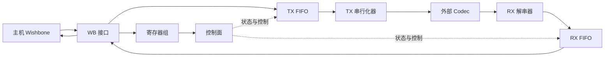
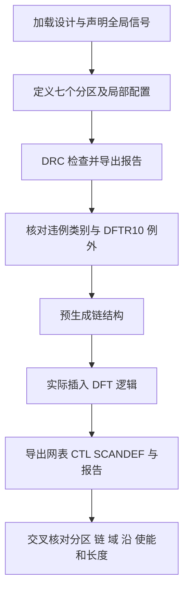

# Task1 Case2 解读：AC97 控制器的功能分区扫描插入

**T1C2 要为 AC97 控制器生成完整插链 dofile：按功能划分 7 个显式扫描分区，分别配置链数、长度和扫描使能，同时保留默认分区，并保证扫描链不跨分区、不混时钟域、不混触发边沿。**

本例的关键不是把所有 FF 串起来，而是同时满足“哪些 FF 属于一个分区、哪些 FF 可以进入同一条链、哪些分区共用使能”这三类不同约束。七个显式分区指定的链数合计为 13，但顶层还有 8 个 FF 归默认分区，**不能把 13 直接当成全设计必须恰好生成的总链数**。

本文对照任务书、`golden.dofile`、输入网表和 Scan 用户手册解释设计与配置。本次没有执行 Scan 工具，没有生成插链结果；以下精确数量属于输入网表的静态统计，预期结果与实际验收仍需区分。来源缩写和定位见文末。

## 1. 先确定任务边界

### 1.1 本例做完整内部扫描插入

T1C2 的设计是 `ac97_top`，负责主机侧 Wishbone 接口与外部 AC97 Codec 之间的数据转换、缓存和控制。任务要求 internal scan insertion，即对内部寄存器完成扫描替换和链连接；没有要求配置 IEEE 1500 wrapper 或边界扫描。[S:5–6、19–32]

| 项目     | 本例要求                                |
| ------ | ----------------------------------- |
| 输入网表   | `input/netlist/ac97_ctrl.v`，层级化门级网表 |
| 标准单元库  | `input/lib/sky130.lib`              |
| 当前设计   | `ac97_top`                          |
| 扫描时钟   | `clk_i`、`bit_clk_pad_i`             |
| 扫描复位   | `rst_i`，低有效                         |
| 分区     | 7 个显式功能分区，外加承接顶层 FF 的默认分区           |
| 长度限制   | 所有**非默认分区**每条扫描链最大长度为 300           |
| 边界     | 链不跨分区、不混时钟域、不混触发沿                   |
| 特殊配置   | 启用 lockup latch，扫描替换开启              |
| DRC 例外 | 允许遗留 **DFTR10**，无需处理                |
| 运行预算   | 整个 case wall time 不超过 **150 秒**     |

本例属于 Task1，没有 `original.dofile` 或 `preset_issues.json`。因此本文围绕要求和参考实现展开，不编造“ISSUE-01”等官方故障编号，也不预设工具已经报出某种 DRC。[S:110–170；L:4]

### 1.2 与已学案例的区别

| 案例   | 核心终点              | 阅读重点                     |
| ---- | ----------------- | ------------------------ |
| T1C1 | 前置处理，不建链          | 选择性 ICG 重连、DFF/SFF 双向替换  |
| T2C1 | 修复错误脚本，生成单主时钟域四条链 | 六类故障、门控使能、DRC 与链数独立验收    |
| T1C2 | 生成功能分区的完整插链流程     | 分区上下文、多时钟/多沿隔离、局部参数与完整输出 |

前序笔记：[[01.T1C1解读]]、[[03.T2C1解读]]。它们的具体端口、链数和执行终点不应直接复制到本例。

## 2. 从音频数据路径理解功能分区

### 2.1 为什么分成这些区域

发送方向上，主机经 Wishbone 接口写入并行数据，输出 FIFO 缓冲后交给 TX 串行化器，最终送往 Codec。接收方向上，RX 解串器把串行数据转换成并行数据，经输入 FIFO 缓冲后供主机读取。寄存器组与控制面管理状态、功耗、DMA、中断和复位。[S:24–32、65–96]

下面是功能关系示意，仅用于说明分区职责，不是门级连线的完整还原。



功能分区让这些区域可以分别设置链预算和使能。例如 FIFO 的 FF 很密集，需要更多并行扫描链；串行接口虽 FF 较少，却有时钟或边沿的隔离要求。

### 2.2 三个概念不能合并

| 概念               | 回答的问题            | 本例中的例子                              |
| ---------------- | ---------------- | ----------------------------------- |
| 功能分区 Partition   | 哪些实例属于同一组扫描配置范围？ | `rx_fifo_partition` 包含 `u9/u10/u11` |
| 时钟域 Clock domain | 哪个源时钟驱动这些 FF？    | `clk_i` 与 `bit_clk_pad_i`           |
| 触发边沿 Clock edge  | FF 在源时钟的哪一个沿采样？  | `ac97_sin` 内同时有正沿与负沿 FF             |

**同一分区可以包含两个时钟域**，例如 `ctrl_partition`；但这**不代表同一条链可以跨两个域**。**两个分区可以共用一个 `scan_enable`**，例如 RX/TX SerDes；但这也**不代表允许把它们的 FF 合并到同一条链。**

## 3. 输入网表的静态基线

### 3.1 单元数量与扫描映射

本次从 `ac97_top` 出发，沿网表模块实例层级递归统计标准单元实例，得到 2229 个 FF 和 72 个 `sdlclkp_1`。该方法按实例出现次数计数，避免把共享模块定义误当成只实例化一次。

以下名称省略前缀 `sky130_fd_sc_hd__`：

| 原始 FF 类型 | 静态数量 | 功能 | 任务书给出的扫描类型 |
| --- | --- | --- | --- |
| `dfxtp_1` | 2008 | 正沿、无独立异步复位的基本 DFF | `sdfxtp_1` |
| `dfrtp_1` | 212 | 正沿、低有效异步复位 | `sdfrtp_1` |
| `dfrtn_1` | 1 | 负沿、低有效异步复位 | `sdfrtn_1` |
| `dfstp_2` | 8 | 低有效异步置位 | `sdfstp_2` |
| 合计 | **2229** | 输入 FF 基线 | 实际替换与入链结果待工具报告 |

任务书对应位置使用约数，本次精确统计与其设计总量一致。[S:34–35、102–108；N:完整层级]

golden 使用 `set_scan_cfg -replace true`，没有像 T1C1 那样逐对执行 `set_scan_cell_mapping`，由工具库映射完成替换。这不等于忽略功能配对；验收仍要确认复位、置位及负沿语义保留。库中四个目标扫描类型均存在。[G:28–32；B:对应 cell 定义]

### 3.2 一张表绑定分区、成员与参数

“输入 FF”和“输入 ICG”列是本次按层级统计的原网表数量，不是扫描链报告的计数。其余指定参数来自任务书与 golden。[S:65–96、113–150；G:38–113]

| 分区                    | 顶层实例                                                     | 输入 FF | 输入 ICG | 源时钟             | 指定链数 | 指定 SE        |
| --------------------- | -------------------------------------------------------- | ----: | -----: | --------------- | ---: | ------------ |
| `rx_fifo_partition`   | `u9 u10 u11`                                             |   561 |     21 | `clk_i`         |    2 | `se_rx_fifo` |
| `tx_fifo_partition`   | `u3 u4 u5 u6 u7 u8`                                      |   948 |     36 | `clk_i`         |    4 | `se_tx_fifo` |
| `rx_serdes_partition` | `u1`                                                     |   137 |      6 | `bit_clk_pad_i` |    2 | `se_serdes`  |
| `tx_serdes_partition` | `u0`                                                     |   196 |      0 | `bit_clk_pad_i` |    1 | `se_serdes`  |
| `reg_partition`       | `u13`                                                    |   157 |      5 | `clk_i`         |    1 | `se_ctrl`    |
| `wb_partition`        | `u12`                                                    |    79 |      0 | `clk_i`         |    1 | `se_ctrl`    |
| `ctrl_partition`      | `u2 u14 u15 u16 u17 u18 u19 u20 u21 u22 u23 u24 u25 u26` |   143 |      4 | 两个域             |    2 | `se_ctrl`    |
| `Default_Partition`   | 顶层直接实例化的 FF                                              |     8 |      0 | `clk_i`         |  未明定 | 未明定          |

七个显式分区覆盖 27 个顶层子模块中的 FF，合计 2221 个；再加顶层 8 个，共 2229 个。ICG 合计为 72。

全部非默认分区的 `max_length` 均要求为 300。默认分区的链数、最大长度和 SE 名称在任务书中没有另行指定，golden 也没有显式配置这些参数；不能替官方补成“同样 300”“一定 1 条”或“肯定使用 se_ctrl”。

### 3.3 默认分区的八个 FF

在 N:580–603 可以找到以下顶层实例：

```text
in_valid_s_reg[0..2]    3 个
in_valid_s1_reg[0..2]   3 个
valid_s_reg            1 个
valid_s1_reg           1 个
```

它们均为 `dfxtp_1`，CLK 直接接 `clk_i`。例如：[N:589–591]

```verilog
sky130_fd_sc_hd__dfxtp_1 valid_s_reg (
    .CLK(clk_i), .D(valid_s1), .Q(valid_s)
);
```

`add_scan_partition ... -include {u...}` 只覆盖指定子模块范围，这些顶层 FF 不会因为没有被手动列出就消失。任务书明确要求它们由工具归入默认分区。[S:95–96、125]

因此，验收必须打开**默认分区报告检查这些对象的归属和实际处理**。

## 4. 两种“两条链”：分别由边沿和时钟决定

### 4.1 RX SerDes：同一个源时钟，正负沿分链

`u1` 的实例绑定是：[N:224 起]

```verilog
ac97_sin u1 (.clk(bit_clk_pad_i), ...);
```

该模块有 137 个 FF，其中一个是负沿单元：[N:2339–2342]

```verilog
sky130_fd_sc_hd__dfrtn_1 sdata_in_r_reg (
    .CLK_N(clk),
    .D(sdata_in),
    .RESET_B(n2),
    .Q(sdata_in_r)
);
```

库中 `dfrtn_1` 和对应 `sdfrtn_1` 均含 `clocked_on : "!CLK_N"` 与低有效复位属性，证实这里确实是**负沿**采样。[B:52286、155143 起]

其余 136 个 FF 为**正沿**类型；内部六个门控也都以模块 `clk` 为源。[N:2314–2338] 因为不允许混沿，即使 137 小于长度上限 300，也不能全放在一条链中。

任务书明确把 RX SerDes 两条链的原因写成“负沿 FF 需独立成链”。golden 第 79 行注释却写“双时钟域 FF”，第 80 行又注明 `bit_clk_pad_i` 域。**本例应依据任务书及输入连接解释为同一源时钟的正负沿分离，不能据这条注释虚构第二个主时钟。**[S:134；G:79–80]

“136 个正沿对象和 1 个负沿对象”是输入分组，不是已经观察到的最终链长；实际报告可能还涉及工具插入的辅助单元。

### 4.2 Ctrl：一个功能分区中包含两个源时钟

`u2` 的时钟绑定与 `u1` 不同：[N:234–236]

```verilog
ac97_soc u2 (
    .clk(bit_clk_pad_i),
    .wclk(clk_i),
    ...
);
```

在 `ac97_soc` 内，20 个 FF 直接使用 `clk`；5 个直接使用 `wclk`，另 10 个经由以 `wclk` 为源的两组门控驱动。因此该模块的 35 个 FF 分为 20 个位时钟域对象和 15 个系统时钟域对象。[N:2755 起；门控 N:2879–2887]

Ctrl 其余成员都在系统时钟域。由此得到输入分组：

| Ctrl 内源时钟 | 输入 FF 数 |
| --- | ---: |
| `bit_clk_pad_i` | 20 |
| `clk_i` | 123 |
| 合计 | 143 |

143 虽然也小于 300，但不允许混时钟域，至少需要分别承载两个域的链。任务指定两条链的原因正是这个域边界。[S:93–94、138、141]

### 4.3 链预算不能只看平均数量

| 分区/场景 | 只看数量容易得到的误判 | 真正需要检查的限制 |
| --- | --- | --- |
| RX FIFO：561 FF、2 链 | 写了两条链就肯定每条≤300 | 实际分配和实际最大长度仍需报告确认 |
| TX FIFO：948 FF、4 链 | 只要总容量 1200 足够就算通过 | 四条链必须实际满足各自长度与分区要求 |
| RX SerDes：137 FF、2 链 | 一条链就装得下，可以减为一条 | 负沿必须与正沿分离，且链数是明确要求 |
| Ctrl：143 FF、2 链 | 一条链就装得下，可以合并 | 两个源时钟必须分链，且链数是明确要求 |

从容量估算看，FIFO 的平均链负载分别为 280.5 和 237；这些只用于判断预算是否合理，不能直接当成工具输出。

手册还明确说明：**当 `chain_count` 与 `max_length` 冲突时，工具优先遵从 `chain_count`，实际链长可能超过 `max_length`。**[M:2.1.2.4] 因此“脚本里写了 `-max_length 300`”并不能证明结果达标；本例任务要求两个条件都满足，工具优先级不会自动豁免超长结果。

## 5. golden 如何表达这些要求

### 5.1 先配置全局信号和基础选项

```tcl
load_lib [file join $script_dir "lib" "sky130.lib"]
load_netlist [file join $script_dir "netlist" "ac97_ctrl.v"]
present_design ac97_top

set_scan_signal -type clock -port clk_i -off_state 0
set_scan_signal -type clock -port bit_clk_pad_i -off_state 0
set_scan_signal -type reset -port rst_i -off_state 1

set_scan_cfg -add_lockup true \
    -replace true \
    -mix_edges false \
    -si_port_format "scan_data_in_%d" \
    -so_port_format "scan_data_out_%d"
```

以上顺序来自 G:12–32。先声明全局时钟和复位，再定义功能分区；不要把全局时钟配置误写到某个功能分区的局部配置中。

`rst_i` 低电平有效，所以不生效的关闭状态是 1，写 `-off_state 1`。它不是“复位在 1 时有效”。同理，clock 的 `-off_state 0` 描述时钟关闭状态，不是时钟周期。

`-replace true` 开启 DFF→SFF 替换；`-mix_edges false` 禁止一条链混用不同触发沿；`%d` 是生成扫描数据端口时使用的数字占位符。[S:152–153；G:24–32]

### 5.2 再定义七个成员集合

```tcl
add_scan_partition rx_fifo_partition -include {u9 u10 u11}
add_scan_partition tx_fifo_partition -include {u3 u4 u5 u6 u7 u8}
add_scan_partition rx_serdes_partition -include {u1}
add_scan_partition tx_serdes_partition -include {u0}
add_scan_partition reg_partition -include {u13}
add_scan_partition wb_partition -include {u12}
add_scan_partition ctrl_partition -include {u2 u14 u15 u16 u17 u18 u19 u20 u21 u22 u23 u24 u25 u26}
```

`-include` 指定的是实例范围，不能把 `u9` 随意改成模块类型名 `ac97_in_fifo_0`。层级实例说明“这一个具体对象”，模块类型说明“它使用什么定义”。[G:38–56；M:2.1.2.7]

验证分区归属时应核对成员集合，而非只核对名字。若配置重叠，手册还有首次归属与 `-force` 覆盖规则；本例集合已经互不重叠，没有必要引入强制覆盖。

### 5.3 切换当前分区，再设置该分区的参数

以 RX FIFO 为例：[G:66–68]

```tcl
set_current_scan_partition rx_fifo_partition
set_scan_cfg -chain_count 2 -max_length 300 -mix_clocks false
set_scan_signal -type scan_enable -port se_rx_fifo
```

接着 TX FIFO 使用：[G:74–76]

```tcl
set_current_scan_partition tx_fifo_partition
set_scan_cfg -chain_count 4 -max_length 300 -mix_clocks false
set_scan_signal -type scan_enable -port se_tx_fifo
```

`set_current_scan_partition` 改变后续配置作用的上下文。如果漏写第二次切换，就可能把四条链和 `se_tx_fifo` 配给 RX FIFO。命令即使能执行，结果也会偏离任务。

七组配置全部采用相同模式，具体参数见 [[#3.2 一张表绑定分区、成员与参数|分区总表]]。golden 先设公共配置，再逐分区覆盖链数、长度和 SE；验收时仍要用配置报告检查每个分区的实际有效值，不只凭脚本注释认定继承结果。

### 5.4 四个显式使能名，不是七个，也不保证全设计只有四个

任务按功能组要求：

- `se_rx_fifo`：仅 RX FIFO 分区。
- `se_tx_fifo`：仅 TX FIFO 分区。
- `se_serdes`：RX/TX SerDes 两个分区共用。
- `se_ctrl`：Reg、WB、Ctrl 三个分区共用。

所以“各分区独立配置”不等于“每个分区必须独占一个 SE”。同一个名字在两个分区中声明，是表达共用使能；它不改变两个分区的链隔离要求。[S:143–150；G:82–113]

默认分区没有明确 SE 命名要求，工具还可能为门控处理生成相应控制信号。不能仅由四个指定名字推定最终网表中恰好只有四个测试使能端口。

### 5.5 本例的 ICG 控制不能照抄 T2C1 的全局 usage 结论

本例有 72 个 ICG，需要检查测试时钟是否能到达下游。golden 在各自定义分区中声明扫描使能时没有写 `-usage all`，也没有单独执行 `-connect_icg_only`。[G:68–113、121]

手册在分区配置章节说明：自定义 Partition 中的 `set_scan_signal` 配置用于 Scan 连接的使能；而一般 scan_enable 章节又区分 `scan`、`clock_gating` 与 `all` 的用途。[M:2.1.2.7、scan_enable 说明]

因此，应按**当前分区上下文**理解命令，不能因为 T2C1 在全局范围使用 `-usage all`，就在这里机械追加同一选项。golden 未显式列出全局门控 SE 的处理细节；最终 ICG 测试端接到哪个控制信号、信号用途和极性如何，应由真实信号报告、插入日志及输出网表确认。本文没有把分区 SE 声明直接等同于“72 个 ICG 已正确重连”。

### 5.6 Lockup latch 不是跨边界合链的许可

Lockup latch 用于在扫描移位路径上缓解相关时钟偏斜和保持时间风险。任务要求启用它，golden 以 `-add_lockup true` 表达。[S:153；G:28；M:Lockup Latch]

这与“不混时钟、不混沿、不跨分区”是并列约束。**不能为了制造 lockup 插入位置，故意把原本禁止混合的对象串到一起。**

配置允许工具按需要插入 lockup，不表示每条链必定插入一个，也不意味着要给每个 ICG 配一个。输入网表的 72 个 ICG 也不是 lockup latch 数量。具体插入位置和数量仍应看实际工具结果，任务书没有给固定数量。

## 6. 检查、插入与输出分别证明什么

### 6.1 执行阶段顺序

golden 的核心顺序为：[G:116–121]

```tcl
examine_scan_drc -verbose
rpt_scan_drc_violation > "$out_rpt_dir/pre_drc.rpt"
examine_scan_chain
insert_dft_logic -verbose
```

`examine_scan_drc` 检查设计在已声明测试条件下是否满足规则；`rpt_scan_drc_violation` 导出检查结果；`examine_scan_chain` 预生成链结构；`insert_dft_logic` 才实际替换单元、连接链并插入相应测试逻辑。[M:2.1.4]

完整流程的每个阶段都留下不同证据，不能用“文件成功写出”代替内容验收。



图中的“核对”是本文建议的验收动作；golden 命令文本本身没有展示 Agent 如何自动判定报告内容。

### 6.2 DFTR10 可以保留，但检查不能省略

DFTR10 检查时钟连接到单元数据输入的情况。任务书明确允许遗留这一类违例，无需处理。[S:154；M:DRC 规则表]

本例正确的读法是：

- 必须执行 DRC，保留完整报告。
- 按规则名确认残留确实是本例允许的 DFTR10。
- 其他违例不能获得这条例外，仍需核查并处理。
- DFTR10 数量没有在任务书中给出固定阈值，不能从其他 case 搬一个数过来。

golden 没有显式把 DFTR10 设置为 Ignore；任务书也没有要求必须用 Ignore 命令。因而不能把“允许保留”改写成“必须屏蔽”，更不能扩展成“所有 DRC 都可以跳过”。

报告名 `pre_drc.rpt` 对应插入前检查，不能据此宣称已完成插入后的独立 DRC 或功能等价验证。

### 6.3 网表、CTL、SCANDEF 的分工

| 产物         | 回答的问题                    | golden 命令                            |
| ---------- | ------------------------ | ------------------------------------ |
| Verilog 网表 | 单元实际换成了什么，测试逻辑和链怎么连接？    | `dump_netlist -file .../post_scan.v` |
| CTL        | 如何向后续测试流程描述设计的测试模型与扫描结构？ | `dump_ctl .../ac97.ctl`              |
| SCANDEF    | 如何向物理设计流程传递扫描链相关信息？      | `dump_scan_def -file .../ac97.def`   |

CTL 和 SCANDEF 不代替 Verilog 电路连接，三者应彼此一致。输出 `ac97.def` 不代表完成了布局布线；这里导出的是扫描链相关的物理流程交接信息。[G:137–139；M:输出文件]

### 6.4 寄存器报告：rpt_insertion_info 有明确手册依据

任务书要求“插链后网表内寄存器报告”，golden 对应导出：[S:164；G:126]

```tcl
rpt_insertion_info -file "$out_rpt_dir/ac97_insertion.rpt"
```

手册“报告插链网表的寄存器信息”明确说明，这条命令报告插链后网表内寄存器数量，包括 FF/DFF/SFF 数量、可扫描与不可扫描 FF 数量、链上单元数量等。[M:2221 起]

因此，**有手册依据支持它用于本例的寄存器统计报告，不能因为 golden 未调用 `rpt_scan_element` 就认定缺交。** 团队静态规则卡曾提醒要核对实际内容，这一提醒仍成立；本次补充的手册证据说明了命令的具体用途。最终仍须确认运行后文件实际包含相关信息。

这不等于该统计报告能证明每个具体寄存器的链位置。若需要逐对象审计，可补充工具支持的 `rpt_scan_chain_cell` 或 `rpt_scan_element`；这是增强验证的建议，不是本例任务书额外规定的固定报告名。

## 7. golden 导出清单与脚本阅读索引

### 7.1 必交付类型与参考文件名

任务书规定产物类型，未统一指定下面这些文件名；文件名取自 golden。[S:157–170；G:126–139]

| 交付类型           | golden 参考文件                              | 核查内容                  |
| -------------- | ---------------------------------------- | --------------------- |
| 满足任务要求的 dofile | 未指定统一文件名                                 | 与实际执行版本一致             |
| 插链后网表          | `output/post_scan.v`                     | 实际替换、链连接、端口与门控控制      |
| CTL            | `output/ac97.ctl`                        | 测试模型和扫描结构             |
| SCANDEF        | `output/ac97.def`                        | 扫描链交接信息               |
| DRC 报告         | `output/reports/pre_drc.rpt`             | 保留完整违例，并按 DFTR10 例外判定 |
| 寄存器统计          | `output/reports/ac97_insertion.rpt`      | 插入后寄存器及扫描相关计数         |
| 链报告            | `output/reports/ac97_chain.rpt`          | 分区、链数、长度、时钟、SE、SI/SO  |
| 分区报告           | `output/reports/ac97_scan_partition.rpt` | 七个显式分区与默认分区的实际成员      |
| 配置报告           | `output/reports/ac97_scan_cfg.rpt`       | 每分区实际生效的参数            |
| 信号报告           | `output/reports/ac97_scan_signal.rpt`    | 时钟、复位、SE、用途与归属        |
| 每轮完整工具日志       | 执行系统收集                                   | 全部真实运行过程              |
| Agent 摘要与决策记录  | Agent/执行系统记录                             | 配置依据、迭代原因、结果和未解决项     |

`output` 相对于本例 case 目录。golden 通过 `info script` 定位自身目录，再取父目录作为 `case_dir`；搬动脚本时要重新核对输入和输出路径。[G:2–13]

### 7.2 逐段读 golden

| 行号 | 内容 | 读完应能回答的问题 |
| --- | --- | --- |
| 2–14 | 路径与设计加载 | 网表和库是否来自当前 case，顶层是否正确？ |
| 20–24 | 两个时钟与低有效复位 | 有没有把 inactive state 与 active polarity 搞反？ |
| 28–32 | 公共配置 | 替换、禁止混沿、lockup 和端口命名怎样设置？ |
| 38–56 | 七个分区定义 | 实例集合是否完整、是否重叠、顶层 FF 留在哪里？ |
| 66–113 | 逐分区配置 | 当前上下文、链数、长度、mix_clocks、SE 是否对应？ |
| 116–121 | 检查、预生成、插入 | 工具阶段和真实输出分别是什么？ |
| 126–139 | 报告与模型导出 | 必交类型是否齐全，内容是否相互一致？ |

## 8. 验收时最容易漏掉的事项

### 8.1 分区与链的检查清单

- [ ] 成功加载指定库和网表，当前设计为 `ac97_top`。
- [ ] 27 个顶层子模块按任务表进入七个显式分区，没有交叉覆盖或漏收。
- [ ] 顶层八个 FF 出现在默认分区，并核查其实际扫描处理结果。
- [ ] 七个显式分区的链数分别为 **2、4、2、1、1、1、2**，不是只核对合计 13。
- [ ] 每个非默认分区每条链实际长度≤300；不能只检查参数文本。
- [ ] 每条链不跨分区、不混源时钟域、不混触发沿。
- [ ] RX SerDes 的负沿 FF 与正沿 FF 分开，Ctrl 的两个时钟域分开。
- [ ] 四个明确指定的 SE 名称与共享关系正确；默认分区和 ICG 的实际控制另有可查证据。
- [ ] 扫描数据端口符合 `scan_data_in_%d` / `scan_data_out_%d` 格式。
- [ ] lockup 配置生效，其实际插入结果有日志或结构依据；不凭空要求固定数量。
- [ ] 复位、置位和触发沿在单元替换后保持正确，未替换/未扫描对象有解释。

### 8.2 结果与证据的检查清单

- [ ] DRC 确实运行，残留类别按本例仅有的 DFTR10 许可处理。
- [ ] 真正执行了 `insert_dft_logic`，而非停在预生成链阶段。
- [ ] 网表、CTL、SCANDEF 以及六类报告可读，且来自对应的真实运行。
- [ ] 配置报告反映实际上下文；分区报告反映分析后的成员，而不是只有 DRC 前的声明文本。
- [ ] 最终寄存器统计与输入基线可解释对应；2229 是输入 FF 数，不是禁止工具新增辅助单元的硬性数量守恒要求。
- [ ] 每轮日志、Agent 摘要与决策记录齐备，总 wall time≤150 秒。

本例没有像某些其他 case 那样明文写出固定的“100% 扫描覆盖率”数字，也没有定义非默认分区以外的精确链预算。不能自行增加这些硬性参数；同时，已要求处理的功能区域不能靠随意排除 FF 来满足链长或清除 DRC。

## 9. 本次结论与待验证边界

本次静态分析确认了：输入的 2229 个 FF 与 72 个 ICG、七分区成员及默认分区八个 FF、RX SerDes 的单源时钟正负沿结构、Ctrl 的双时钟结构，以及 golden 各配置段与任务要求的对应关系。

还需要保留以下边界：

| 项目 | 当前能确认的结论 | 尚待实际运行核对 |
| --- | --- | --- |
| 全设计链数 | 七个显式分区预算合计 13；另有默认分区 | 默认分区实际链数与最终总链数 |
| RX SerDes 两链原因 | 任务书及网表支持正负沿分离 | 插入后边沿隔离及实际链内容 |
| ICG 测试控制 | 输入有 72 个 ICG，golden 使用分区 SE 配置 | 最终 TE/SCE 连接、控制信号用途与测试可控性 |
| 寄存器报告 | 手册支持 `rpt_insertion_info` 报告所需统计 | 实际文件内容与最终网表是否一致 |
| lockup | 任务要求且 golden 启用 | 实际插入数量、位置与工具依据 |
| DRC 与耗时 | 明确允许 DFTR10，整个 case≤150 秒 | 实际违例类别、执行成功与 wall time |

能够迁移到其他案例的方法是：**先绑定成员集合，再按分区、时钟和边沿确定链边界，最后用实际报告验证配置。** 分区名、端口、数量和例外规则都应在新案例中重新读取。

## 参考资料

以下均为本次实际查阅的本地材料。`S/G/L/N/B/M` 为本文缩写，行号按原件从 1 开始计数；手册优先按章节名或命令名定位。暂无外部引用。

- **S：任务书**：[[官方材料/public_cases/task_1/case2/input/task_spec|Task1 Case2 task_spec]]。重点：第 65–108、113–155、157–170 行。
- **L：运行限制**：[[官方材料/public_cases/task_1/case2/input/limitations|Task1 Case2 limitations]]。第 4 行。
- **G：参考脚本**：[golden.dofile](../../../../官方材料/public_cases/task_1/case2/input/golden.dofile)。重点：第 20–113 行配置与第 116–139 行执行/导出。
- **N：输入网表**：[ac97_ctrl.v](../../../../官方材料/public_cases/task_1/case2/input/netlist/ac97_ctrl.v)。`ac97_top` 第 6 行起；顶层八个 FF 第 580–603 行；`ac97_sin` 第 2282 行起；`ac97_soc` 第 2755 行起。
- **B：标准单元库**：[sky130.lib](../../../../官方材料/public_cases/task_1/case2/input/lib/sky130.lib)。查阅 `dfrtn_1/sdfrtn_1` 的负沿属性，以及 `sdfrtp_1/sdfxtp_1/sdfstp_2` 的存在性。
- **M：工具手册整理稿**：[[MinerU_markdown_Scan_User_Manual_2098627714095534080|Scan 用户手册]]。查阅 2.1.2.4 配置 Scan Chain、2.1.2.7 配置 DFT Partition、2.1.4 预生成及插入 Scan Chain、DFT 信号用途、DRC 规则表及“报告插链网表的寄存器信息”。
- **团队规则整理**：[[02-Task1静态DFT规则卡#3. T1C2：功能分区内部扫描|Task1 Case2 静态规则卡]]。
- **前序笔记**：[[01.T1C1解读]]、[[03.T2C1解读]]。
