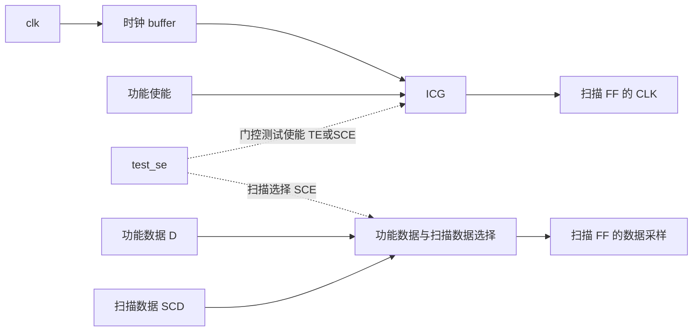

# Task2 Case1 解读：修复六类问题，完成四条扫描链

**T2C1 要修复 picorv32 的错误 dofile，使工具正确加载设计、识别扫描时钟和门控使能，按合法顺序完成 DFF 替换与完整插链，最终得到 clk 域内的 4 条扫描链，并满足 DRC 与扫描覆盖要求。**

本例的学习重点是区分三种失败：命令无法执行、设计在测试条件下不可控、生成结果不符合任务规格。六个预置问题分别落在这三层；只消除报错或只得到 DRC 零违例，都不足以证明完成任务。

本文对照任务书、`original.dofile`、`golden.dofile`、`preset_issues.json`、实际输入网表和工具手册进行静态分析。**预置日志是官方材料中的现象说明，不是本次运行结果。** 本次未执行 Scan 工具，也未生成插链网表或证明修复成功。文末给出来源缩写与定位方式。

## 1. 本例到底要求什么

### 1.1 与 T1C1 的区别

| 比较项 | T1C1 | T2C1 |
| --- | --- | --- |
| 工作入口 | 按任务书生成前置处理 dofile | 修复已有错误 `original.dofile` |
| 设计 | `openE902` | `picorv32` |
| 处理终点 | ICG 重连、单元替换和回替；不建链 | 完整扫描链插入 |
| 特定范围处理 | 有 ICG 排除范围与非扫描模块回替 | 本例没有对应的特殊模块回替任务 |
| 链数要求 | 不建链 | **4 条，全部属于 clk 时钟域** |
| 主要证据 | 三阶段网表 | 插链网表、DRC、链报告、链上单元明细 |

前一篇的替换原理仍可参考 [[01.T1C1解读#2.1 DFF、SFF 与扫描链|DFF、SFF 与扫描链]]，但不能把 T1C1 的 `-replace_only` 当作本例的执行终点。

### 1.2 输入与约束

| 材料/参数 | 本例取值 | 用途 |
| --- | --- | --- |
| 顶层模块 | `picorv32` | `present_design` 的目标 |
| 门级网表 | `input/netlist/pre_scan.v` | 电路实例与连接的依据 |
| 单元库 | `input/lib/sky130.lib` | 单元类型、功能与扫描映射依据 |
| 原始脚本 | `input/original.dofile` | 六个问题的实际配置载体 |
| 参考脚本 | `input/golden.dofile` | 官方给出的一种修复实现 |
| 预置问题 | `input/preset_issues.json` | 根因说明、禁止修复方式和成功判据 |
| 扫描时钟 | `clk` | 单一主时钟，内部经 buffer 与门控分发 |
| 扫描使能 | 新建 `test_se` | 同时控制扫描 FF 与 ICG |
| 链数 | 4 | 最终链报告必须符合 |
| 时间 | 整个 case wall time ≤150 秒 | 不是每轮工具调用各有 150 秒 |

依据：[S:5–17、23–57；L:5]。`preset_issues.json` 中的 `public_case_1` 在这里指 Task2/case1，不能只凭 case1 名称跨任务套用。

## 2. 先读电路：扫描数据通路与时钟通路都要打通

### 2.1 1610 个 DFF 与 68 个 latch

任务书列出 1610 个 `sky130_fd_sc_hd__dfxtp_1` 和 68 个不可扫描的 `sky130_fd_sc_hd__dlxtp_1`。[S:34–37]

本次对输入网表 `picorv32` 顶层模块内实例声明进行静态计数，得到相同数量；另找到 44 个顶层 ICG 封装实例。1610 个 DFF 的时钟连接中，**1432 个直接接这批 ICG 的输出网，另 178 个不直接接这些输出网**。这里的“直接”按引脚连接的网名对应统计，不是完整时序分析。

| 静态观察 | 数量 | 能说明什么 |
| --- | --- | --- |
| 顶层 `dfxtp_1` 实例 | 1610 | 与任务书给出的普通 DFF 数量一致 |
| 顶层 `dlxtp_1` 实例 | 68 | 应与任务书中的不可扫描 latch 区分 |
| 顶层 ICG 封装实例 | 44 | 门控测试使能需要实际覆盖的结构依据 |
| DFF 的 CLK 直接接这些 ICG 输出 | 1432 | 与 ISSUE-05 的预置违例总数一致，支持其影响范围解释 |

**1432 的数量对应不等于本次复现了 1432 条 DRC 违例。** 真正的规则触发还取决于工具模型、配置与运行阶段，仍须以实际日志为准。

68 个 `dlxtp_1` 不应被强行纳入 DFF→SFF 映射，也不能因为它们不在链上就认定扫描覆盖失败。覆盖率的分母应对应任务要求的可扫描对象，不能把所有含状态的单元混作同一类。

### 2.2 为什么 resetn 不需要被声明为扫描 reset

任务书称 `resetn` 为低有效异步复位输入，同时明确指出本例可扫描寄存器都是无复位引脚的 `dfxtp_1`，复位作用经组合逻辑实现，**无需配置 reset 类型的扫描信号**。[S:41]

库中 `dfxtp_1` 的 FF 定义包含：[B:56430 起]

```text
clocked_on : "CLK";
next_state : "D";
```

它**没有对应的异步清零 FF 属性**。因此应区分任务书对顶层信号的称呼与门级触发器的实际控制端：存在名为 `resetn` 的输入，并不意味着它是可扫描 FF 的独立异步 reset 引脚，更不意味着可以把它用作扫描时钟。

这里不额外推定 RTL 的事件敏感列表或仿真时序；本例配置结论以任务要求和门级库模型为准。后续若讨论复位的严格同步/异步语义，应另查 RTL 与完整数据路径。

### 2.3 从一个报错寄存器追到门控

ISSUE-05 点名的寄存器确实存在于输入网表：[N:2547–2548]

```verilog
sky130_fd_sc_hd__dfxtp_1 instr_blt_reg (
    .D(N354), .CLK(net500), .Q(instr_blt)
);
```

其时钟网 `net500` 来自以下门控实例：[N:2409–2410]

```verilog
SNPS_CLOCK_GATE_HIGH_picorv32_41 clk_gate_instr_beq_reg (
    .CLK(n1043), .EN(N351), .ENCLK(net500), .TE(n12)
);
```

再往上游追：[N:5848、5859]

```verilog
sky130_fd_sc_hd__buf_1 U1819 (.A(clk), .X(n1043));
sky130_fd_sc_hd__conb_1 U1830 (.LO(n12), .HI(n1042));
```

因此，源时钟由 `clk` 经 buffer 到 `n1043`，再经门控到 `net500`，最后进入 `instr_blt_reg`。门控 TE 原先接常量单元的低电平输出 `n12`；本次看到的 44 个顶层门控实例均接此 TE 网。

封装内部将 `TE` 接到底层 `sky130_fd_sc_hd__sdlclkp_1` 的 `SCE`，将 `EN` 接到 `GATE`，例如 N:8–15 的定义。这与 T1C1 一样：**TE 与 SCE 是不同层级对同一测试控制连接的命名。**

下面展示 `test_se` 在修复后应承担的两类职责，虚线表示配置后由工具建立的控制连接。



把 FF 改成扫描单元只解决了数据选择问题；门控若仍关着，移位时钟就无法送到下游。ISSUE-05 正是在检查这两类控制是否都配置到了。

## 3. 六个预置问题总览

以下现象和计数均引用官方 preset，未作为本次实测结果。

| 问题 | original 中的错误 | 官方预置现象 | golden 的修复 |
| --- | --- | --- | --- |
| ISSUE-01 | 缺少 `load_netlist` | `COM-2001` / `COM-3008`，找不到设计 | 先加载 `pre_scan.v`，再选择顶层 |
| ISSUE-02 | DFF 映射到 `nand2_1` | `COM-3010` / `CMD-0074`，目标不匹配 FF | 目标改成 `sdfxtp_1` |
| ISSUE-03 | 插入在 DRC 之前 | `SCAN-1009` / `CMD-0074`，阶段顺序错误 | DRC→预生成链→插入 |
| ISSUE-04 | 将 `resetn` 声明成 clock | DFTR1×1610、DFTR8×1、DFTR10×245；0 链、0 替换 | 时钟改为 `clk` |
| ISSUE-05 | scan_enable 的用途仅为 `scan` | 1432 条违例，示例为 `instr_blt_reg` 的 DFTR9-1 | 改成 `-usage all` |
| ISSUE-06 | 链数设为 2 | DRC 为 0，但只有 2 条链 | `-chain_count 4` |

定位：[P:ISSUE-01～06；O:11–34；G:12–33]。

**不要把六条现象理解成 original 单次运行必定依次输出的日志。** 缺少网表会阻止后续设计操作；时钟与门控错误也可能相互遮挡。应先修复执行前提，再解释后续 DRC，最后核对输出契约。

## 4. 逐项解读：错误为何发生，怎样算修好

### 4.1 ISSUE-01：加载库不等于加载设计

原脚本仅执行 `load_lib`，随后直接 `present_design picorv32`。[O:11–13]

库描述“有哪些标准单元以及它们的功能”；网表描述“当前电路有哪些实例以及它们怎么连接”。只加载库，工具不会自动获得 picorv32 设计。修复应补齐：

```tcl
load_lib     "$script_dir/lib/sky130.lib"
load_netlist "$script_dir/netlist/pre_scan.v"
present_design picorv32
```

成功证据是目标网表加载成功、顶层选择成功。允许用等价路径加载同一网表；不能删去 `present_design`、注释后续报错命令或屏蔽 ERROR 来“通过”。[P:ISSUE-01；G:12–14]

**可迁移的判断：** 当多个设计相关命令连续失败，先检查最早的设计加载失败，避免把下游报错都当成独立故障。

### 4.2 ISSUE-02：目标在库中存在，也可能完全不适合替换

错误配置把 `dfxtp_1` 映射成 `nand2_1`。[O:16]

`nand2_1` 是组合与非门，库中的逻辑函数为 `(!A) | (!B)`；它没有寄存状态。目标并非单纯拼写错或找不到，而是**不属于工具要求的 FF 类型**。[B:89818 起；P:ISSUE-02]

正确配对为：

```tcl
set_scan_cell_mapping sky130_fd_sc_hd__dfxtp_1 sky130_fd_sc_hd__sdfxtp_1
```

`sdfxtp_1` 的扫描状态方程为：[B:162459 起]

```text
next_state : "(D&!SCE) | (SCD&SCE)";
```

`SCE=0` 时取功能数据 `D`，`SCE=1` 时取扫描数据 `SCD`。这才是在保留普通 DFF 功能的基础上增加扫描数据选择。

成功判据首先是映射命令执行成功；完整验收还需核对实际替换和入链结果。不能修改 Liberty 把 NAND 伪装成 FF，也不能注释映射命令逃避错误。[P:ISSUE-02；G:17]

### 4.3 ISSUE-03：命令顺序代表工具处理阶段

原脚本的顺序是：[O:27–34]

```text
insert_dft_logic → examine_scan_drc → examine_scan_chain
```

golden 改为：[G:29–33]

```tcl
examine_scan_drc -file "$out_rpt_dir/pre_drc.rpt"
examine_scan_chain
insert_dft_logic
```

三条命令的作用并不相同：

| 命令 | 作用 | 是否就是最终网表插入 |
| --- | --- | --- |
| `examine_scan_drc` | 在测试配置下检查设计的扫描规则 | 否 |
| `examine_scan_chain` | 按配置分配扫描单元，预生成链结构 | 否 |
| `insert_dft_logic` | 按预生成链结构执行实际替换、插链和相应测试逻辑插入 | 是 |

手册在“2.1.4 预生成及插入 Scan Chain”中明确区分了预生成结构与改写网表。不能因为 `examine_scan_chain` 能提供链信息，就跳过实际插入。[M:2.1.4]

preset 说明插入后再执行这里的 `examine_scan_drc` 会触发阶段错误。修复不能删掉 DRC，也不能强制绕过阶段检查；本例按 golden 的标准顺序理解和执行。[P:ISSUE-03]

### 4.4 ISSUE-04：端口存在不代表角色正确

错误与修复的差别仅是端口名：[O:19；G:20]

```tcl
# 错误：将复位输入当作时钟
set_scan_signal -type clock -port resetn -off_state 0

# 正确：本例指定的主扫描时钟
set_scan_signal -type clock -port clk -off_state 0
```

`resetn` 是真实输入端口，因此这种错误可能进入电气/逻辑检查阶段才暴露，不能靠“端口是否存在”这类检查发现。

预置问题给出三类 DRC：[P:ISSUE-04；M:DRC 规则表]

| 规则     | 一般含义            | 本例错误声明下的解释                   |
| ------ | --------------- | ---------------------------- |
| DFTR1  | FF 的时钟输入不可控     | 真正驱动 FF 的 `clk` 没有被正确声明      |
| DFTR8  | 声明的时钟不能控制时序单元采样 | `resetn` 不能充当预期的 FF 时钟源      |
| DFTR10 | 时钟信号连接到单元数据输入   | 错将参与复位组合逻辑的数据控制信号视为时钟，引出角色冲突 |

官方预置计数满足 `1610+1+245=1856`，这里是违例条数相加，不是 1856 个不同寄存器。一个对象可能涉及多类检查，不能把规则数当成唯一实例数。

修复后要以真实 DRC 验证 DFTR1/8/10 清零。禁止禁用或豁免这些规则，也不能通过改原始网表的时钟/复位连接来规避声明错误。[P:ISSUE-04]

`-off_state 0` 指时钟的关闭状态为低电平；它不是一个用于指定时钟周期或“把时钟永远绑 0”的参数。

### 4.5 ISSUE-05：scan_enable 只管数据选择还不够

原配置只覆盖普通扫描连接：[O:22]

```tcl
set_scan_signal -type scan_enable -port test_se -off_state 0 -usage scan
```

正确配置同时覆盖 FF 与门控：[G:23]

```tcl
set_scan_signal -type scan_enable -port test_se -off_state 0 -usage all
```

| `-usage` | 工具手册所述用途 |
| --- | --- |
| `scan` | Functional FF 的扫描使能连接 |
| `clock_gating` | Clock-Gating 的测试使能连接 |
| `all` | 同时覆盖上述两类 |

在本例高有效扫描使能配置下，shift 时 FF 要选择扫描数据，同时门控必须能够打开，让扫描时钟到达下游。只配置 `scan`，即使数据选择控制存在，门控仍可能在检查条件下关闭，进而出现 **“时钟已置为开启状态，但 FF 的 CLK 不活跃”** 的 DFTR9。[P:ISSUE-05]

[[#2.3 从一个报错寄存器追到门控|instr_blt_reg 的实际路径]]提供了具体结构依据。不要只根据 DFTR9 编号就固定套用 `-usage all`；还应检查扫描使能用途、门控控制连接和出错寄存器的时钟来源。

本次静态搜索输入网表没有 `test_se` 标识，符合任务“新建端口”的要求。手册说明该类型未指定 `-view` 时默认 `spec`，表示用于新生成链的扫描使能；配置不要求事先手工向输入网表添加这个端口。[S:54–55；M:scan_enable 定义]

preset 也允许省略 `-usage` 等能达到同样覆盖效果的配置；学习和审阅时显式写 `all` 更直接。成功判据为 DFTR9-1 清零；不得忽略 DFTR9、排除违例 FF，或手改原始网表 ICG TE 连线。[P:ISSUE-05]

### 4.6 ISSUE-06：DRC 清零后仍须核对四条链

原配置为两条链：[O:25]

```tcl
set_scan_cfg -chain_count 2 -mix_clocks false -mix_edges false
```

修复为：[G:26]

```tcl
set_scan_cfg -chain_count 4 -mix_clocks false -mix_edges false
```

DRC 检查结构在测试条件下是否满足相应规则；链数则是任务指定的结构目标。两条合法扫描链完全可能没有 DRC 违例，但仍违背本例“四条链”的规格。

`-mix_clocks false` 禁止不同扫描时钟混链，`-mix_edges false` 禁止不同沿混链。golden 保留了这两个选项；任务书的明确要求是 4 条链全部在 `clk` 域内。内部存在不同门控输出网名，并不因此自动变成多个独立主时钟域，仍须按其源时钟追踪。

若仅为理解链数对长度的影响，1610 个 FF 平均分到 4 条链约为 402.5 个；分到 2 条链平均为 805 个。**这只是算术示意，不是本例真实链长，也不是要求输出恰好 402/403 的验收标准。** 任务书未规定最大链长、严格均衡或扫描数据端口命名格式。

成功判据是 DRC 保持零违例，最终链报告确实为 4 条链。不能手改报告数字，也不能用后处理脚本拆链冒充工具配置修复。[P:ISSUE-06]

## 5. 把修复串成一个完整流程

### 5.1 参考 dofile 的核心顺序

下面按 golden 保留核心命令，仅省略注释与目录创建部分，用于学习；`script_dir`、`out_rpt_dir`、`out_res_dir` 需先按完整脚本设置。

```tcl
# 1. 建立当前设计
load_lib "$script_dir/lib/sky130.lib"
load_netlist "$script_dir/netlist/pre_scan.v"
present_design picorv32

# 2. 声明扫描单元、时钟与使能
set_scan_cell_mapping sky130_fd_sc_hd__dfxtp_1 sky130_fd_sc_hd__sdfxtp_1
set_scan_signal -type clock -port clk -off_state 0
set_scan_signal -type scan_enable -port test_se -off_state 0 -usage all
set_scan_cfg -chain_count 4 -mix_clocks false -mix_edges false

# 3. 检查、预生成、实际插入
examine_scan_drc -file "$out_rpt_dir/pre_drc.rpt"
examine_scan_chain
insert_dft_logic

# 4. 输出最终链信息和网表
rpt_scan_chain -file "$out_rpt_dir/scan_chain.rpt"
rpt_scan_chain_cell -file "$out_rpt_dir/scan_cell.rpt"
dump_netlist -file "$out_res_dir/post_scan.v"
exit
```

完整脚本定位：[G:2–40]。这里没有为 T1C1 的三阶段快照保留单独导出，因为本例交付终点是完整插链网表。

### 5.2 路径差异不是第七个扫描故障

golden 位于 `case1/input`，通过 `info script` 确定脚本目录，再取上一级作为 `base_dir`。它的参考导出位置为：

```text
case1/output/golden/report/pre_drc.rpt
case1/output/golden/report/scan_chain.rpt
case1/output/golden/report/scan_cell.rpt
case1/output/golden/output/post_scan.v
```

original 对应使用 `output/original/report` 与 `output/original/output`，这是参考材料为区分结果而设置的目录差异，不属于 preset 六个问题。[O/G:2–9]

脚本如果搬到其他目录，基于 `script_dir` 的输入路径也会改变。复用时要核对实际路径，不应把“当前 shell 目录”与“脚本目录”混为一谈。

### 5.3 建议按依赖关系检查，而非按错误数量猜测

下面是由本例依赖关系整理的执行检查顺序，不是官方规定的迭代轮数。

1. **先确认设计建立。** 检查库、网表加载和顶层选择；失败时先修前置步骤。
2. **再确认配置有效。** 目标必须是正确扫描 FF，时钟是 `clk`，`test_se` 覆盖两类对象，链数设为 4。
3. **确认阶段顺序。** DRC 在插入之前，预生成链在实际插入之前。
4. **读取真实 DRC 与插入日志。** 核对时钟和门控问题是否消失，而非依赖 preset 计数。
5. **独立核对最终结构。** 检查四条链、源时钟、扫描覆盖、实际连接和交付完整性。

一次修复多条已明确的配置错误是合理的；无需为了对应六个问题人为规定必须运行六轮。每轮实际执行及修改依据都要记录，并共享整个案例 150 秒预算。

## 6. 怎样验收，哪些证据不能互相替代

### 6.1 输出清单

| 任务要求 | golden 采用的实现 | 验证重点 |
| --- | --- | --- |
| 修改后 dofile | 本例未指定统一文件名 | 与真正执行版本一致 |
| 插链后 Verilog 网表 | `post_scan.v` | 已实际插入，单元与链连接正确 |
| DRC 报告 | `pre_drc.rpt` | 来自插入前 DRC 阶段，内容需真实检查 |
| 扫描链报告 | `scan_chain.rpt` | 最终为 4 条，均属于 `clk` 域 |
| 链上单元明细报告 | `scan_cell.rpt` | 可扫描 FF 的覆盖与链归属可追踪 |
| 每轮完整工具日志 | 由执行系统收集 | 错误、阶段执行和迭代过程完整保留 |
| Agent 摘要与决策记录 | 由 Agent/执行系统记录 | 修改原因、依据、结果及未解决问题 |

任务书没有固定 dofile、网表或这些报告的文件名；上表命名是 golden 的实现。它也没有要求 CTL、SCANDEF 或 `decision_log.json` 的固定格式。[S:59–67；G:29–40]

`pre_drc.rpt` 是**插入前**生成的报告，不能把它直接写成“插入后重新 DRC 已通过”。另一方面，不能为补一个后置报告直接在同一脚本的插入后追加这里的 `examine_scan_drc`，这正涉及 ISSUE-03 的阶段限制。若要进一步验证导出的设计，应先确认工具支持的重新加载和检查流程，并记录真实执行过程。

### 6.2 完成检查清单

- [ ] 实际加载正确的库和 `pre_scan.v`，成功选中 `picorv32`。
- [ ] DFF→SFF 映射命令成功，目标为相应扫描触发器。
- [ ] 扫描时钟为 `clk`，没有把 `resetn` 当作 clock。
- [ ] 工具创建 `test_se`，且它同时覆盖扫描 FF 与 ICG 控制。
- [ ] DRC→预生成链→实际插入的阶段顺序正确，命令成功完成。
- [ ] 本例要求的 DRC 零违例得到真实报告支持，尤其核对 DFTR1/8/10 和 DFTR9。
- [ ] 最终链报告为 4 条链，源扫描时钟均为 `clk`。
- [ ] 以原始 1610 个 DFF 为对象基线逐项核对替换和扫描覆盖；68 个指定不可扫描 latch 单独对待。
- [ ] 链明细与输出网表一致，没有漏扫或重复计入；若工具改名或插入辅助单元，按对象对应关系核对。
- [ ] 修改后 dofile、网表、三类报告、完整运行日志与 Agent 记录齐备。
- [ ] 整个 case wall time 不超过 150 秒。

1610 是本例输入 DFF 基线，不应机械要求链明细所有行数恰好为 1610；报告格式、辅助单元和对象类型需分别解释。但也不能把大量未入链 FF 仅凭“报告不同”带过，必须逐项说明处理结果。

“命令成功”“DRC 零违例”“四条链”“完整覆盖”是不同层面的证据；再加上交付物齐全，才构成本例完整验收。功能等价或仿真通过也必须有实际证据，本文不作已通过声明。

## 7. 从本例可以迁移的诊断方法

| 可迁移的模式 | 每个新案例要重新核对的事实 | 本例绑定 |
| --- | --- | --- |
| 设计操作之前必须建立当前设计 | 输入文件、顶层、实际加载结果 | `pre_scan.v`、`picorv32` |
| 映射目标必须满足功能与类型要求 | 库定义、复位/置位/使能和扫描接口 | `dfxtp_1→sdfxtp_1` |
| 工具操作受阶段顺序约束 | 当前工具流程与命令前置条件 | DRC→chain→insert |
| 信号存在不代表角色正确 | 时钟源、控制信号与实际引脚路径 | `clk` 是 clock，`resetn` 不是 |
| 扫描控制要覆盖门控路径 | usage、ICG 测试端与下游 FF | `test_se -usage all` |
| DRC 通过不能代替规格验收 | 链数、域、覆盖范围与交付要求 | 4 条 clk 域扫描链 |

不要将“看到 DFTR9 就改 usage”“看到 resetn 就声明 reset”“所有案例都设四条链”当作通用规则。有效规则必须包含对象、前提和验证方法，具体参数由新案例绑定。更细的字段化整理见 [[03-Task2静态DFT规则卡#2. Task2/case1：public_case_1|Task2 case1 六张静态规则卡]]。

本次已经核对六个预置问题与 original/golden 的对应关系、关键单元库功能、输入 FF/latch 数量及报错寄存器的门控路径。**仍待实测：修复脚本是否在实际工具环境成功执行、DRC 是否为零、是否形成四条链、覆盖是否完整、耗时是否达标。**

## 参考资料

以下均为实际查阅的本地材料。行号按原件从 1 开始计数；`P:ISSUE-xx` 按问题编号定位，也可使用 `/问题列表/0`～`/问题列表/5` 的 JSON Pointer。暂无外部引用。

- **S：任务书**：[[官方材料/public_cases/task_2/case1/input/task_spec|Task2 Case1 task_spec]]。重点：第 5–10、30–41、51–67 行。
- **L：运行限制**：[[官方材料/public_cases/task_2/case1/input/limitations|Task2 Case1 limitations]]。第 5 行。
- **O：原始错误脚本**：[original.dofile](../../../../官方材料/public_cases/task_2/case1/input/original.dofile)。重点：第 11–34 行。
- **G：官方参考脚本**：[golden.dofile](../../../../官方材料/public_cases/task_2/case1/input/golden.dofile)。重点：第 12–40 行。
- **P：六个预置问题**：[preset_issues.json](../../../../官方材料/public_cases/task_2/case1/input/preset_issues.json)。ISSUE-01～06，包含现象、根因、修复方式、禁止项与成功判据。
- **N：输入网表**：[pre_scan.v](../../../../官方材料/public_cases/task_2/case1/input/netlist/pre_scan.v)。顶层模块始于第 1427 行；门控实例第 2399–2485 行附近；`instr_blt_reg` 第 2547 行；时钟 buffer 和常量单元第 5841–5859 行。
- **B：标准单元库**：[sky130.lib](../../../../官方材料/public_cases/task_2/case1/input/lib/sky130.lib)。查阅 `dfxtp_1`、`sdfxtp_1` 和 `nand2_1` 的逻辑定义。
- **M：工具手册整理稿**：[[MinerU_markdown_Scan_User_Manual_2098627714095534080|Scan 用户手册]]。查阅 scan_enable 的 `usage`/`view`、clock 的 `off_state`、DRC 规则表、2.1.4 预生成及插入 Scan Chain。
- **团队规则整理**：[[03-Task2静态DFT规则卡#2. Task2/case1：public_case_1|Task2 case1 静态 DFT 规则卡]]。
- **前序学习笔记**：[[01.T1C1解读|T1C1 前置处理解读]]。
