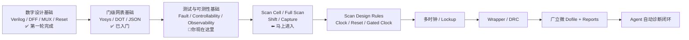

```mermaid
flowchart LR
    A["数字设计基础<br/>Verilog / DFF / MUX / Reset<br/>✅ 第一轮完成"]
    --> B["门级网表基础<br/>Yosys / DOT / JSON<br/>✅ 已入门"]
    --> C["测试与可测性基础<br/>Fault / Controllability / Observability<br/>📍你现在这里"]
    --> D["Scan Cell / Full Scan<br/>Shift / Capture<br/>⬅ 马上进入"]
    --> E["Scan Design Rules<br/>Clock / Reset / Gated Clock"]
    --> F["多时钟 / Lockup"]
    --> G["Wrapper / DRC"]
    --> H["广立微 Dofile + Reports"]
    --> I["Agent 自动诊断闭环"]
```
