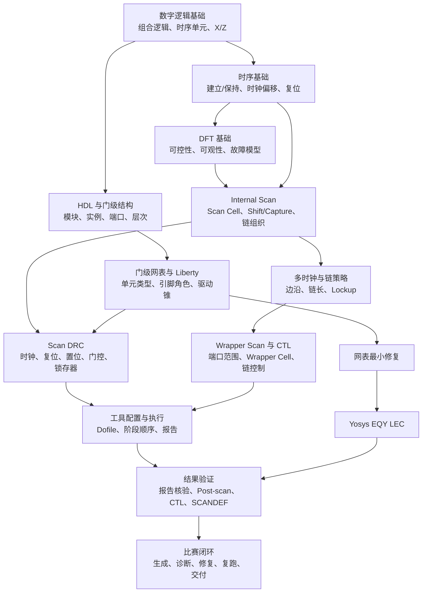

# DFT 与设计知识学习地图及学习大纲

## 1. 报告目的

本报告面向 2026 NCTIEDA Semitronix Scan Insertion 赛题，给出团队需要掌握的 **DFT 与数字设计知识地图**，并将其展开为一套按时间排序、能够产出可验收成果的学习计划。

学习目标不是通读三本教材，而是建立一条能够支撑比赛任务的能力链：读懂任务说明与门级设计，正确配置 Scan Insertion，依据日志和报告定位问题，在必要时安全修改网表并通过逻辑等价检查。

赛题规则、工具语义和教材知识的归属必须分开：教材解释原理，工具手册定义命令与规则，Public case 提供可执行范例，最终验收以正式赛题指南和真实工具结果为准。

## 2. 计划基线与使用方式

本大纲采用以下默认条件：

- 总周期：4 周，共 20 个学习日；
- 每个学习日：个人投入约 3～4 小时；
- 团队形式：三人共同掌握核心知识，再按 Agent 与系统、DFT 与规则、工具与质量三个方向深化；
- 学习方法：每个主题都以“阅读—小实验—结构化产物—交叉复核”闭环完成；
- 外部依赖：广立微工具手册、Public case 或正式 Liberty 尚未获得时，只建立待填模板，不把推测写成工具事实。

若需要压缩为 2 周，应合并同一周内相邻两天的内容，但不能删除第 10、15、18、20 日的阶段验收。

## 3. 理论知识学习地图

下图用于说明各知识模块的先修关系，以及它们如何汇聚为比赛所需的端到端能力。

## 4. 分层学习范围

### 4.1 第一层：数字设计基础

**目标：** 能准确解释门级电路中的组合逻辑、时序单元、控制信号与时序关系，并能阅读结构化 Verilog。

必学内容：

- 组合逻辑、MUX、三态、未知态 `X` 和高阻态 `Z`；
- DFF、DLATCH、同步/异步复位、置位与使能；
- 时钟上升沿/下降沿、建立时间、保持时间和时钟偏移；
- Verilog/SystemVerilog 的模块、实例、端口连接、连续赋值和结构化描述；
- 移位寄存器和最基本的扫描链。

材料定位：

- [《数字设计和计算机体系结构（原书第 2 版）》](<DFT补强/数字设计和计算机体系结构原书第2版.md>)：第 2 章组合逻辑设计，第 3 章时序逻辑设计，第 4 章硬件描述语言，第 5.4 节时序电路模块中的“扫描链”；
- [《VLSI Test Principles and Architectures》](<DFT补强/VLSI Test Principles and Architectures - Design for Testability.md>)：第 3.2 节 Gate-Level Network 仅作门级模型补充。

阶段产物：一份包含 DFF、Latch、门控时钟、复位和 MUX 的小型门级网表标注图。

### 4.2 第二层：测试与可测性基础

**目标：** 理解为什么要插入 Scan，以及“测试模式下可控、可观”如何转化为设计约束。

必学内容：

- 缺陷、故障、失效与故障模型的区别；
- Stuck-at Fault 的基本概念；
- 可控性、可观性和可测性；
- 组合电路与时序电路测试难度的差异；
- DFT 的 Ad Hoc 与 Structured Approach。

材料定位：

- 英文 DFT 教材：第 1.3 节 Fault Models，第 2.2～2.3 节 Testability Analysis 与 DFT Basics；
- [《VLSI 测试方法学和可测性设计》](<DFT补强/VLSI测试方法学和可测性设计.md>)：第 1.3～1.6 节、第 5 章。

阶段产物：用一页图解释“时序电路—Scan Chain—组合 ATPG 问题”的转换关系。

### 4.3 第三层：Internal Scan 核心

**目标：** 能从任务要求推导扫描结构，解释插链前后的功能模式与扫描模式。

必学内容：

- Muxed-D、Clocked-Scan、LSSD Scan Cell；
- Full Scan、Almost Full Scan 与 Partial Scan；
- Scan Enable、Scan In、Scan Out；
- Shift、Capture 和测试初始化；
- Scan Configuration、Replacement、Reordering、Stitching；
- 链数、最大链长、链平衡和测试时间之间的关系。

材料定位：

- 英文 DFT 教材：第 2.4～2.7 节，作为本层主材料；
- 中文 DFT 教材：第 6 章扫描路径法，作为中文预习和复查材料；
- 数字设计教材：第 5.4 节“扫描链”，只用于建立最初直觉。

阶段产物：手工完成一个双时钟、小规模网表的 Scan Cell 选择和扫描链草图。

### 4.4 第四层：时钟、边沿与 Lockup

**目标：** 能解释跨时钟域或混合边沿扫描链中的移位风险，并选择合理的链组织和 Lockup 策略。

必学内容：

- 单时钟域与多时钟域的链组织；
- 正沿、负沿 Scan Cell 的排序；
- 时钟偏移导致的保持时间问题；
- Lockup Latch 与 Lockup Flip-Flop 的用途；
- Gated Clock、Derived Clock 在测试模式下的可控性；
- Capture 阶段的 One-hot、Staggered Clocking 与时钟分组概念。

材料定位：

- 英文 DFT 教材：第 2.6～2.7 节，重点检索 `Gated Clocks`、`Clock Grouping`、`scan-chain balancing`、`negative-edge` 和 `lock-up latch`；
- 数字设计教材：第 3.5 节时序逻辑的时序，用于复习保持时间和时钟偏移。

阶段产物：为三种跨域/混合边沿情形分别给出“风险—排序—Lockup—验证”说明。

### 4.5 第五层：Scan DRC 与门级根因分析

**目标：** 能从 DRC 现象回到门级结构，区分 Dofile/约束问题和必须修改网表的问题。

必学内容：

- 时钟、复位、置位在测试模式下不可控；
- 门控/生成时钟无法开启或捕获；
- 时钟网络错误连接到数据、时钟、复位或置位端；
- 锁存器、RAM、常量时序单元和 LS/TE 结构；
- 组合反馈、双向端口和三态总线；
- 现象、违规对象、结构根因和修复动作的区别。

材料定位：

- 英文 DFT 教材：第 2.6 节 Scan Design Rules、第 2.7.1 节 Scan Design Rule Checking and Repair；
- [正式赛题指南](<../docs/赛题二-基于大语言模型的Scan Insertion智能体系统设计.md>)：第 4.2.2 节列出的 DFTR1～DFTR17、DFTR-TIE、DFTR-L 范围；
- 广立微工具手册：实际规则编号、判定条件和建议修复，获得后补入；
- Public case：`preset_issues.json`、原始 Dofile、正确 Dofile、日志和 DRC 报告，获得后作为实训主材料。

阶段产物：DFTR 规则卡片库。每张卡至少包含规则语义、典型网表结构、证据、允许修复、禁止修复和复跑判据。

### 4.6 第六层：Wrapper Scan、CTL 与交付物

**目标：** 理解 Wrapper 的结构与模式，并能核对任务要求中的端口范围、控制信号和交付物。

必学内容：

- IEEE 1500 Wrapper 的目的和总体结构；
- Wrapper Input/Output Cell、WIR、WBR 和 Wrapper 控制；
- Shared/Dedicated Wrapper Cell 的比赛语义；
- Wrapper 端口范围、Wrapper Chain 数量和长度；
- CTL 描述的信息和使用边界；
- SCANDEF 的用途，以及它与实际扫描链连接的一致性。

材料定位：

- 英文 DFT 教材：第 10.4.2～10.4.5 节；
- 中文 DFT 教材：第 12.2～12.4 节；
- 广立微工具手册和 Public case：Wrapper 命令、Shared/Dedicated 语义、报告字段及 SCANDEF 生成方式。

阶段产物：一张“任务要求—Wrapper 配置—报告字段—输出文件”核验表。

### 4.7 第七层：工具执行、报告核验与 LEC

**目标：** 把理论判断转化为真实工具动作，并以正向证据证明最终结果满足任务要求。

必学内容：

- Dofile 的加载、配置、DRC、链预生成、插入、报告和写出顺序；
- `scan_signal`、`scan_element`、`scan_configuration`、`scan_chain`、`scan_chain_cell` 及 Wrapper 报告；
- Post-scan 网表中的 Scan Cell、Scan 端口和链连接抽查；
- 门级网表与 Liberty 的对象对齐；
- Yosys EQY 的 Gold/Gate、顶层、库模型、黑盒和失败报告；
- 最小修复、复跑以及“工具成功不等于要求满足”。

材料定位：

- [任务边界与评分规则](<../docs/比赛入门文档/02-任务边界与评分规则.md>)：输出契约、硬门槛、报告清单和 LEC 要求；
- 广立微工具手册、Public case 和 Yosys EQY 官方资料，作为本层主材料；
- 英文 DFT 教材第 2.7.4 节 Scan Verification，作为验证原理补充。

阶段产物：一个能够对某轮运行给出“通过/失败/证据不足”结论的验收清单。

## 5. 教材阅读取舍

### 5.1 必修范围

| 材料 | 必修范围 | 用途 |
| --- | --- | --- |
| 数字设计教材 | 第 2～4 章；第 5.4 节扫描链 | 数字逻辑、时序、HDL 和 Scan 直觉 |
| 英文 DFT 教材 | 第 1.3 节；第 2.2～2.7 节；第 10.4.2～10.4.5 节 | DFT、Internal Scan、DRC、Lockup、Wrapper、CTL |
| 中文 DFT 教材 | 第 1.3～1.6 节；第 5～6 章；第 12.2～12.4 节 | 中文预习、概念复查和术语对照 |
| 赛题指南 | 第 4、5、8 章 | 任务边界、评分、输出与决策记录契约 |

### 5.2 按需查阅

- 英文 DFT 教材第 3 章：门级网络、逻辑模拟和未知态；
- 英文 DFT 教材第 4 章：只了解 Scan 如何把时序 ATPG 问题转为组合问题；
- 两本 DFT 教材的存储器章节：仅在 RAM 相关 DRC 难以理解时查阅；
- 边界扫描/JTAG：只学习与 Wrapper 和测试访问结构相邻的概念。

### 5.3 当前可暂缓

- ATPG 算法的详细推导，如 D Algorithm、PODEM、FAN；
- LBIST、MBIST、测试压缩和芯片失效诊断；
- 模拟/混合信号测试、RF 测试和 MEMS 测试；
- 数字设计教材中的处理器体系结构、汇编、缓存和外设；
- 与本赛题 Scan Insertion 闭环无直接关系的物理制造测试细节。

## 6. 四周时间表

### 6.1 第一周：建立共同语言与设计底座

| 学习日 | 主题与材料 | 当日产物 | 验收标准 |
| ---: | --- | --- | --- |
| 第 1 日 | 阅读赛题指南第 4、5、8 章和比赛入门文档，建立术语表 | 赛题能力清单与术语表 | 能区分任务一、任务二及三类问题 |
| 第 2 日 | 数字设计教材第 2 章；复习组合逻辑、MUX、X/Z | 组合逻辑速查表 | 能解释常见门级实例和端口连接 |
| 第 3 日 | 数字设计教材第 3 章；DFF、Latch、复位、建立/保持、偏移 | 时序单元对照表 | 能从波形判断捕获和保持风险 |
| 第 4 日 | 数字设计教材第 4 章；结构化 Verilog | 小型结构化门级网表及标注 | 能追踪一条端口到时序单元的驱动路径 |
| 第 5 日 | 数字设计教材扫描链；英文教材第 1.3、2.2～2.3 节 | Scan 原理图与第一周测验 | 能说明可控性、可观性和 Scan 的关系 |

**第一周关口：** 每名成员独立阅读同一份小网表，识别顶层端口、DFF、Latch、时钟、复位和门控结构；结果由另一人复核。

### 6.2 第二周：掌握 Internal Scan 与通用 DRC

| 学习日 | 主题与材料 | 当日产物 | 验收标准 |
| ---: | --- | --- | --- |
| 第 6 日 | 英文教材第 2.4 节 Scan Cell Designs | 三类 Scan Cell 对照表 | 能画出功能/扫描数据选择路径 |
| 第 7 日 | 英文教材第 2.5 节 Scan Architectures；中文教材第 6 章辅助 | Full/Partial Scan 对照和手工插链 | 能解释 Shift、Capture 和初始化 |
| 第 8 日 | 英文教材第 2.6 节 Scan Design Rules | 通用 DRC 根因表 | 能解释门控时钟和异步复位的测试风险 |
| 第 9 日 | 英文教材第 2.7.1～2.7.2 节 | Scan 流程卡片 | 能区分配置、替换、重排和串接 |
| 第 10 日 | 多时钟域、边沿、链平衡和 Lockup | 双时钟手工插链案例 | 链顺序、Lockup 位置和理由经交叉复核通过 |

**第二周关口：** 面对一个包含正负沿触发器和两个时钟域的小设计，能够给出合理的链分组与 Lockup 方案，并指出应检查的 DRC。

### 6.3 第三周：进入赛题专用结构和诊断

| 学习日 | 主题与材料 | 当日产物 | 验收标准 |
| ---: | --- | --- | --- |
| 第 11 日 | 英文教材第 10.4.2～10.4.4 节；中文教材第 12.2～12.4 节 | Wrapper 结构图 | 能说明 Wrapper Cell、WIR、WBR 和模式 |
| 第 12 日 | CTL、SCANDEF 与 Wrapper 报告 | 交付物用途和核验表 | 清楚区分教材已知内容与待工具手册确认项 |
| 第 13 日 | 门级 Verilog 与实际 Liberty 联合分析 | 设计摘要 Schema 草案 | 能抽取时序单元、时钟、复位、置位和门控关系 |
| 第 14 日 | 官方 DRC 分类与 DFTR 卡片模板 | DFTR1～17、TIE、L 的空白规则库 | 每张卡均预留现象、根因、修复和验证字段 |
| 第 15 日 | 工具手册和 Public case 实训；未发放时用模拟 case 代替 | 第一份需求—配置—证据矩阵 | 每条要求都有配置对象和验收报告，不以退出码代替成功 |

**第三周关口：** 能从任务说明拆出 DFT Signal、Internal Scan、Lockup、Wrapper 和输出要求，并为每项指定报告证据。工具资料未发放时，本关口只验收结构，不验收命令事实。

### 6.4 第四周：工具闭环、LEC 与综合演练

| 学习日 | 主题与材料 | 当日产物 | 验收标准 |
| ---: | --- | --- | --- |
| 第 16 日 | Dofile 阶段顺序、对象和参数；用正确 Dofile 反向理解 | Dofile 命令流程图 | 每条命令能说明前置状态和预期产物 |
| 第 17 日 | 日志、DRC、Scan、Wrapper、Post-scan 报告核验 | 运行验收清单 | 能发现“成功退出但配置不符” |
| 第 18 日 | Yosys EQY：成功、配置失败和真实不等价三类案例 | EQY 最小练习集 | 能区分环境/模型问题和功能不等价 |
| 第 19 日 | 任务二问题闭环：现象—对象—根因—修复—验证 | 至少 6 个问题的诊断记录 | 修复落在根因，且无 Ignore/降级/屏蔽报告 |
| 第 20 日 | 端到端综合演练与交叉复核 | 模拟 case 完整交付包 | 需求覆盖、问题闭环、报告、LEC 和最终结果一致 |

**最终关口：** 团队在无人提示下完成一次模拟任务：读取任务、分析设计、形成配置、运行或模拟运行、诊断、最小修复、验证并给出可审计结论。

## 7. 三人团队的学习分工

共同必修内容包括第一、二周全部内容，以及第 15、17、18、20 日。专业方向可在第三、四周并行深化：

| 方向 | 主责内容 | 必须向团队交付 |
| --- | --- | --- |
| Agent 与系统 | 需求结构化、手册检索、状态机和证据引用 | 需求 Schema、检索切片规则、停止条件 |
| DFT 与规则 | Internal/Wrapper Scan、DFTR、Lockup 和修复语义 | 规则卡片库、配置核验表、疑难案例讲解 |
| 工具与质量 | 网表/Liberty 分析、工具执行、报告解析和 EQY | 解析器样例、验收清单、LEC 练习集 |

每项关键产物至少由非主责成员复核一次。团队不能形成“只有一人能解释 DFT、只有一人能运行工具”的单点依赖。

## 8. 学习完成判据

满足以下条件，才能认为本轮 DFT 与设计知识补强完成：

- 能把自然语言任务拆成 DFT Signal、Internal Scan、Lockup、Wrapper 和输出要求；
- 能读取门级网表与 Liberty，识别关键时序单元及其控制路径；
- 能解释链数、链长、时钟域、边沿和 Lockup 的配置理由；
- 能从日志和报告识别执行问题、DRC 问题和配置不符；
- 能说明某个修复应改 Dofile、约束还是网表，并给出正向验证；
- 修改网表时能运行并解释 Yosys EQY；
- 能核对 Post-scan、CTL、SCANDEF 和各类报告是否符合任务；
- 不把工具退出码、静态推测或缺失报告当作成功证据。

学习过程中发现的新缺口统一登记到[《DFT 与设计知识学习缺口报告》](DFT与设计知识学习缺口报告.md)，避免把待确认事项混入已掌握知识。
