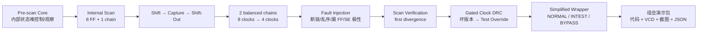
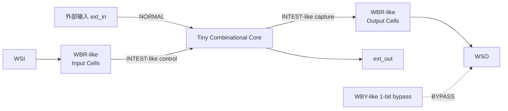

# 三天 DFT 实验冲刺报告：从 Internal Scan 到 Wrapper、DRC 与故障定位

## 执行摘要

这三天的目标不是继续扩大 DFT 理论覆盖面，而是把你已经学过但仍然抽象的 **可控性/可观性 → Scan Cell → Scan Chain → Shift/Capture → Scan Verification → Scan DRC → Wrapper** 变成一条能反复运行、故意破坏、自动抓错并最终用于组会演示的实验链。

这与现有学习计划的方向一致：你已经有 Verilog、HDLBits、普通 DFF、Scan DFF、四位 Scan Chain 和基础工具经验；原计划也明确要求把实验升级为自检 Testbench、单链/双链、故障注入、门控时钟和可复现证据，而不是继续大量读理论。fileciteturn0file0 你已有的学习地图也把 **Internal Scan → Scan DRC → Wrapper/CTL → 验证** 定义为比赛所需的连续能力链。fileciteturn0file3

三天主线如下：



教材给出的理论主线正好支持这个实验结构：Muxed-D Scan Cell 在功能/捕获模式选择功能数据，在扫描模式选择串行扫描输入；Full Scan 通过内部存储单元的扫描访问提高内部状态的 controllability 和 observability；Scan flow 又进一步分为 configuration、replacement、reordering、stitching 与 verification。fileciteturn0file1

我建议这三天**暂时不把 Liberty、OpenSTA、EQY、完整 IEEE 1500 协议塞进主线**。它们仍然重要，但你当前的第三天验收目标是“能给队友讲懂 Scan + Wrapper + Gated Clock DRC + 故障定位”。现有缺口报告也已经区分了“教材能充分支持的通用 Scan/DRC 原理”和“需要正式工具手册/Public Case 才能校准的工具级 Wrapper、DFTR 与报告语义”。fileciteturn0file4

三天结束时，你必须拥有下面这组实物，而不仅是“学完了”。

| 实验产物 | 第三天必须达到的结果 | 组会中证明什么 |
|---|---|---|
| 八位单链 Internal Scan | `E05_SCAN1_PASS` | Scan 如何把内部状态变得可控/可观 |
| 八位双链 Internal Scan | `E05_SCAN2_PASS` | chain count、最大链长和 shift 时间的关系 |
| Scan 故障注入 | `E06_FAULTS_PASS` | stitching/order/SE 错误如何被验证器发现和定位 |
| Gated Clock DRC | `E07_GATED_CLOCK_PASS` | 为什么 Scan DRC 不只是“背规则” |
| 简化 Wrapper | `WRAPPER_PASS` | Internal Scan 与 Core Boundary Wrapper 的区别 |
| VCD | 五份 | 可重复分析的原始波形证据 |
| PNG 截图 | 至少五张 | 组会直接展示 |
| Scan JSON | 单链/双链各一份 | 把“链结构”变成结构化报告 |
| Yosys JSON | 单链/双链/Wrapper | 从 HDL 结构进入工具可解析结构 |
| 完整日志 | 每个实验一份 | PASS/FAIL 可审计，而不是凭肉眼判断 |

Icarus Verilog 官方工作流就是先用 `iverilog` 编译，再用 `vvp` 执行；多文件设计可以直接把 RTL 和 Testbench 同时传给编译器，`-s` 可以明确指定仿真顶层。citeturn5view0 本报告的所有主实验都遵循这个最小工作流。VVP 默认支持 `$dumpvars` 产生 VCD；GTKWave 官方支持标准 Verilog VCD 和 FST，因此这套实验不需要额外波形格式转换工具。citeturn5view1turn5view2

## 资源、目录与最终产出

**教材范围只查这些：**

| 主题 | 教材定位 | 这三天只回答的问题 |
|---|---|---|
| Testability | §2.2–2.3 | 为什么时序电路内部状态不好控制、观察？ |
| Scan Cell | §2.4 | `scan_en` 到底在切换哪两条数据路径？ |
| Full Scan | §2.5 | 为什么 Scan 能把内部 FF 暴露成测试接口？ |
| Scan DRC | §2.6，尤其 Gated Clocks | 为什么功能时钟能工作，扫描时却可能完全没 clock？ |
| Scan Flow | §2.7 | replacement、stitching、shift verification 分别在干什么？ |
| Wrapper Architecture | §10.4.2 | Wrapper 为什么在 Core 边界，而 Internal Scan 在 Core 内部？ |
| Wrapper Components | §10.4.3 | WBR、WIR、WBY、WBC 分别做什么？ |
| Instruction Set | §10.4.4 | INTEST、EXTEST、BYPASS 改变哪条测试路径？ |
| CTL | §10.4.5 | 为什么 CTL 是可复用测试信息描述，而不是“测试硬件”？ |

上述章节正是你现有教材目录中 Internal Scan、Scan Design Rules、Scan Design Flow 与 IEEE 1500 Core-Based Testing 的核心范围。fileciteturn0file1 你已有学习地图也将这些章节列为当前必修，而 ATPG 算法、BIST、完整 JTAG 等可以暂缓。fileciteturn0file3

**必用官方资源：**

| 资源 | 用途 |
|---|---|
| [Icarus Verilog Getting Started](https://steveicarus.github.io/iverilog/usage/getting_started.html) | `iverilog → vvp` 编译与执行；多文件、指定顶层。citeturn5view0 |
| [VVP Command Line Flags](https://steveicarus.github.io/iverilog/usage/vvp_flags.html) | VCD/FST、运行时行为。citeturn5view1 |
| [GTKWave 官方文档](https://gtkwave.github.io/gtkwave/) | 打开 VCD/FST、波形分析。citeturn5view2 |
| [Yosys Interactive Investigation](https://yosyshq.readthedocs.io/projects/yosys/en/latest/using_yosys/more_scripting/interactive_investigation.html) | `show`、结构图和设计调查。Yosys 官方示例展示了 `show -format dot -prefix ...` 生成 DOT 结构图。citeturn6view2 |
| [Yosys stat 文档](https://yosyshq.readthedocs.io/projects/yosys/en/stable/cmd/index_passes_status.html#stat-print-some-statistics) | 输出设计对象统计和层次信息。citeturn6view0 |
| [Yosys write_json 文档](https://yosyshq.readthedocs.io/projects/yosys/en/v0.55/cmd/write_json.html) | 将当前设计写成包含 modules、ports、cells、netnames 等字段的 JSON 网表。citeturn6view1 |
| [Yosys Mapping to Cell Libraries](https://yosyshq.readthedocs.io/projects/yosys/en/latest/using_yosys/synthesis/cell_libs.html) | 后续 Liberty/标准单元实验；官方示例使用 `dfflibmap` 和 `abc -liberty`。本三天不是主线。citeturn6view3 |

这些也与已经整理过的开源资源路线相符：Icarus/GTKWave 用于教学仿真与波形，Yosys 用于结构化设计调查，OpenSTA/EQY 放在后续工具闭环。fileciteturn0file5

建议直接建立：

```text
scan_bootcamp/
├── rtl/
│   └── dft_lab_rtl.v
├── tb/
│   ├── tb_e05_scan1.v
│   ├── tb_e05_scan2.v
│   ├── tb_e06_faults.v
│   ├── tb_e07_gated.v
│   └── tb_wrapper.v
├── scripts/
│   └── gen_reports.py
├── outputs/
│   └── screenshots/
├── logs/
├── run_all.sh
└── Makefile
```

这沿用了你原计划“原始输入不覆盖、日志/VCD/报告分开、每次运行有明确 PASS/FAIL”的纪律。fileciteturn0file2

五张**必须保存**的截图定义如下：

| 截图文件 | GTKWave 必须放入的信号 | 截图要说明 |
|---|---|---|
| `e05_scan1_shift_capture.png` | `clk, scan_en, scan_in, scan_out, q_scan[7:0], in_bus` | 单链 Shift-In → Capture → Shift-Out |
| `e05_scan2_parallel_shift.png` | `clk, scan_en, SI0, SI1, SO0, SO1, q_scan[7:0]` | 两条链并行，四拍装完八位 |
| `e06_first_divergence.png` | `q_gold, q_break, q_swap, q_sepol, q_missing` | 不同接链错误的首次分叉 |
| `e07_gated_bad_fixed.png` | `clk, gclk_bad, gclk_fixed, scan_en, func_enable, q_bad, q_fixed` | 主时钟在跳但坏设计的 gated clock 不跳 |
| `wrapper_normal_intest.png` | `mode_intest, mode_bypass, shift_wr, capture_wr, wsi, wso, wbr_dbg, ext_in, ext_out` | NORMAL、INTEST-like、BYPASS-like 三条路径 |

GTKWave 本质上是读取仿真产生的 dumpfile 做事后分析；VCD 是其直接支持格式，因此这里保留 VCD 作为原始证据，PNG 只作为演示材料。citeturn5view2

## 起步日：Internal Scan 扩展闭环

这一天的唯一大目标：

> 从“四位玩具 Scan Chain”升级到“有功能逻辑的八位时序 Core + 功能回归 + 单链 + 双链 + Capture + 结构报告”。

Muxed-D Scan Cell 可以把功能数据路径与扫描数据路径看成一个 MUX：在功能/捕获模式选择正常 `D`，在 Shift 模式选择 `SI`。Full Scan 的关键意义不是“FF 会移位”，而是让内部存储状态能通过扫描链进行初始化和观察。fileciteturn0file1

### 当日时间表

| 时间 | 明确子任务 | 输入 | 输出 | 验收 |
|---|---|---|---|---|
| 09:00–10:00 | **建立实验基线：从可控性/可观性到 Scan MUX** | 教材 §2.2–2.5；已有四位 Scan Chain | `logs/tool_versions.txt`；手绘数据路径 | 能口头解释 `SE=0` 与 `SE=1`；`iverilog -V`、`vvp -V` 有输出 |
| 10:00–11:00 | **构造八位 Pre-scan Tiny Core 与单链 Scan Core** | `dft_lab_rtl.v` | `tiny_core_prescan`、`tiny_core_scan1` | Yosys/编译器无语法错误 |
| 11:00–12:00 | **功能模式回归：Scan 插入不能破坏正常功能路径** | `tb_e05_scan1.v` | `logs/e05_scan1.log` | 四组输入全部 `[PASS][FUNC]` |
| 13:00–14:00 | **单链完整测试协议：Shift → Capture → Shift-Out** | target=`10101100` | `e05_scan1.vcd` | `LOAD`、`CAPTURE`、全部 `SHIFT-OUT` PASS |
| 14:00–15:00 | **用波形解释 controllability 与 observability** | `e05_scan1.vcd` | `e05_scan1_shift_capture.png` | 能不看笔记解释三段波形 |
| 15:00–16:00 | **扩展为两条平衡 Scan Chain** | `tiny_core_scan2` | `e05_scan2.vcd` | target 八位只需四个 shift clock |
| 16:00–17:00 | **比较单链与双链，并生成教学 Scan Report** | 单链/双链代码 | 两份 `scan_chain_report_*.json` | chain count、length、cell list、SI/SO 均正确 |
| 17:00–18:00 | **Yosys 结构化检查与当天复盘** | `dft_lab_rtl.v` | `scan1_yosys.json`、`scan2_yosys.json`、Yosys log | JSON 非空；`stat` 可识别模块/单元；当天所有 PASS 保持 |

### 实验核心预测

单链：

```text
scan_in
  ↓
q0 → q1 → q2 → q3 → q4 → q5 → q6 → q7
                                      ↓
                                  scan_out
```

目标：

```text
10101100
```

为了最后得到：

```text
q[7:0] = 10101100
```

要从最高位开始串入：

```text
1 → 0 → 1 → 0 → 1 → 1 → 0 → 0
```

八个 Shift clock 后：

```text
q = 10101100
```

随后令：

```text
scan_en = 0
in_bus  = 101
```

功能逻辑运行一个 Capture clock。本报告提供的逻辑下，预期：

```text
10101100
    |
    | Capture, in_bus=101
    v
11111000
```

然后重新：

```text
scan_en = 1
```

依次从 `scan_out=q7` 观察：

```text
1 → 1 → 1 → 1 → 1 → 0 → 0 → 0
```

你在组会里要强调：


这就是 Chapter 2 中从 sequential testability 问题向 scan-based testing 转化的核心直觉。fileciteturn0file1

### 为什么还要做双链

双链定义为：

```text
chain0:
SI0 → q0 → q2 → q4 → q6 → SO0

chain1:
SI1 → q1 → q3 → q5 → q7 → SO1
```

比较：

| 配置 | FF 总数 | 链数 | 最大链长 | 完整加载所需 Shift clock | Scan-In/Out 端口 |
|---|---:|---:|---:|---:|---:|
| 单链 | 8 | 1 | 8 | 8 | 1 对 |
| 双链 | 8 | 2 | 4 | 4 | 2 对 |

在没有压缩等其他机制时，增加并行扫描链并平衡链长可以减少最长链，从而减少串行 shift 所需周期；教材的 scan configuration/reordering 部分也专门讨论 chain count、chain balancing 和最长扫描链对测试时间的影响。fileciteturn0file1

双链实验 target：

```text
11010011
```

四个周期同时送：

```text
cycle    SI0    SI1
  1       q6     q7
  2       q4     q5
  3       q2     q3
  4       q0     q1
```

最终：

```text
q = 11010011
```

Capture：

```text
in_bus = 011
```

提供代码下预期：

```text
11010011 → 11110000
```

### 当天硬验收

终端最后必须同时存在：

```text
========== E05_SCAN1_PASS ==========
========== E05_SCAN2_PASS ==========
```

还必须存在：

```text
outputs/e05_scan1.vcd
outputs/e05_scan2.vcd
outputs/scan_chain_report_1.json
outputs/scan_chain_report_2.json
outputs/scan1_yosys.json
outputs/scan2_yosys.json
outputs/screenshots/e05_scan1_shift_capture.png
outputs/screenshots/e05_scan2_parallel_shift.png
```

Yosys 的 `write_json` 会将当前设计写成结构化 JSON 网表，而 `stat` 可输出选定设计部分的对象统计；这正适合在不增加复杂工具的情况下，把“我觉得链是这样接的”升级为可解析结构证据。citeturn6view0turn6view1

**当天停止条件：**如果单链还不能稳定 PASS，不许先做双链；如果功能回归失败，不许把问题解释成“Scan 模式错误”，先修功能路径。这个纪律也符合你原计划中“基线未稳定，不扩大实验范围”的要求。fileciteturn0file0

## 诊断日：故障注入与门控时钟

第二天的目标从“会做正确设计”升级到：

> **我能证明我的验证器会抓错，而且能给出 first divergence；然后用 gated clock 做一个最直观的 Scan DRC 实验。**

教材的 Scan Verification 不只要求看最终 `scan_out` 对不对，还讨论通过特定 shift/flush 序列发现扫描连接、时钟或初始化问题；错误的 stitching、边沿/时钟问题以及未妥善处理的 gated/generated clocks 都可能导致 shift verification 失败。fileciteturn0file1

### 当日时间表

| 时间 | 明确子任务 | 输入 | 输出 | 验收 |
|---|---|---|---|---|
| 09:00–10:00 | **读懂 Scan Verification：先定义“什么叫错”** | 教材 §2.7.4 | 故障矩阵笔记 | 能区分断链、顺序错、漏 FF、SE 极性错 |
| 10:00–11:00 | **注入四类 Scan Stitching/Control 故障** | `tiny_core_scan_faulty` | 四个 fault mode | 全部能编译 |
| 11:00–12:00 | **Flush-like pattern 自动抓错** | `01100_01100_01100` | `e06_faults.vcd`, fault log | 四种 fault 全部 `[DETECTED]` |
| 13:00–14:00 | **首次分叉定位实验** | gold 与 faulty `q` | `e06_first_divergence.png` | 能指出“第几拍、哪个 FF 首先分叉” |
| 14:00–15:00 | **构造 Gated Clock DRC 坏设计** | 教材 §2.6.3 | `gated_scan_bad` | `func_enable=0` 时 Scan 完全 shift 不动 |
| 15:00–16:00 | **加入 test override 修复并做功能回归** | `gated_scan_fixed` | `e07_gated.vcd` | fixed 能加载 `1010`；功能模式 bad/fixed 一致 |
| 16:00–17:00 | **做坏/好波形对照** | gated VCD | `e07_gated_bad_fixed.png` | 一张图能看到 `clk`、两个 `gclk` 和两个 `q` |
| 17:00–18:00 | **整理 found→diagnosis→fix→verify 故障卡** | 日志、波形 | fault manifest + 汇报讲稿 | 能五分钟完成一次“发现→修复→重跑”演示 |

### Scan 故障矩阵

代码会构造：

| Fault Mode | 故障 | 正确链 | 错误结构核心变化 | 预期首次明显异常 |
|---|---|---|---|---|
| baseline | 无 | `q0→q1→q2→...` | 无 | 无 |
| break | q4 前断链 | `q3→q4` | `q4.SI=0` | q4 |
| order | q2/q3 顺序交换 | `q1→q2→q3→q4` | `q1→q3→q2→q4` | q2/q3 |
| SE polarity | Scan Enable 极性错误 | `scan_en=1` shift | 实际进入 function mode | 通常很早出现 |
| missing FF | q4 未纳入有效扫描路径 | `q3→q4→q5` | `q3→q5`，q4 被跳过 | q4 附近 |

提供的 flush-like 输入：

```text
01100 01100 01100
```

包含多次：

```text
0→1
1→1
1→0
0→0
```

变化，因此比一直 shift `000000...` 或 `111111...` 更容易暴露顺序/连接错误。教材在 Scan Shift Verification 中也强调使用包含多种 transition 的 flush pattern 来暴露 shift operation 问题。fileciteturn0file1

本代码下你预计看到类似：

```text
[DETECTED][SE_POLARITY] cycle=2 first_diff_q=0 ...
[DETECTED][ORDER]       cycle=4 first_diff_q=2 ...
[DETECTED][BREAK]       cycle=6 first_diff_q=4 ...
[DETECTED][MISSING_FF]  cycle=6 first_diff_q=4 ...

========== E06_FAULTS_PASS ==========
```

这里的 `first_diff_q` 是**教学 Testbench 直接观察内部寄存器后的首次分叉点**，不是说真实芯片一定可以直接从外部看到每个 `q`。实验目的类似 Scan Verification 的 white-box/debug 环境：先用 golden 与 faulty scan contents 找到 divergence，再把这种思维迁移到实际工具的 chain report、scan-out mismatch 和 locator。教材也讨论了在完整验证环境中利用内部 scan cell 内容辅助定位 shift divergence。fileciteturn0file1

故障定位流程固定成：


这和你原实验计划要求的 `found → diagnosis → fix → verify` 闭环一致。fileciteturn0file0

### Gated Clock DRC

坏版本：

```verilog
assign gated_clk = clk & func_enable;
```

功能使用时：

```text
func_enable = 1
clk          _|‾|_|‾|_|‾|_
gated_clk    _|‾|_|‾|_|‾|_
```

扫描时却故意设置：

```text
func_enable = 0
scan_en      = 1

clk          _|‾|_|‾|_|‾|_
gated_clk    ______________
q            0000 0000 0000
```

于是：

> Scan MUX 明明已经选了 `SI`，但 Scan FF 根本没有收到 shift clock。

这就是为什么“有 Scan Cell”并不等于“Scan 一定能工作”。

教材 §2.6.3 明确把 gated clocks 视为 Scan Design Rule 问题：至少在 shift 阶段必须保证扫描单元的时钟可用；教材还展示了使用 test-mode 或 scan-enable 类控制将时钟门强制打开的思路。fileciteturn0file1

本实验教学修复：

```verilog
assign gated_clk = clk & (func_enable | scan_en);
```

于是扫描时：

```text
func_enable = 0
scan_en      = 1

clk          _|‾|_|‾|_|‾|_
gated_clk    _|‾|_|‾|_|‾|_
q            ...逐拍 Shift...
```

四拍以后：

```text
bad:
q_bad   = 0000

fixed:
q_fixed = 1010
```

终端设计成：

```text
[EXPECTED_FAIL][BAD_DRC] gated clock blocked every shift pulse
[PASS][FIX] test override loaded q_fixed=1010
========== E07_GATED_CLOCK_PASS ==========
```

注意 `[EXPECTED_FAIL]` 是实验里的**预期坏样本现象**，所以整个实验最终仍然 PASS：我们成功证明验证器能够看到故障，也成功证明修复版能 shift。

这张图就是第二天最重要的组会证据：

```text
            BAD                         FIXED

clk       ┌─┐ ┌─┐ ┌─┐ ┌─┐          ┌─┐ ┌─┐ ┌─┐ ┌─┐
          └─┘ └─┘ └─┘ └─┘          └─┘ └─┘ └─┘ └─┘

gclk      __________________          ┌─┐ ┌─┐ ┌─┐ ┌─┐
                                      └─┘ └─┘ └─┘ └─┘

q         0000 0000 0000 0000        0001→0010→0101→1010
```

**风险点：**这里的 `clk & (...)` 是为了把“测试模式必须让 clock 可控”做成肉眼可见的最小教学模型，不要把这个 RTL 小例子等同于真实芯片的完整时钟树/ICG 实现。并且零延迟 RTL 仿真能证明的是逻辑选择和事件顺序，不能证明真实硅上的 setup/hold、clock skew 或物理时序已经签核。你的原计划也明确规定不能用零延迟 RTL 波形代替真实 timing signoff。fileciteturn0file0

### 当天硬验收

必须出现：

```text
========== E06_FAULTS_PASS ==========
========== E07_GATED_CLOCK_PASS ==========
```

必须留下：

```text
outputs/e06_faults.vcd
outputs/e07_gated.vcd

outputs/fault_injection_manifest.json
outputs/gated_clock_manifest.json

logs/e06_faults.log
logs/e07_gated.log

outputs/screenshots/e06_first_divergence.png
outputs/screenshots/e07_gated_bad_fixed.png
```

## 汇报日：简化 Wrapper 与组会集成

第三天不实现完整 IEEE 1500。

目标是：

> 用一个足够小但概念方向正确的 Wrapper 教学模型，把“内部 Scan”与“Core 边界测试访问”区分开。

IEEE 1500 Wrapper 的总体思想是在 embedded core 边界提供标准化测试访问结构；相关组件包括 WBR/WBC、WIR、WBY，以及串行 wrapper port/control。WBR 由 Wrapper Boundary Cells 构成，可以在正常、面向 Core 的测试、面向外部逻辑的测试等模式中改变控制/观察方向；WBY 提供短的旁路数据路径。fileciteturn0file1

教材的 `WS_INTEST_RING`/`WS_INTEST_SCAN` 等概念进一步说明，Wrapper 能用于测试 Core，甚至可把 Core 内部 Scan Chain 与 Wrapper 数据路径组织到联合测试架构中；而 `BYPASS` 则允许不测试某个 Core 时缩短串行测试路径。fileciteturn0file1

### 当日时间表

| 时间 | 明确子任务 | 输入 | 输出 | 验收 |
|---|---|---|---|---|
| 09:00–10:00 | **只读懂 Wrapper 的四件东西** | §10.4.2–10.4.5 | 一张 Wrapper 草图 | 能讲清 WBR/WIR/WBY/INTEST |
| 10:00–11:00 | **实现 WBR-like + NORMAL + INTEST-like 数据路径** | `simple_wrapper` | RTL | 编译通过 |
| 11:00–12:00 | **加入 WBY-like bypass 与自检 TB** | `tb_wrapper.v` | `wrapper.vcd` | NORMAL、INTEST、BYPASS 全 PASS |
| 13:00–14:00 | **做 Wrapper 波形与 Internal Scan 对照图** | Wrapper VCD | `wrapper_normal_intest.png` | 能用一图指出 Core 内部与 Core 边界 |
| 14:00–15:00 | **全套回归并冻结 JSON/log/VCD** | `run_all.sh` | 完整 outputs/logs | `ALL_LABS_PASS` |
| 15:00–16:00 | **制作组会十五分钟故事线** | 五张波形 + Mermaid | 汇报顺序 | 不依赖教材原文也能讲 |
| 16:00–17:00 | **现场演示 rehearsal：先 FAIL 再修复** | E06/E07 | 演示脚本 | 五分钟内演完一次故障闭环 |
| 17:00–18:00 | **最终 dry-run 与材料冻结** | 全部代码/结果 | meeting package | 从空终端执行一键脚本全部 PASS |

### 简化 Wrapper 到底实现什么



你要让队友形成这个区分：

```text
Internal Scan
位置：Core 内部
对象：内部 FF / state
方法：Shift-In → Capture → Shift-Out

Wrapper Scan
位置：Core 边界
对象：Core 输入/输出边界
方法：通过 Wrapper Cell 控制 Core 输入、捕获 Core 输出
```

所以：

> **Wrapper Scan 不能简单理解成“另一条 Internal Scan Chain”。**

Internal Scan 解决的是内部状态 access；Wrapper 解决的是 Core 在 SoC 集成环境中的边界级测试 access。你的学习地图也明确把两者放在不同知识层。fileciteturn0file3

本实验有意把：

```text
mode_intest
mode_bypass
```

当成“已经经过 WIR 解码后的模式控制”。

**没有实现：**

```text
完整 WIR 指令寄存器
完整 WSP 状态/控制协议
Update / Transfer / Apply
完整 EXTEST
Parallel WPP/TAM
完整标准 Wrapper Cell 行为
CTL 输出
```

因此 `wrapper_manifest.json` 会明确写：

```json
"ieee1500_compliant": false
```

这是很重要的工程诚实性：它是 **IEEE 1500 概念教学模型，不是 IEEE 1500 合规实现**。你的缺口报告也指出，教材足以支持 Wrapper 原理，但工具级 Wrapper 配置、报告与比赛交付语义仍需正式工具资料校准。fileciteturn0file4

CTL 这三天只讲一句：

> CTL 的作用是表达可复用 Core 的测试相关信息、接口/测试模式/约束等，使 Core 测试知识可以被集成环境使用；它不是替代 WBR/WIR/WBY 的硬件。fileciteturn0file1

### 组会十五分钟讲解顺序

| 时间 | 展示 | 核心句 |
|---:|---|---|
| 0–1 min | Pre-scan Core 图 | “内部 FF 难直接控制、难直接观察。” |
| 1–3 min | `scan_ff` 五行核心代码 | “Scan 本质上给 FF 的 D 前面增加测试数据选择路径。” |
| 3–6 min | 单链 Shift/Capture/Shift-Out 波形 | “Shift 控制状态，Capture 测功能逻辑，Shift-Out 观察响应。” |
| 6–7 min | 单链/双链对照 | “链数增加后最大链长从 8 变 4，本例装载周期从 8 变 4。” |
| 7–10 min | E06 故障波形 | “验证不只是看最终输出，还要找 first divergence。” |
| 10–12 min | Gated Clock 坏/好对照 | “Scan FF 有了还不够，shift clock 必须真正到达。” |
| 12–14 min | Wrapper 图与波形 | “Internal Scan 看 Core 内部，Wrapper 看 Core 边界。” |
| 14–15 min | 整体流程图 | “最终流程是 insert → verify → diagnose → fix → rerun。” |

第三天**最值得做的现场 demo**是 gated clock：

先运行坏设计，指着：

```text
clk       在跳
gclk_bad  不跳
q_bad     0000
```

再指着修复设计：

```text
gclk_fixed 在跳
q_fixed    1010
```

这会比单独讲“Scan Design Rule says clock controllability”有效得多。

### 最终组会材料包

建议冻结：

```text
meeting_package/
├── code/
│   ├── scan_ff_excerpt.v
│   ├── scan1_excerpt.v
│   ├── gated_clock_bad_fixed.v
│   └── wrapper_excerpt.v
├── waves/
│   ├── e05_scan1_shift_capture.png
│   ├── e05_scan2_parallel_shift.png
│   ├── e06_first_divergence.png
│   ├── e07_gated_bad_fixed.png
│   └── wrapper_normal_intest.png
├── json/
│   ├── scan_chain_report_1.json
│   ├── scan_chain_report_2.json
│   ├── fault_injection_manifest.json
│   ├── gated_clock_manifest.json
│   └── wrapper_manifest.json
└── notes/
    └── meeting_script.md
```

## 可直接运行的代码答案

下面代码以你已有的 Icarus/VVP 环境为执行基线。Icarus 官方支持将多个设计文件直接传给 `iverilog`，再用 `vvp` 运行编译结果；本方案进一步使用 `-s` 固定 Testbench 顶层，避免一个 RTL 文件中存在多个未实例化模块时被误当成多个 root。citeturn5view0

当前研究容器没有可用的 Icarus binary，且无法联网安装，所以我不把代码冒充成“已经在本容器实跑过”；为降低这个风险，下面代码只使用 Icarus `-g2012` 可接受的基础 Verilog/SystemVerilog 语法，并且 `run_all.sh` 会对每一个实验重新编译、运行，并在缺少指定 PASS token 时立即以失败退出。你机器上的最终真值仍然是实际 `iverilog + vvp` 结果。

**`rtl/dft_lab_rtl.v`**

```verilog
`timescale 1ns/1ps

// ============================================================
// Basic Muxed-D style scan flip-flop
// scan_en=0: functional/capture D
// scan_en=1: serial scan input SI
// ============================================================
module scan_ff (
    input  wire clk,
    input  wire rst_n,
    input  wire scan_en,
    input  wire si,
    input  wire d,
    output reg  q
);
    always @(posedge clk or negedge rst_n) begin
        if (!rst_n)
            q <= 1'b0;
        else if (scan_en)
            q <= si;
        else
            q <= d;
    end
endmodule


// ============================================================
// Common functional logic for the 8-bit tiny core.
// All pre-scan and post-scan variants use exactly this logic.
// ============================================================
module tiny_core_logic (
    input  wire [7:0] q,
    input  wire [2:0] in_bus,
    output wire [7:0] d,
    output wire [3:0] y
);
    assign d[0] = in_bus[0] ^ q[7];
    assign d[1] = q[0] ^ in_bus[1];
    assign d[2] = q[1] & ~q[0];
    assign d[3] = q[2] | in_bus[2];
    assign d[4] = q[3] ^ q[1];
    assign d[5] = q[4] ^ q[2];
    assign d[6] = (q[5] & q[0]) ^ in_bus[0];
    assign d[7] = q[6] | q[3];

    assign y = q[7:4] ^ q[3:0];
endmodule


// ============================================================
// Pre-scan baseline
// ============================================================
module tiny_core_prescan (
    input  wire       clk,
    input  wire       rst_n,
    input  wire [2:0] in_bus,
    output wire [3:0] y,
    output wire [7:0] q_dbg
);
    reg  [7:0] q;
    wire [7:0] d;

    tiny_core_logic u_logic (
        .q(q),
        .in_bus(in_bus),
        .d(d),
        .y(y)
    );

    always @(posedge clk or negedge rst_n) begin
        if (!rst_n)
            q <= 8'b0;
        else
            q <= d;
    end

    assign q_dbg = q;
endmodule


// ============================================================
// One-chain Internal Scan
//
// scan_in -> q0 -> q1 -> q2 -> q3
//         -> q4 -> q5 -> q6 -> q7 -> scan_out
// ============================================================
module tiny_core_scan1 (
    input  wire       clk,
    input  wire       rst_n,
    input  wire [2:0] in_bus,
    input  wire       scan_en,
    input  wire       scan_in,
    output wire       scan_out,
    output wire [3:0] y,
    output wire [7:0] q_dbg
);
    wire [7:0] q;
    wire [7:0] d;
    wire [7:0] si;

    tiny_core_logic u_logic (
        .q(q),
        .in_bus(in_bus),
        .d(d),
        .y(y)
    );

    assign si[0] = scan_in;
    assign si[1] = q[0];
    assign si[2] = q[1];
    assign si[3] = q[2];
    assign si[4] = q[3];
    assign si[5] = q[4];
    assign si[6] = q[5];
    assign si[7] = q[6];

    scan_ff u_ff0 (
        .clk(clk), .rst_n(rst_n), .scan_en(scan_en),
        .si(si[0]), .d(d[0]), .q(q[0])
    );
    scan_ff u_ff1 (
        .clk(clk), .rst_n(rst_n), .scan_en(scan_en),
        .si(si[1]), .d(d[1]), .q(q[1])
    );
    scan_ff u_ff2 (
        .clk(clk), .rst_n(rst_n), .scan_en(scan_en),
        .si(si[2]), .d(d[2]), .q(q[2])
    );
    scan_ff u_ff3 (
        .clk(clk), .rst_n(rst_n), .scan_en(scan_en),
        .si(si[3]), .d(d[3]), .q(q[3])
    );
    scan_ff u_ff4 (
        .clk(clk), .rst_n(rst_n), .scan_en(scan_en),
        .si(si[4]), .d(d[4]), .q(q[4])
    );
    scan_ff u_ff5 (
        .clk(clk), .rst_n(rst_n), .scan_en(scan_en),
        .si(si[5]), .d(d[5]), .q(q[5])
    );
    scan_ff u_ff6 (
        .clk(clk), .rst_n(rst_n), .scan_en(scan_en),
        .si(si[6]), .d(d[6]), .q(q[6])
    );
    scan_ff u_ff7 (
        .clk(clk), .rst_n(rst_n), .scan_en(scan_en),
        .si(si[7]), .d(d[7]), .q(q[7])
    );

    assign scan_out = q[7];
    assign q_dbg = q;
endmodule


// ============================================================
// Two balanced Internal Scan chains
//
// chain0: scan_in0 -> q0 -> q2 -> q4 -> q6 -> scan_out0
// chain1: scan_in1 -> q1 -> q3 -> q5 -> q7 -> scan_out1
// ============================================================
module tiny_core_scan2 (
    input  wire       clk,
    input  wire       rst_n,
    input  wire [2:0] in_bus,
    input  wire       scan_en,
    input  wire       scan_in0,
    input  wire       scan_in1,
    output wire       scan_out0,
    output wire       scan_out1,
    output wire [3:0] y,
    output wire [7:0] q_dbg
);
    wire [7:0] q;
    wire [7:0] d;
    wire [7:0] si;

    tiny_core_logic u_logic (
        .q(q),
        .in_bus(in_bus),
        .d(d),
        .y(y)
    );

    // chain0
    assign si[0] = scan_in0;
    assign si[2] = q[0];
    assign si[4] = q[2];
    assign si[6] = q[4];

    // chain1
    assign si[1] = scan_in1;
    assign si[3] = q[1];
    assign si[5] = q[3];
    assign si[7] = q[5];

    scan_ff u_ff0 (
        .clk(clk), .rst_n(rst_n), .scan_en(scan_en),
        .si(si[0]), .d(d[0]), .q(q[0])
    );
    scan_ff u_ff1 (
        .clk(clk), .rst_n(rst_n), .scan_en(scan_en),
        .si(si[1]), .d(d[1]), .q(q[1])
    );
    scan_ff u_ff2 (
        .clk(clk), .rst_n(rst_n), .scan_en(scan_en),
        .si(si[2]), .d(d[2]), .q(q[2])
    );
    scan_ff u_ff3 (
        .clk(clk), .rst_n(rst_n), .scan_en(scan_en),
        .si(si[3]), .d(d[3]), .q(q[3])
    );
    scan_ff u_ff4 (
        .clk(clk), .rst_n(rst_n), .scan_en(scan_en),
        .si(si[4]), .d(d[4]), .q(q[4])
    );
    scan_ff u_ff5 (
        .clk(clk), .rst_n(rst_n), .scan_en(scan_en),
        .si(si[5]), .d(d[5]), .q(q[5])
    );
    scan_ff u_ff6 (
        .clk(clk), .rst_n(rst_n), .scan_en(scan_en),
        .si(si[6]), .d(d[6]), .q(q[6])
    );
    scan_ff u_ff7 (
        .clk(clk), .rst_n(rst_n), .scan_en(scan_en),
        .si(si[7]), .d(d[7]), .q(q[7])
    );

    assign scan_out0 = q[6];
    assign scan_out1 = q[7];
    assign q_dbg = q;
endmodule


// ============================================================
// Fault-injection version.
//
// FAULT_MODE:
//   0 = correct
//   1 = chain break before q4
//   2 = q2/q3 scan order swapped
//   3 = scan-enable polarity inverted
//   4 = q4 omitted from effective scan chain
// ============================================================
module tiny_core_scan_faulty #(
    parameter integer FAULT_MODE = 0
) (
    input  wire       clk,
    input  wire       rst_n,
    input  wire [2:0] in_bus,
    input  wire       scan_en,
    input  wire       scan_in,
    output wire       scan_out,
    output wire [7:0] q_dbg
);
    wire [7:0] q;
    wire [7:0] d;
    wire [7:0] si;
    wire [3:0] unused_y;
    wire       se_eff;

    tiny_core_logic u_logic (
        .q(q),
        .in_bus(in_bus),
        .d(d),
        .y(unused_y)
    );

    assign se_eff =
        (FAULT_MODE == 3) ? ~scan_en : scan_en;

    assign si[0] = scan_in;
    assign si[1] = q[0];

    // Order fault:
    // correct q1 -> q2 -> q3
    // faulty  q1 -> q3 -> q2
    assign si[2] =
        (FAULT_MODE == 2) ? q[3] : q[1];

    assign si[3] =
        (FAULT_MODE == 2) ? q[1] : q[2];

    // Break/missing-q4 fault.
    assign si[4] =
        ((FAULT_MODE == 1) || (FAULT_MODE == 4))
        ? 1'b0
        : ((FAULT_MODE == 2) ? q[2] : q[3]);

    // Missing q4 means q3 feeds q5 directly.
    assign si[5] =
        (FAULT_MODE == 4) ? q[3] : q[4];

    assign si[6] = q[5];
    assign si[7] = q[6];

    scan_ff u_ff0 (
        .clk(clk), .rst_n(rst_n), .scan_en(se_eff),
        .si(si[0]), .d(d[0]), .q(q[0])
    );
    scan_ff u_ff1 (
        .clk(clk), .rst_n(rst_n), .scan_en(se_eff),
        .si(si[1]), .d(d[1]), .q(q[1])
    );
    scan_ff u_ff2 (
        .clk(clk), .rst_n(rst_n), .scan_en(se_eff),
        .si(si[2]), .d(d[2]), .q(q[2])
    );
    scan_ff u_ff3 (
        .clk(clk), .rst_n(rst_n), .scan_en(se_eff),
        .si(si[3]), .d(d[3]), .q(q[3])
    );
    scan_ff u_ff4 (
        .clk(clk), .rst_n(rst_n), .scan_en(se_eff),
        .si(si[4]), .d(d[4]), .q(q[4])
    );
    scan_ff u_ff5 (
        .clk(clk), .rst_n(rst_n), .scan_en(se_eff),
        .si(si[5]), .d(d[5]), .q(q[5])
    );
    scan_ff u_ff6 (
        .clk(clk), .rst_n(rst_n), .scan_en(se_eff),
        .si(si[6]), .d(d[6]), .q(q[6])
    );
    scan_ff u_ff7 (
        .clk(clk), .rst_n(rst_n), .scan_en(se_eff),
        .si(si[7]), .d(d[7]), .q(q[7])
    );

    assign scan_out = q[7];
    assign q_dbg = q;
endmodule


// ============================================================
// Gated-clock DRC bad example.
// During scan:
//   func_enable = 0
//   scan_en     = 1
// gated_clk stays 0, so scan shifting cannot occur.
// ============================================================
module gated_scan_bad (
    input  wire       clk,
    input  wire       rst_n,
    input  wire       func_enable,
    input  wire       func_in,
    input  wire       scan_en,
    input  wire       scan_in,
    output wire       scan_out,
    output wire       gated_clk_dbg,
    output wire [3:0] q_dbg
);
    wire gated_clk;
    wire [3:0] q;
    wire [3:0] d;
    wire [3:0] si;

    assign gated_clk = clk & func_enable;

    assign d[0] = q[3] ^ func_in;
    assign d[1] = q[0];
    assign d[2] = q[1];
    assign d[3] = q[2];

    assign si[0] = scan_in;
    assign si[1] = q[0];
    assign si[2] = q[1];
    assign si[3] = q[2];

    scan_ff u_ff0 (
        .clk(gated_clk), .rst_n(rst_n), .scan_en(scan_en),
        .si(si[0]), .d(d[0]), .q(q[0])
    );
    scan_ff u_ff1 (
        .clk(gated_clk), .rst_n(rst_n), .scan_en(scan_en),
        .si(si[1]), .d(d[1]), .q(q[1])
    );
    scan_ff u_ff2 (
        .clk(gated_clk), .rst_n(rst_n), .scan_en(scan_en),
        .si(si[2]), .d(d[2]), .q(q[2])
    );
    scan_ff u_ff3 (
        .clk(gated_clk), .rst_n(rst_n), .scan_en(scan_en),
        .si(si[3]), .d(d[3]), .q(q[3])
    );

    assign scan_out = q[3];
    assign gated_clk_dbg = gated_clk;
    assign q_dbg = q;
endmodule


// ============================================================
// Teaching-only gated-clock test override.
//
// scan_en=1 forces gated clock open during shift.
// This is a minimal DRC teaching model, not a production CTS/ICG model.
// ============================================================
module gated_scan_fixed (
    input  wire       clk,
    input  wire       rst_n,
    input  wire       func_enable,
    input  wire       func_in,
    input  wire       scan_en,
    input  wire       scan_in,
    output wire       scan_out,
    output wire       gated_clk_dbg,
    output wire [3:0] q_dbg
);
    wire gated_clk;
    wire [3:0] q;
    wire [3:0] d;
    wire [3:0] si;

    assign gated_clk =
        clk & (func_enable | scan_en);

    assign d[0] = q[3] ^ func_in;
    assign d[1] = q[0];
    assign d[2] = q[1];
    assign d[3] = q[2];

    assign si[0] = scan_in;
    assign si[1] = q[0];
    assign si[2] = q[1];
    assign si[3] = q[2];

    scan_ff u_ff0 (
        .clk(gated_clk), .rst_n(rst_n), .scan_en(scan_en),
        .si(si[0]), .d(d[0]), .q(q[0])
    );
    scan_ff u_ff1 (
        .clk(gated_clk), .rst_n(rst_n), .scan_en(scan_en),
        .si(si[1]), .d(d[1]), .q(q[1])
    );
    scan_ff u_ff2 (
        .clk(gated_clk), .rst_n(rst_n), .scan_en(scan_en),
        .si(si[2]), .d(d[2]), .q(q[2])
    );
    scan_ff u_ff3 (
        .clk(gated_clk), .rst_n(rst_n), .scan_en(scan_en),
        .si(si[3]), .d(d[3]), .q(q[3])
    );

    assign scan_out = q[3];
    assign gated_clk_dbg = gated_clk;
    assign q_dbg = q;
endmodule


// ============================================================
// Simplified educational Wrapper.
//
// Implemented:
//   - WBR-like 4-bit serial register
//   - WBY-like 1-bit bypass
//   - NORMAL path
//   - inward-facing INTEST-like control/capture
//
// NOT a complete IEEE 1500 implementation.
// mode_intest/mode_bypass represent decoded instruction state.
// ============================================================
module simple_wrapper (
    input  wire       wrck,
    input  wire       wrst_n,
    input  wire       wsi,
    input  wire       shift_wr,
    input  wire       capture_wr,
    input  wire       mode_intest,
    input  wire       mode_bypass,
    input  wire [1:0] ext_in,
    output wire       wso,
    output wire [1:0] ext_out,
    output wire [3:0] wbr_dbg,
    output wire       wby_dbg
);
    reg  [3:0] wbr;
    reg        wby;

    wire [1:0] core_in;
    wire [1:0] core_out;

    // NORMAL:
    //   ext_in -> core
    //
    // INTEST-like:
    //   WBR lower bits -> core
    assign core_in =
        mode_intest ? wbr[1:0] : ext_in;

    // Tiny combinational core.
    assign core_out[0] =
        core_in[0] ^ core_in[1];

    assign core_out[1] =
        core_in[0] & core_in[1];

    assign ext_out = core_out;

    // Bypass-like serial choice.
    assign wso =
        mode_bypass ? wby : wbr[3];

    always @(posedge wrck or negedge wrst_n) begin
        if (!wrst_n) begin
            wbr <= 4'b0;
            wby <= 1'b0;
        end
        else if (shift_wr) begin
            if (mode_bypass)
                wby <= wsi;
            else
                wbr <= {wbr[2:0], wsi};
        end
        else if (capture_wr && mode_intest) begin
            // Lower bits act as input wrapper cells.
            // Upper bits capture core outputs.
            wbr[3:2] <= core_out;
        end
    end

    assign wbr_dbg = wbr;
    assign wby_dbg = wby;
endmodule
```

**`tb/tb_e05_scan1.v`**

```verilog
`timescale 1ns/1ps

module tb_e05_scan1;

    reg clk;
    reg rst_n;
    reg [2:0] in_bus;
    reg scan_en;
    reg scan_in;

    wire [3:0] y_pre;
    wire [3:0] y_scan;
    wire [7:0] q_pre;
    wire [7:0] q_scan;
    wire scan_out;

    integer errors;
    integer i;

    reg [7:0] expected;
    reg [7:0] target;

    tiny_core_prescan u_pre (
        .clk(clk),
        .rst_n(rst_n),
        .in_bus(in_bus),
        .y(y_pre),
        .q_dbg(q_pre)
    );

    tiny_core_scan1 u_scan (
        .clk(clk),
        .rst_n(rst_n),
        .in_bus(in_bus),
        .scan_en(scan_en),
        .scan_in(scan_in),
        .scan_out(scan_out),
        .y(y_scan),
        .q_dbg(q_scan)
    );

    initial begin
        clk = 1'b0;
        forever #5 clk = ~clk;
    end

    function [7:0] calc_next;
        input [7:0] q;
        input [2:0] v;
        begin
            calc_next[0] = v[0] ^ q[7];
            calc_next[1] = q[0] ^ v[1];
            calc_next[2] = q[1] & ~q[0];
            calc_next[3] = q[2] | v[2];
            calc_next[4] = q[3] ^ q[1];
            calc_next[5] = q[4] ^ q[2];
            calc_next[6] = (q[5] & q[0]) ^ v[0];
            calc_next[7] = q[6] | q[3];
        end
    endfunction

    task reset_duts;
        begin
            rst_n = 1'b0;
            in_bus = 3'b000;
            scan_en = 1'b0;
            scan_in = 1'b0;

            repeat (2)
                @(posedge clk);

            @(negedge clk);
            rst_n = 1'b1;
            #1;
        end
    endtask

    task functional_step;
        input [2:0] v;
        begin
            @(negedge clk);

            scan_en = 1'b0;
            scan_in = 1'b0;
            in_bus = v;

            @(posedge clk);
            #1;

            if ((q_pre !== q_scan) ||
                (y_pre !== y_scan)) begin

                $display(
                    "[FAIL][FUNC] in=%b pre_q=%b scan_q=%b pre_y=%b scan_y=%b",
                    v, q_pre, q_scan, y_pre, y_scan
                );

                errors = errors + 1;
            end
            else begin
                $display(
                    "[PASS][FUNC] in=%b q=%b y=%b",
                    v, q_scan, y_scan
                );
            end
        end
    endtask

    task load_scan_pattern;
        input [7:0] pattern;
        begin
            scan_en = 1'b1;

            for (i = 7; i >= 0; i = i - 1) begin
                @(negedge clk);
                scan_in = pattern[i];

                @(posedge clk);
                #1;

                $display(
                    "[SHIFT-IN] bit=%b q=%b",
                    pattern[i],
                    q_scan
                );
            end

            if (q_scan !== pattern) begin
                $display(
                    "[FAIL][LOAD] expected=%b actual=%b",
                    pattern,
                    q_scan
                );
                errors = errors + 1;
            end
            else begin
                $display(
                    "[PASS][LOAD] q=%b",
                    q_scan
                );
            end
        end
    endtask

    task check_shift_out;
        input [7:0] pattern;
        begin
            scan_en = 1'b1;
            scan_in = 1'b0;

            for (i = 7; i >= 0; i = i - 1) begin
                @(negedge clk);

                if (scan_out !== pattern[i]) begin
                    $display(
                        "[FAIL][SHIFT-OUT] i=%0d expected=%b actual=%b",
                        i,
                        pattern[i],
                        scan_out
                    );
                    errors = errors + 1;
                end
                else begin
                    $display(
                        "[PASS][SHIFT-OUT] i=%0d bit=%b",
                        i,
                        scan_out
                    );
                end

                @(posedge clk);
                #1;
            end
        end
    endtask

    initial begin
        $dumpfile("outputs/e05_scan1.vcd");
        $dumpvars(0, tb_e05_scan1);

        errors = 0;

        rst_n = 1'b0;
        in_bus = 3'b000;
        scan_en = 1'b0;
        scan_in = 1'b0;

        $display(
            "=== E05 scan1: functional regression ==="
        );

        reset_duts;

        functional_step(3'b001);
        functional_step(3'b101);
        functional_step(3'b011);
        functional_step(3'b110);

        $display(
            "=== E05 scan1: shift -> capture -> shift ==="
        );

        reset_duts;

        target = 8'b1010_1100;

        load_scan_pattern(target);

        expected =
            calc_next(target, 3'b101);

        @(negedge clk);

        scan_en = 1'b0;
        in_bus = 3'b101;

        @(posedge clk);
        #1;

        if (q_scan !== expected) begin
            $display(
                "[FAIL][CAPTURE] expected=%b actual=%b",
                expected,
                q_scan
            );
            errors = errors + 1;
        end
        else begin
            $display(
                "[PASS][CAPTURE] %b -> %b",
                target,
                q_scan
            );
        end

        check_shift_out(expected);

        if (errors == 0)
            $display(
                "========== E05_SCAN1_PASS =========="
            );
        else
            $display(
                "========== E05_SCAN1_FAIL errors=%0d ==========",
                errors
            );

        #2;
        $finish;
    end

endmodule
```

**`tb/tb_e05_scan2.v`**

```verilog
`timescale 1ns/1ps

module tb_e05_scan2;

    reg clk;
    reg rst_n;
    reg [2:0] in_bus;

    reg scan_en;
    reg scan_in0;
    reg scan_in1;

    wire [3:0] y_pre;
    wire [3:0] y_scan;

    wire [7:0] q_pre;
    wire [7:0] q_scan;

    wire scan_out0;
    wire scan_out1;

    integer errors;
    integer i;

    reg [7:0] target;
    reg [7:0] expected;

    tiny_core_prescan u_pre (
        .clk(clk),
        .rst_n(rst_n),
        .in_bus(in_bus),
        .y(y_pre),
        .q_dbg(q_pre)
    );

    tiny_core_scan2 u_scan (
        .clk(clk),
        .rst_n(rst_n),
        .in_bus(in_bus),

        .scan_en(scan_en),

        .scan_in0(scan_in0),
        .scan_in1(scan_in1),

        .scan_out0(scan_out0),
        .scan_out1(scan_out1),

        .y(y_scan),
        .q_dbg(q_scan)
    );

    initial begin
        clk = 1'b0;
        forever #5 clk = ~clk;
    end

    function [7:0] calc_next;
        input [7:0] q;
        input [2:0] v;
        begin
            calc_next[0] = v[0] ^ q[7];
            calc_next[1] = q[0] ^ v[1];
            calc_next[2] = q[1] & ~q[0];
            calc_next[3] = q[2] | v[2];
            calc_next[4] = q[3] ^ q[1];
            calc_next[5] = q[4] ^ q[2];
            calc_next[6] =
                (q[5] & q[0]) ^ v[0];
            calc_next[7] =
                q[6] | q[3];
        end
    endfunction

    task reset_duts;
        begin
            rst_n = 1'b0;
            in_bus = 3'b000;

            scan_en = 1'b0;
            scan_in0 = 1'b0;
            scan_in1 = 1'b0;

            repeat (2)
                @(posedge clk);

            @(negedge clk);
            rst_n = 1'b1;
            #1;
        end
    endtask

    task functional_step;
        input [2:0] v;
        begin
            @(negedge clk);

            scan_en = 1'b0;
            in_bus = v;

            @(posedge clk);
            #1;

            if ((q_pre !== q_scan) ||
                (y_pre !== y_scan)) begin

                $display(
                    "[FAIL][FUNC] in=%b pre_q=%b scan_q=%b",
                    v,
                    q_pre,
                    q_scan
                );

                errors = errors + 1;
            end
            else begin
                $display(
                    "[PASS][FUNC] in=%b q=%b",
                    v,
                    q_scan
                );
            end
        end
    endtask

    task load_two_chains;
        input [7:0] pattern;
        begin
            scan_en = 1'b1;

            for (i = 3; i >= 0; i = i - 1) begin
                @(negedge clk);

                scan_in0 =
                    pattern[2*i];

                scan_in1 =
                    pattern[2*i+1];

                @(posedge clk);
                #1;

                $display(
                    "[SHIFT-IN-2CH] SI0=%b SI1=%b q=%b",
                    pattern[2*i],
                    pattern[2*i+1],
                    q_scan
                );
            end

            if (q_scan !== pattern) begin
                $display(
                    "[FAIL][LOAD-2CH] expected=%b actual=%b",
                    pattern,
                    q_scan
                );
                errors = errors + 1;
            end
            else begin
                $display(
                    "[PASS][LOAD-2CH] q=%b clocks=4",
                    q_scan
                );
            end
        end
    endtask

    task check_two_chain_shift_out;
        input [7:0] pattern;
        begin
            scan_en = 1'b1;
            scan_in0 = 1'b0;
            scan_in1 = 1'b0;

            for (i = 3; i >= 0; i = i - 1) begin
                @(negedge clk);

                if (scan_out0 !== pattern[2*i]) begin
                    $display(
                        "[FAIL][SO0] expected=%b actual=%b",
                        pattern[2*i],
                        scan_out0
                    );
                    errors = errors + 1;
                end

                if (scan_out1 !== pattern[2*i+1]) begin
                    $display(
                        "[FAIL][SO1] expected=%b actual=%b",
                        pattern[2*i+1],
                        scan_out1
                    );
                    errors = errors + 1;
                end

                @(posedge clk);
                #1;
            end
        end
    endtask

    initial begin
        $dumpfile("outputs/e05_scan2.vcd");
        $dumpvars(0, tb_e05_scan2);

        errors = 0;

        rst_n = 1'b0;
        in_bus = 3'b000;

        scan_en = 1'b0;
        scan_in0 = 1'b0;
        scan_in1 = 1'b0;

        $display(
            "=== E05 scan2: functional regression ==="
        );

        reset_duts;

        functional_step(3'b001);
        functional_step(3'b101);
        functional_step(3'b011);
        functional_step(3'b110);

        $display(
            "=== E05 scan2: balanced two-chain test ==="
        );

        reset_duts;

        target = 8'b1101_0011;

        load_two_chains(target);

        expected =
            calc_next(target, 3'b011);

        @(negedge clk);

        scan_en = 1'b0;
        in_bus = 3'b011;

        @(posedge clk);
        #1;

        if (q_scan !== expected) begin
            $display(
                "[FAIL][CAPTURE-2CH] expected=%b actual=%b",
                expected,
                q_scan
            );
            errors = errors + 1;
        end
        else begin
            $display(
                "[PASS][CAPTURE-2CH] %b -> %b",
                target,
                q_scan
            );
        end

        check_two_chain_shift_out(expected);

        if (errors == 0)
            $display(
                "========== E05_SCAN2_PASS =========="
            );
        else
            $display(
                "========== E05_SCAN2_FAIL errors=%0d ==========",
                errors
            );

        #2;
        $finish;
    end

endmodule
```

**`tb/tb_e06_faults.v`**

```verilog
`timescale 1ns/1ps

module tb_e06_faults;

    reg clk;
    reg rst_n;
    reg [2:0] in_bus;
    reg scan_en;
    reg scan_in;

    wire [7:0] q_gold;
    wire [7:0] q_break;
    wire [7:0] q_swap;
    wire [7:0] q_sepol;
    wire [7:0] q_missing;

    wire so_gold;
    wire so_break;
    wire so_swap;
    wire so_sepol;
    wire so_missing;

    integer i;
    integer cycle;

    integer seen_break;
    integer seen_swap;
    integer seen_sepol;
    integer seen_missing;

    reg [14:0] flush_pattern;

    tiny_core_scan_faulty #(
        .FAULT_MODE(0)
    ) u_gold (
        .clk(clk),
        .rst_n(rst_n),
        .in_bus(in_bus),
        .scan_en(scan_en),
        .scan_in(scan_in),
        .scan_out(so_gold),
        .q_dbg(q_gold)
    );

    tiny_core_scan_faulty #(
        .FAULT_MODE(1)
    ) u_break (
        .clk(clk),
        .rst_n(rst_n),
        .in_bus(in_bus),
        .scan_en(scan_en),
        .scan_in(scan_in),
        .scan_out(so_break),
        .q_dbg(q_break)
    );

    tiny_core_scan_faulty #(
        .FAULT_MODE(2)
    ) u_swap (
        .clk(clk),
        .rst_n(rst_n),
        .in_bus(in_bus),
        .scan_en(scan_en),
        .scan_in(scan_in),
        .scan_out(so_swap),
        .q_dbg(q_swap)
    );

    tiny_core_scan_faulty #(
        .FAULT_MODE(3)
    ) u_sepol (
        .clk(clk),
        .rst_n(rst_n),
        .in_bus(in_bus),
        .scan_en(scan_en),
        .scan_in(scan_in),
        .scan_out(so_sepol),
        .q_dbg(q_sepol)
    );

    tiny_core_scan_faulty #(
        .FAULT_MODE(4)
    ) u_missing (
        .clk(clk),
        .rst_n(rst_n),
        .in_bus(in_bus),
        .scan_en(scan_en),
        .scan_in(scan_in),
        .scan_out(so_missing),
        .q_dbg(q_missing)
    );

    initial begin
        clk = 1'b0;
        forever #5 clk = ~clk;
    end

    function integer first_diff;
        input [7:0] a;
        input [7:0] b;

        integer k;

        begin
            first_diff = -1;

            for (k = 0; k < 8; k = k + 1) begin
                if ((first_diff == -1) &&
                    (a[k] !== b[k]))
                    first_diff = k;
            end
        end
    endfunction

    task reset_all;
        begin
            rst_n = 1'b0;

            in_bus = 3'b000;
            scan_en = 1'b0;
            scan_in = 1'b0;

            repeat (2)
                @(posedge clk);

            @(negedge clk);
            rst_n = 1'b1;
            #1;
        end
    endtask

    initial begin
        $dumpfile("outputs/e06_faults.vcd");
        $dumpvars(0, tb_e06_faults);

        rst_n = 1'b0;

        in_bus = 3'b000;
        scan_en = 1'b0;
        scan_in = 1'b0;

        seen_break = 0;
        seen_swap = 0;
        seen_sepol = 0;
        seen_missing = 0;

        flush_pattern =
            15'b01100_01100_01100;

        reset_all;

        scan_en = 1'b1;

        for (i = 14; i >= 0; i = i - 1) begin
            cycle = 15 - i;

            @(negedge clk);

            scan_in =
                flush_pattern[i];

            @(posedge clk);
            #1;

            if (!seen_break &&
                (q_break !== q_gold)) begin

                seen_break = 1;

                $display(
                    "[DETECTED][BREAK] cycle=%0d first_diff_q=%0d gold=%b actual=%b",
                    cycle,
                    first_diff(q_gold, q_break),
                    q_gold,
                    q_break
                );
            end

            if (!seen_swap &&
                (q_swap !== q_gold)) begin

                seen_swap = 1;

                $display(
                    "[DETECTED][ORDER] cycle=%0d first_diff_q=%0d gold=%b actual=%b",
                    cycle,
                    first_diff(q_gold, q_swap),
                    q_gold,
                    q_swap
                );
            end

            if (!seen_sepol &&
                (q_sepol !== q_gold)) begin

                seen_sepol = 1;

                $display(
                    "[DETECTED][SE_POLARITY] cycle=%0d first_diff_q=%0d gold=%b actual=%b",
                    cycle,
                    first_diff(q_gold, q_sepol),
                    q_gold,
                    q_sepol
                );
            end

            if (!seen_missing &&
                (q_missing !== q_gold)) begin

                seen_missing = 1;

                $display(
                    "[DETECTED][MISSING_FF] cycle=%0d first_diff_q=%0d gold=%b actual=%b",
                    cycle,
                    first_diff(q_gold, q_missing),
                    q_gold,
                    q_missing
                );
            end
        end

        if (
            seen_break &&
            seen_swap &&
            seen_sepol &&
            seen_missing
        )
            $display(
                "========== E06_FAULTS_PASS =========="
            );
        else
            $display(
                "========== E06_FAULTS_FAIL break=%0d swap=%0d sepol=%0d missing=%0d ==========",
                seen_break,
                seen_swap,
                seen_sepol,
                seen_missing
            );

        #2;
        $finish;
    end

endmodule
```

**`tb/tb_e07_gated.v`**

```verilog
`timescale 1ns/1ps

module tb_e07_gated;

    reg clk;
    reg rst_n;

    reg func_enable;
    reg func_in;

    reg scan_en;
    reg scan_in;

    wire so_bad;
    wire so_fixed;

    wire gclk_bad;
    wire gclk_fixed;

    wire [3:0] q_bad;
    wire [3:0] q_fixed;

    integer i;
    integer errors;

    reg [3:0] target;

    gated_scan_bad u_bad (
        .clk(clk),
        .rst_n(rst_n),

        .func_enable(func_enable),
        .func_in(func_in),

        .scan_en(scan_en),
        .scan_in(scan_in),

        .scan_out(so_bad),

        .gated_clk_dbg(gclk_bad),
        .q_dbg(q_bad)
    );

    gated_scan_fixed u_fixed (
        .clk(clk),
        .rst_n(rst_n),

        .func_enable(func_enable),
        .func_in(func_in),

        .scan_en(scan_en),
        .scan_in(scan_in),

        .scan_out(so_fixed),

        .gated_clk_dbg(gclk_fixed),
        .q_dbg(q_fixed)
    );

    initial begin
        clk = 1'b0;
        forever #5 clk = ~clk;
    end

    task reset_all;
        begin
            rst_n = 1'b0;

            func_enable = 1'b0;
            func_in = 1'b0;

            scan_en = 1'b0;
            scan_in = 1'b0;

            repeat (2)
                @(posedge clk);

            @(negedge clk);

            rst_n = 1'b1;
            #1;
        end
    endtask

    initial begin
        $dumpfile("outputs/e07_gated.vcd");
        $dumpvars(0, tb_e07_gated);

        errors = 0;

        rst_n = 1'b0;

        func_enable = 1'b0;
        func_in = 1'b0;

        scan_en = 1'b0;
        scan_in = 1'b0;

        $display(
            "=== gated clock scan shift: bad versus fixed ==="
        );

        reset_all;

        target = 4'b1010;

        func_enable = 1'b0;
        scan_en = 1'b1;

        for (i = 3; i >= 0; i = i - 1) begin
            @(negedge clk);

            scan_in = target[i];

            @(posedge clk);
            #1;

            $display(
                "[SHIFT] bit=%b gclk_bad=%b gclk_fixed=%b q_bad=%b q_fixed=%b",
                target[i],
                gclk_bad,
                gclk_fixed,
                q_bad,
                q_fixed
            );
        end

        if (q_bad === 4'b0000)
            $display(
                "[EXPECTED_FAIL][BAD_DRC] gated clock blocked every shift pulse"
            );
        else begin
            $display(
                "[FAIL] bad design unexpectedly shifted: q_bad=%b",
                q_bad
            );
            errors = errors + 1;
        end

        if (q_fixed === target)
            $display(
                "[PASS][FIX] test override loaded q_fixed=%b",
                q_fixed
            );
        else begin
            $display(
                "[FAIL][FIX] expected=%b actual=%b",
                target,
                q_fixed
            );
            errors = errors + 1;
        end

        // ----------------------------------------------------
        // Functional regression:
        // after reset and func_enable=1, bad/fixed clock paths
        // should behave identically in this teaching model.
        // ----------------------------------------------------
        $display(
            "=== functional-mode regression after reset ==="
        );

        reset_all;

        func_enable = 1'b1;
        scan_en = 1'b0;
        func_in = 1'b1;

        repeat (3) begin
            @(posedge clk);
            #1;

            if (q_bad !== q_fixed) begin
                $display(
                    "[FAIL][FUNC] q_bad=%b q_fixed=%b",
                    q_bad,
                    q_fixed
                );
                errors = errors + 1;
            end
            else begin
                $display(
                    "[PASS][FUNC] q=%b",
                    q_fixed
                );
            end

            @(negedge clk);

            func_in = ~func_in;
        end

        if (errors == 0)
            $display(
                "========== E07_GATED_CLOCK_PASS =========="
            );
        else
            $display(
                "========== E07_GATED_CLOCK_FAIL errors=%0d ==========",
                errors
            );

        #2;
        $finish;
    end

endmodule
```

**`tb/tb_wrapper.v`**

```verilog
`timescale 1ns/1ps

module tb_wrapper;

    reg wrck;
    reg wrst_n;

    reg wsi;

    reg shift_wr;
    reg capture_wr;

    reg mode_intest;
    reg mode_bypass;

    reg [1:0] ext_in;

    wire wso;
    wire [1:0] ext_out;

    wire [3:0] wbr_dbg;
    wire wby_dbg;

    integer errors;
    integer i;

    reg [3:0] expected_wbr;

    simple_wrapper dut (
        .wrck(wrck),
        .wrst_n(wrst_n),

        .wsi(wsi),

        .shift_wr(shift_wr),
        .capture_wr(capture_wr),

        .mode_intest(mode_intest),
        .mode_bypass(mode_bypass),

        .ext_in(ext_in),

        .wso(wso),
        .ext_out(ext_out),

        .wbr_dbg(wbr_dbg),
        .wby_dbg(wby_dbg)
    );

    initial begin
        wrck = 1'b0;
        forever #5 wrck = ~wrck;
    end

    task reset_wrapper;
        begin
            wrst_n = 1'b0;

            wsi = 1'b0;

            shift_wr = 1'b0;
            capture_wr = 1'b0;

            mode_intest = 1'b0;
            mode_bypass = 1'b0;

            ext_in = 2'b00;

            repeat (2)
                @(posedge wrck);

            @(negedge wrck);

            wrst_n = 1'b1;
            #1;
        end
    endtask

    initial begin
        $dumpfile("outputs/wrapper.vcd");
        $dumpvars(0, tb_wrapper);

        errors = 0;

        wrst_n = 1'b0;

        wsi = 1'b0;

        shift_wr = 1'b0;
        capture_wr = 1'b0;

        mode_intest = 1'b0;
        mode_bypass = 1'b0;

        ext_in = 2'b00;

        reset_wrapper;

        // ====================================================
        // NORMAL
        // ext_in=11
        // core_out[1] = 1 & 1 = 1
        // core_out[0] = 1 ^ 1 = 0
        // expected = 10
        // ====================================================
        $display(
            "=== wrapper NORMAL mode ==="
        );

        mode_intest = 1'b0;

        ext_in = 2'b11;

        #1;

        if (ext_out !== 2'b10) begin
            $display(
                "[FAIL][NORMAL] expected ext_out=10 actual=%b",
                ext_out
            );
            errors = errors + 1;
        end
        else begin
            $display(
                "[PASS][NORMAL] ext_in=11 ext_out=%b",
                ext_out
            );
        end

        // ====================================================
        // Simplified INTEST:
        // load wrapper input bits = 10
        // ====================================================
        $display(
            "=== wrapper simplified INTEST ==="
        );

        mode_intest = 1'b1;
        mode_bypass = 1'b0;

        shift_wr = 1'b1;
        capture_wr = 1'b0;

        // Load wbr[1:0] = 10.
        // Farthest bit first.
        @(negedge wrck);
        wsi = 1'b1;

        @(posedge wrck);
        #1;

        @(negedge wrck);
        wsi = 1'b0;

        @(posedge wrck);
        #1;

        if (wbr_dbg[1:0] !== 2'b10) begin
            $display(
                "[FAIL][WBR-LOAD] expected=10 actual=%b",
                wbr_dbg[1:0]
            );
            errors = errors + 1;
        end
        else begin
            $display(
                "[PASS][WBR-LOAD] input cells=%b",
                wbr_dbg[1:0]
            );
        end

        // Core input = 10.
        // XOR = 1, AND = 0.
        // core_out[1:0] = 01.
        // Capture into wbr[3:2].
        @(negedge wrck);

        shift_wr = 1'b0;
        capture_wr = 1'b1;

        @(posedge wrck);
        #1;

        if (wbr_dbg[3:2] !== 2'b01) begin
            $display(
                "[FAIL][INTEST-CAPTURE] expected=01 actual=%b",
                wbr_dbg[3:2]
            );
            errors = errors + 1;
        end
        else begin
            $display(
                "[PASS][INTEST-CAPTURE] captured core_out=%b",
                wbr_dbg[3:2]
            );
        end

        expected_wbr = 4'b0110;

        if (wbr_dbg !== expected_wbr) begin
            $display(
                "[FAIL][WBR] expected=%b actual=%b",
                expected_wbr,
                wbr_dbg
            );
            errors = errors + 1;
        end

        // ====================================================
        // Shift captured WBR out.
        // ====================================================
        capture_wr = 1'b0;
        shift_wr = 1'b1;
        wsi = 1'b0;

        for (i = 3; i >= 0; i = i - 1) begin
            @(negedge wrck);

            if (wso !== expected_wbr[i]) begin
                $display(
                    "[FAIL][WBR-SHIFT-OUT] i=%0d expected=%b actual=%b",
                    i,
                    expected_wbr[i],
                    wso
                );

                errors = errors + 1;
            end

            @(posedge wrck);
            #1;
        end

        // ====================================================
        // One-bit WBY-like bypass
        // ====================================================
        $display(
            "=== wrapper WBY-like bypass ==="
        );

        mode_bypass = 1'b1;
        mode_intest = 1'b0;

        shift_wr = 1'b1;

        @(negedge wrck);
        wsi = 1'b1;

        @(posedge wrck);
        #1;

        if (
            (wby_dbg !== 1'b1) ||
            (wso !== 1'b1)
        ) begin
            $display(
                "[FAIL][BYPASS] wby=%b wso=%b",
                wby_dbg,
                wso
            );
            errors = errors + 1;
        end
        else begin
            $display(
                "[PASS][BYPASS] one-bit bypass path works"
            );
        end

        if (errors == 0)
            $display(
                "========== WRAPPER_PASS =========="
            );
        else
            $display(
                "========== WRAPPER_FAIL errors=%0d ==========",
                errors
            );

        #2;
        $finish;
    end

endmodule
```

**`scripts/gen_reports.py`**

这几份 JSON 是**教学/预期结构报告**，不是任何商业 DFT 工具的正式 Scan Report。Yosys 另外生成 `*_yosys.json` 作为从实际 RTL 解析出的结构网表。

```python
#!/usr/bin/env python3

import json
from pathlib import Path


OUT = Path("outputs")
OUT.mkdir(parents=True, exist_ok=True)


reports = {
    "scan_chain_report_1.json": {
        "kind": "educational_manual_scan_report",
        "top": "tiny_core_scan1",
        "chain_count": 1,
        "max_chain_length": 8,
        "shift_cycles_per_load": 8,
        "chains": [
            {
                "name": "chain0",
                "length": 8,
                "cells": [
                    f"u_ff{i}" for i in range(8)
                ],
                "scan_in": "scan_in",
                "scan_out": "scan_out",
                "clock_domain": "clk",
                "edge": "posedge",
            }
        ],
    },

    "scan_chain_report_2.json": {
        "kind": "educational_manual_scan_report",
        "top": "tiny_core_scan2",
        "chain_count": 2,
        "max_chain_length": 4,
        "shift_cycles_per_load": 4,
        "chains": [
            {
                "name": "chain0",
                "length": 4,
                "cells": [
                    "u_ff0",
                    "u_ff2",
                    "u_ff4",
                    "u_ff6",
                ],
                "scan_in": "scan_in0",
                "scan_out": "scan_out0",
                "clock_domain": "clk",
                "edge": "posedge",
            },
            {
                "name": "chain1",
                "length": 4,
                "cells": [
                    "u_ff1",
                    "u_ff3",
                    "u_ff5",
                    "u_ff7",
                ],
                "scan_in": "scan_in1",
                "scan_out": "scan_out1",
                "clock_domain": "clk",
                "edge": "posedge",
            },
        ],
    },

    "fault_injection_manifest.json": {
        "kind": "educational_fault_injection_manifest",
        "pattern": "01100_01100_01100",
        "faults": {
            "1": "break before q4",
            "2": "q2/q3 scan-order swap",
            "3": "scan-enable polarity inverted",
            "4": "q4 omitted from effective scan chain",
        },
        "diagnosis_metric": (
            "first cycle and first q bit "
            "that diverges from golden chain"
        ),
    },

    "gated_clock_manifest.json": {
        "kind": "educational_scan_drc_manifest",
        "bad_clock_expression":
            "clk & func_enable",

        "teaching_fix_expression":
            "clk & (func_enable | scan_en)",

        "shift_condition": {
            "func_enable": 0,
            "scan_en": 1,
        },

        "expected_bad_state_after_4_shifts":
            "0000",

        "expected_fixed_state_after_4_shifts":
            "1010",
    },

    "wrapper_manifest.json": {
        "kind": "educational_wrapper_manifest",

        "ieee1500_compliant": False,

        "implemented": [
            "WBR-like 4-bit serial register",
            "WBY-like 1-bit bypass",
            "NORMAL data path",
            (
                "inward-facing INTEST-like "
                "control/capture"
            ),
        ],

        "abstracted_or_omitted": [
            "WIR register and instruction encoding",
            "WSP state/control protocol",
            "Update/Transfer/Apply events",
            "parallel WPP/TAM",
            (
                "complete IEEE 1500 "
                "wrapper cell semantics"
            ),
            "CTL generation",
        ],
    },
}


for name, data in reports.items():
    path = OUT / name

    path.write_text(
        json.dumps(data, indent=2),
        encoding="utf-8",
    )

    print(f"[REPORT] wrote {path}")
```

这会生成：

```text
outputs/
├── scan_chain_report_1.json
├── scan_chain_report_2.json
├── fault_injection_manifest.json
├── gated_clock_manifest.json
└── wrapper_manifest.json
```

其中真正值得你后面继续升级的是：

```text
expected/manual report
        ↓
Yosys structural JSON
        ↓
未来商业 DFT tool scan report
        ↓
统一 expected/actual/evidence 验收
```

这正好衔接你比赛方向中的结构化结果核验思想。fileciteturn0file4

## 运行命令、一键脚本与最终验收

首先建立目录：

```bash
mkdir -p \
  rtl \
  tb \
  scripts \
  outputs/screenshots \
  logs
```

记录工具版本：

```bash
iverilog -V > logs/tool_versions.txt 2>&1
vvp -V >> logs/tool_versions.txt 2>&1

if command -v yosys >/dev/null 2>&1; then
    yosys -V >> logs/tool_versions.txt 2>&1
fi

if command -v gtkwave >/dev/null 2>&1; then
    gtkwave --version >> logs/tool_versions.txt 2>&1
fi
```

Icarus 官方文档将 `iverilog` 定义为编译步骤、`vvp` 定义为执行产生的 vvp 程序的运行时引擎；多源文件可以直接列在同一命令行中。citeturn5view0

**单独运行单链实验：**

```bash
mkdir -p outputs logs

iverilog \
  -g2012 \
  -Wall \
  -s tb_e05_scan1 \
  -o outputs/e05_scan1.vvp \
  rtl/dft_lab_rtl.v \
  tb/tb_e05_scan1.v

vvp outputs/e05_scan1.vvp \
  | tee logs/e05_scan1.log
```

检查：

```bash
grep "E05_SCAN1_PASS" logs/e05_scan1.log
```

打开波形：

```bash
gtkwave outputs/e05_scan1.vcd
```

GTKWave 官方支持直接载入标准 VCD dumpfile。citeturn5view2

**运行双链：**

```bash
iverilog \
  -g2012 \
  -Wall \
  -s tb_e05_scan2 \
  -o outputs/e05_scan2.vvp \
  rtl/dft_lab_rtl.v \
  tb/tb_e05_scan2.v

vvp outputs/e05_scan2.vvp \
  | tee logs/e05_scan2.log

gtkwave outputs/e05_scan2.vcd
```

**运行故障注入：**

```bash
iverilog \
  -g2012 \
  -Wall \
  -s tb_e06_faults \
  -o outputs/e06_faults.vvp \
  rtl/dft_lab_rtl.v \
  tb/tb_e06_faults.v

vvp outputs/e06_faults.vvp \
  | tee logs/e06_faults.log

gtkwave outputs/e06_faults.vcd
```

**运行 Gated Clock DRC：**

```bash
iverilog \
  -g2012 \
  -Wall \
  -s tb_e07_gated \
  -o outputs/e07_gated.vvp \
  rtl/dft_lab_rtl.v \
  tb/tb_e07_gated.v

vvp outputs/e07_gated.vvp \
  | tee logs/e07_gated.log

gtkwave outputs/e07_gated.vcd
```

**运行 Wrapper：**

```bash
iverilog \
  -g2012 \
  -Wall \
  -s tb_wrapper \
  -o outputs/wrapper.vvp \
  rtl/dft_lab_rtl.v \
  tb/tb_wrapper.v

vvp outputs/wrapper.vvp \
  | tee logs/wrapper.log

gtkwave outputs/wrapper.vcd
```

**生成 JSON 报告：**

```bash
python3 scripts/gen_reports.py
```

**Yosys 结构检查：**

```bash
yosys -Q -p "
    read_verilog rtl/dft_lab_rtl.v;
    prep -top tiny_core_scan1;
    write_json outputs/scan1_yosys.json;
    stat -top tiny_core_scan1
" | tee logs/yosys_scan1.log
```

双链：

```bash
yosys -Q -p "
    read_verilog rtl/dft_lab_rtl.v;
    prep -top tiny_core_scan2;
    write_json outputs/scan2_yosys.json;
    stat -top tiny_core_scan2
" | tee logs/yosys_scan2.log
```

Wrapper：

```bash
yosys -Q -p "
    read_verilog rtl/dft_lab_rtl.v;
    prep -top simple_wrapper;
    write_json outputs/wrapper_yosys.json;
    stat -top simple_wrapper
" | tee logs/yosys_wrapper.log
```

Yosys 官方 `write_json` 将当前 design 写成 JSON netlist，其中包括 modules、ports、cells、netnames 等结构；`stat` 用于输出选中设计部分的对象统计。citeturn6view0turn6view1

可选生成结构 DOT：

```bash
yosys -Q -p "
    read_verilog rtl/dft_lab_rtl.v;
    prep -top tiny_core_scan1;
    clean;
    show -format dot \
         -prefix outputs/scan1_structure \
         tiny_core_scan1
"
```

Yosys 官方的 interactive investigation 文档使用同样的 `show -format dot -prefix ...` 方法生成结构图，并建议在需要清理中间 artifacts 时先做 `clean`。citeturn6view2

**完整一键脚本 `run_all.sh`：**

```bash
#!/usr/bin/env bash
set -euo pipefail

mkdir -p \
    outputs \
    outputs/screenshots \
    logs

RTL="rtl/dft_lab_rtl.v"


run_tb() {
    local name="$1"
    local top="$2"
    local tb="$3"
    local pass_token="$4"

    echo
    echo "========================================"
    echo "[BUILD] ${name}"
    echo "========================================"

    iverilog \
        -g2012 \
        -Wall \
        -s "${top}" \
        -o "outputs/${name}.vvp" \
        "${RTL}" \
        "${tb}"

    echo
    echo "========================================"
    echo "[RUN] ${name}"
    echo "========================================"

    vvp "outputs/${name}.vvp" \
        | tee "logs/${name}.log"

    if ! grep -q \
        "${pass_token}" \
        "logs/${name}.log"
    then
        echo
        echo "[FAIL] ${name}:"
        echo "PASS token not found:"
        echo "${pass_token}"
        exit 1
    fi

    echo "[PASS-GATE] ${name}"
}


echo "========================================"
echo "[VERSIONS]"
echo "========================================"

{
    echo "=== iverilog ==="
    iverilog -V

    echo
    echo "=== vvp ==="
    vvp -V

    if command -v yosys >/dev/null 2>&1; then
        echo
        echo "=== yosys ==="
        yosys -V
    fi
} > logs/tool_versions.txt 2>&1


echo "========================================"
echo "[GENERATE MANIFESTS]"
echo "========================================"

python3 scripts/gen_reports.py


run_tb \
    e05_scan1 \
    tb_e05_scan1 \
    tb/tb_e05_scan1.v \
    E05_SCAN1_PASS


run_tb \
    e05_scan2 \
    tb_e05_scan2 \
    tb/tb_e05_scan2.v \
    E05_SCAN2_PASS


run_tb \
    e06_faults \
    tb_e06_faults \
    tb/tb_e06_faults.v \
    E06_FAULTS_PASS


run_tb \
    e07_gated \
    tb_e07_gated \
    tb/tb_e07_gated.v \
    E07_GATED_CLOCK_PASS


run_tb \
    wrapper \
    tb_wrapper \
    tb/tb_wrapper.v \
    WRAPPER_PASS


if command -v yosys >/dev/null 2>&1; then

    echo
    echo "========================================"
    echo "[YOSYS] tiny_core_scan1"
    echo "========================================"

    yosys -Q -p "
        read_verilog ${RTL};
        prep -top tiny_core_scan1;
        write_json outputs/scan1_yosys.json;
        stat -top tiny_core_scan1
    " | tee logs/yosys_scan1.log


    echo
    echo "========================================"
    echo "[YOSYS] tiny_core_scan2"
    echo "========================================"

    yosys -Q -p "
        read_verilog ${RTL};
        prep -top tiny_core_scan2;
        write_json outputs/scan2_yosys.json;
        stat -top tiny_core_scan2
    " | tee logs/yosys_scan2.log


    echo
    echo "========================================"
    echo "[YOSYS] simple_wrapper"
    echo "========================================"

    yosys -Q -p "
        read_verilog ${RTL};
        prep -top simple_wrapper;
        write_json outputs/wrapper_yosys.json;
        stat -top simple_wrapper
    " | tee logs/yosys_wrapper.log

else
    echo
    echo "[WARN] yosys not found."
    echo "Simulation is complete."
    echo "Structural JSON/stat steps were skipped."
fi


echo
echo "========================================"
echo "========== ALL_LABS_PASS =========="
echo "========================================"
```

赋予权限并执行：

```bash
chmod +x run_all.sh
./run_all.sh
```

最终终端必须连续证明：

```text
========== E05_SCAN1_PASS ==========
========== E05_SCAN2_PASS ==========
========== E06_FAULTS_PASS ==========
========== E07_GATED_CLOCK_PASS ==========
========== WRAPPER_PASS ==========
========== ALL_LABS_PASS ==========
```

**对应 Makefile：**

```makefile
.PHONY: all clean waves

all:
	bash run_all.sh

waves:
	gtkwave outputs/e05_scan1.vcd &
	gtkwave outputs/e05_scan2.vcd &
	gtkwave outputs/e06_faults.vcd &
	gtkwave outputs/e07_gated.vcd &
	gtkwave outputs/wrapper.vcd &

clean:
	rm -rf outputs logs
```

运行：

```bash
make
```

打开全部波形：

```bash
make waves
```

官方 VVP 也可以选择 FST 代替 VCD；Icarus 文档把 FST 列为 GTKWave/Surfer 场景下更适合的大型 waveform dump 格式，GTKWave 本身也原生支持 FST。这个实验只有几个 FF，继续用 VCD 更直观即可。citeturn5view1turn5view2

第三天最后不要以“代码都编译了”作为完成标准，而应逐项对照：

| 最终关口 | 必须满足 |
|---|---|
| 功能路径 | Pre-scan 与 Scan 版在 `scan_en=0` 的测试序列一致 |
| 单链 | 八位 target 正确 Shift-In，Capture 正确，全部 Shift-Out bit 正确 |
| 双链 | 两条链各长 4，四拍完成八位装载 |
| 故障检测 | 断链、顺序、SE 极性、漏 FF 四种都被自动检测 |
| 故障定位 | 日志包含首次 divergence 的 cycle 和 FF index |
| Gated Clock | bad 样本稳定重现“clk 有、gclk 无、q 不动” |
| DRC 修复 | fixed 样本扫描能装载 `1010`，功能模式回归一致 |
| Wrapper NORMAL | 外部输入直接经过 Core 功能路径 |
| Wrapper INTEST-like | WBR-like 输入控制 Core，输出被捕获 |
| Wrapper BYPASS-like | 一位旁路路径能工作 |
| 证据 | 五个 VCD、至少五张截图、JSON、完整日志都存在 |
| 最终重跑 | 从一个新 shell 执行 `./run_all.sh` 后出现 `ALL_LABS_PASS` |

到这个关口，你在组会上讲的就不再是“教材说 Scan 可以提高可测试性”，而是可以从 **八位内部状态如何被 Shift-In、为什么 Capture 只执行功能路径一拍、响应如何 Shift-Out、双链为什么更短、接错一位如何在第几个周期开始分叉、门控时钟为什么会让整条链失效、Wrapper 又为什么位于 Core 边界** 一路用代码和真实波形证明。这正是你此前 HDLBits 和上周实验所验证过的、最适合你的“先做—观察—搞坏—定位—修好—再回教材解释”的学习方式。fileciteturn0file0