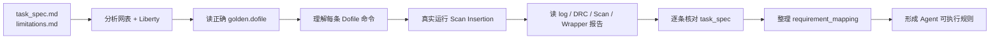
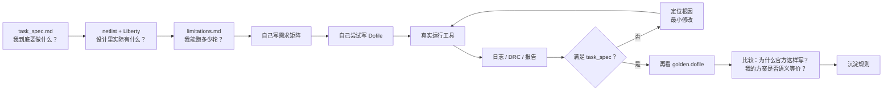

可以。建议把 Public case 当成两套课程：Task1 先学“DFT 配置与结构”，Task2 再学“从问题清单修到完整插链”。

## 目录树

实际根目录：

`D:\research\2026-NCTIEDA-Semitronix\官方材料\public_cases`

```
public_cases/
├── task_1/
│   ├── case1/
│   │   └── input/
│   │       ├── golden.dofile
│   │       ├── limitations.md
│   │       ├── task_spec.md
│   │       ├── lib/
│   │       │   └── sky130.lib
│   │       └── netlist/
│   │           └── opene902.v
│   ├── case2/
│   │   └── input/
│   │       ├── golden.dofile
│   │       ├── limitations.md
│   │       ├── task_spec.md
│   │       ├── lib/
│   │       │   └── sky130.lib
│   │       └── netlist/
│   │           └── ac97_ctrl.v
│   ├── case3/
│   │   └── input/
│   │       ├── golden.dofile
│   │       ├── limitations.md
│   │       ├── task_spec.md
│   │       ├── ctl/
│   │       │   └── aes_cipher_top.ctl
│   │       ├── lib/
│   │       │   ├── aes_cipher_top_liberty.lib
│   │       │   └── sky130_hd.lib
│   │       └── netlist/
│   │           └── open_aes_core_in_e902.v
│   ├── case4/
│   │   └── input/
│   │       ├── golden.dofile
│   │       ├── limitations.md
│   │       ├── task_spec.md
│   │       ├── lib/
│   │       │   └── sky130.lib
│   │       └── netlist/
│   │           └── opene902.v
│   ├── case5/
│   │   └── input/
│   │       ├── golden.dofile
│   │       ├── limitations.md
│   │       ├── task_spec.md
│   │       ├── lib/
│   │       │   └── sky130.lib
│   │       └── netlist/
│   │           └── openc906.v
│   └── case6/
│       └── input/
│           ├── golden.dofile
│           ├── limitations.md
│           ├── task_spec.md
│           ├── lib/
│           │   └── sky130.lib
│           └── netlist/
│               ├── dedicated_wrp_cell.v
│               └── des_perf.v
└── task_2/
    ├── case1/
    │   └── input/
    │       ├── golden.dofile
    │       ├── original.dofile
    │       ├── preset_issues.json
    │       ├── limitations.md
    │       ├── task_spec.md
    │       ├── lib/
    │       │   └── sky130.lib
    │       └── netlist/
    │           └── pre_scan.v
    ├── case2/
    │   └── input/
    │       ├── golden.dofile
    │       ├── original.dofile
    │       ├── preset_issues.json
    │       ├── limitations.md
    │       ├── task_spec.md
    │       ├── lib/
    │       │   └── stdcells.lib
    │       └── netlist/
    │           └── ethernet_sky130.v
    ├── case3/
    │   └── input/
    │       ├── golden.dofile
    │       ├── original.dofile
    │       ├── preset_issues.json
    │       ├── limitations.md
    │       ├── task_spec.md
    │       ├── lib/
    │       │   └── sky130.lib
    │       └── netlist/
    │           └── tv80.v
    ├── case4/
    │   └── input/
    │       ├── golden.dofile
    │       ├── original.dofile
    │       ├── preset_issues.json
    │       ├── limitations.md
    │       ├── task_spec.md
    │       ├── lib/
    │       │   └── sky130.lib
    │       └── netlist/
    │           └── cv32e40p.v
    └── case5/
        └── input/
            ├── golden.dofile
            ├── original.dofile
            ├── preset_issues.json
            ├── limitations.md
            ├── task_spec.md
            ├── lib/
            │   └── sky130.lib
            └── netlist/
                └── veer_eh1.v
```

目前仓库里主要提供 `input/`。运行后产生的 `output/`、日志、报告和最终 dofile 建议放到独立实验目录，不要修改原始网表和 `golden.dofile`。

## 推荐攻略顺序

### Task1：前置配置 → 分区 → 黑盒 → Wrapper → 大规模

顺序：

```
case1 → case4 → case2 → case3 → case6 → case5
```

| 顺序 | Case        | 主要训练能力                                                                          |
| ---- | ----------- | ------------------------------------------------------------------------------------- |
| 1    | Task1 case1 | 最基础的 DFT 前置处理：ICG 重连、DFF→SFF 替换、非扫描域 SFF 回替；不建扫描链         |
| 2    | Task1 case4 | 学习验收约束：保持 ICG 数量和原连接、只改变指定扫描控制、确认不生成扫描链             |
| 3    | Task1 case2 | 多时钟域和多扫描分区：7 个 partition、独立 chain 配置、独立 scan_enable、lockup latch |
| 4    | Task1 case3 | Black-box/CTL 集成：AES 黑盒扫描结构、scan segment、wrapper/unwrapper chain           |
| 5    | Task1 case6 | 长移位寄存器不可拆分、dedicated wrapper cell、shared wrapper、wrapper 复用阈值        |
| 6    | Task1 case5 | 大规模工程能力：约 61.4 万个时序单元，伪主时钟、多个复位和扫描模式配置                |

Task1 中，第一站建议直接做：

`D:\research\2026-NCTIEDA-Semitronix\官方材料\public_cases\task_1\case1\input`

它最适合理解工具命令的执行顺序和每一阶段网表变化。

### Task2：单时钟基础 → ICG/Lockup → 覆盖率 → 多时钟分区 → 超大设计

顺序：

```
case1 → case3 → case4 → case2 → case5
```

| 顺序 | Case        | 主要训练能力                                                               |
| ---- | ----------- | -------------------------------------------------------------------------- |
| 1    | Task2 case1 | 最基础的完整 Scan Insertion：单时钟、DFF 替换、4 条扫描链、基本 DRC        |
| 2    | Task2 case3 | ICG 的 TE 重连、lockup latch、不同触发沿混链、最多 5 条扫描链              |
| 3    | Task2 case4 | 层次化 RISC-V 核、100% 扫描覆盖、链长不超过 100、单时钟域约束              |
| 4    | Task2 case2 | 三个主时钟域、按时钟分区、每个分区独立 chain_count/max_length/scan_enable  |
| 5    | Task2 case5 | 超大规模 Veer：模式常量、JTAG 排除、DFTR 规则处理、链长 1000、完整报告交付 |

Task2 的学习方法是固定的：

```
original.dofile
    ↓
preset_issues.json
    ↓
task_spec.md
    ↓
golden.dofile
    ↓
自己重写 final.dofile
```

其中：

- `original.dofile`：故意不完整的起点；
- `preset_issues.json`：要定位和闭环的问题；
- `golden.dofile`：官方参考答案，只用于理解和对照；
- `task_spec.md`：真正的验收标准。

## 规模提醒

最后再做两个大 case：

- Task1 case5：`openc906.v` 约 271 MB；
- Task2 case5：`veer_eh1.v` 约 244 MB。

它们更适合前面的小 case 已经能稳定生成网表、报告、日志之后再尝试。


# 学习步骤



# 学习目标

目标是：

> **到本周末，真正搞懂 3 个 Task1 + 1 个 Task2，并从里面提炼第一批 Agent 规则。**